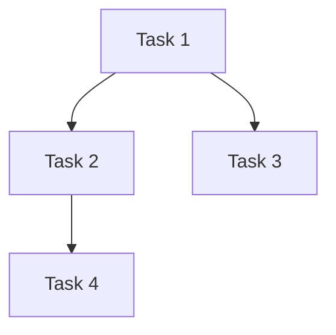

# Multi-Team Coordinator
重要！！！CRITICAL 务必使用下面描述的 team 执行代码

## 概述

协调多个 agent team 并发执行独立任务。根据 Guard 文档是否存在进入不同工作流：
- **无 Guard 文档**：分析需求 → 生成 Guard 文档 → 分配 team
- **有 Guard 文档**：直接读取 → 分配 team → **team 自己规划**

**核心工作流**：每个 Team 是 **code + code-review** 的闭环，由 Team Leader 驱动：
1. **编码**：Coder 实现功能
2. **审查**：Code-Reviewer 审查需求准确性、代码质量
3. **迭代**：不通过则修复再审查，直到通过

## 触发条件

- 用户明确说"分析这个任务并分配给多个团队"
- 用户说"帮我规划一下这个项目"
- 用户提供复杂的任务列表需要拆分
- 用户需要并发执行多个独立功能
- 用户说"继续执行"或"分配团队"（Guard 文档已存在）

## 工作流程（两种状态）

### 状态判断流程

```
                ┌─────────────┐
                │ 用户请求      │
                └──────┬──────┘
                       │
                       ▼
              ┌────────────────┐
              │ Guard 文档存在？ │
              └────┬──────┬───┘
                   │          │
                 [是]        [否]
                   │          │
                   ▼          ▼
        ┌────────────┐  ┌──────────────┐
        │ 状态 2      │  │ 状态 1      │
        │ 分配 Team   │  │ 分析+新建    │
        └──────┬─────┘  └──────┬───────┘
               │                │
               └────────┬──────┘
                        │
                        ▼
               ┌─────────────────┐
               │ Team 并发执行   │
               │ - 内部自规划     │
               │ - 质量保证       │
               └─────────────────┘
```

### 状态 1：无 Guard 文档

```
┌─────────────────────┐
│ 1. 意图分析          │
│ - 识别任务类型        │
│ - 分析依赖关系        │
│ - 评估优先级和复杂度   │
└──────────┬────────────┘
           │
           ▼
┌─────────────────────┐
│ 2. 生成 Guard 文档    │
│ - 输出到固定路径       │
│ - 包含任务列表         │
│ - 依赖图              │
│ - 团队分配             │
└──────────┬────────────┘
           │
           ▼
┌─────────────────────┐
│ 3. 分配 Team         │
│ - 创建 team           │
│ - 分配任务             │
│ - 并发执行             │
└─────────────────────┘
```

### 状态 2：有 Guard 文档（‼️ 重点）

```
┌─────────────────────┐
│ 1. 读取 Guard 文档    │
│ - 加载任务列表         │
│ - 检查依赖状态         │
│ - 确认待分配任务       │
└──────────┬────────────┘
           │
           ▼
┌─────────────────────┐
│ 2. 分配 Team         │
│ - 直接创建 team       │
│ - 分配待执行任务       │
│ - 无需重新规划         │
└──────────┬────────────┘
           │
           ▼
┌─────────────────────┐
│ 3. Team 自规划       │
│ - Team 内部 planner    │
│ - 制定实施计划         │
│ - 自主协调执行         │
└─────────────────────┘
```

**关键区别**：状态 2 下，coordinator 不再做任务分解和规划，直接将任务分配给 team，由 team 内部的 planner 自主规划。

## 团队质量保证（‼️ 必须执行）

### 每个 Team 的工作流（Code + Code-Review 闭环）

```
Team X（Leader 驱动）
    │
    ▼
┌───────────────────┐
│ 1. Leader 分析任务  │
│ - 理解 Guard 需求  │
│ - 识别依赖边界    │
│ - 制定编码计划      │
└────────┬──────────┘
           │
           ▼
┌───────────────────┐
│ 2. Coder 编码    │
│ - 实现功能         │
│ - 运行编译验证      │
└────────┬──────────┘
           │
           ▼
     ┌───────────────────┐
     │ 编译通过？        │
     └────┬──────┬───┘
          │          │
       [是]        [否]
          │          │
          │           ▼
          │      ┌───────────────────┐
          │      │ Coder+Code-Reviewer│
          │      │ 协同修复编译错误  │
          │      └────────┬──────────┘
          │               │
          ▼               ▼
┌─────────────────────┐
│ 3. Code-Reviewer 审查│
│ - 需求准确性      │ ←─ 核心维度
│ - 代码质量         │
│ - 安全规范         │
└────────┬────────────┘
           │
           ▼
     ┌───────────────────┐
     │ 审查通过？        │
     └────┬──────┬───┘
          │          │
       [是]        [否]
          │          │
          ▼          ▼
┌───────────────────┐  ┌───────────────────┐
│ 4. 上报 Guard     │  │ Coder 修复问题    │
│ - 更新进度表       │  │ - Code-Reviewer    │
│ - 标记：需求对齐   │  │   提供修复建议   │
│   代码质量审核      │  └────────┬──────────┘
└───────────────────┘           │
          │          └────────┬───────┘
          ▼               │
          ▼               ▼
    ┌─────────────────────┐   ┌───────────────────┐
    │ 任务完成          │   │ 回到步骤 2      │
    └─────────────────────┘   └───────────────────┘
```

**核心强调**：
1. **需求准确性**：Code-Reviewer 对照 Guard 文档，检查功能是否对齐
2. **代码质量**：Code-Reviewer 审查可维护性、安全性、规范遵循
3. **闭环迭代**：不通过则修复再审查，直到两项都通过

### 质量标准（每个 Team 必须满足）

| 维度 | 标准 | 验证方式 | 上报方 |
|-----|------|---------|--------|
| **编译** | 无任何编译错误 | 运行 `ng build` 或 `ng test` | Coder |
| **需求** | 功能对齐 Guard 文档 | 对照 Guard 文档任务描述 | Code-Reviewer |
| **安全** | 无 OWASP Top 10 漏洞 | code-reviewer 审查 | Code-Reviewer |
| **质量** | 代码可维护、可读 | code-reviewer 审查 | Code-Reviewer |
| **测试** | 关键路径有测试 | 运行 `ng test` | Coder |

**上报说明**：
- **需求对齐**：Code-Reviewer 在审查后确认功能是否与 Guard 文档任务描述对齐，上报「对齐/未对齐」
- **代码质量审核**：Code-Reviewer 完查后上报「通过/待修复」
- Coder 完成编码后需主动请求 Code-Reviewer 审查

### 质量不通过的处理

```
发现编译错误或审查问题
         │
         ▼
┌─────────────────────┐
│ 1. 记录问题          │
│ - 更新 Guard 文档     │
│ - 标记具体问题        │
│ - 标记错误类型        │
└────────┬────────────┘
         │
         ▼
   ┌─────────────────────┐
   │ 是编译错误？      │
   └────┬──────┬───┘
        │          │
     [是]        [否]
        │          │
        ▼          ▼
┌─────────────────────┐  ┌─────────────────────┐
│ 2a. 协同修复模式  │  │ 2b. 审查问题修复  │
│ - Code-Reviewer    │  │ - Coder 自己修复   │
│   分析错误根因     │  │ - 按审查意见修复  │
│ - 提供修复建议     │  │ - 重新提交审查     │
│ - Coder 执行修复   │  └────────┬────────────┘
└────────┬────────────┘         │
        │                      │
        ▼                      └────────┬───────┘
┌─────────────────────┐               │
│ 3. 重新验证          │◄────────────┘
│ - 验证编译通过       │
│ - Code-Reviewer 复审  │
│ - 确认问题解决        │
└─────────────────────┘
```

**编译错误协同模式**（新增）：
- Coder 发现编译错误后，主动呼叫 Code-Reviewer
- Code-Reviewer 分析错误根因（语法、类型、依赖等）
- Code-Reviewer 提供修复方案或直接修复
- Coder 执行修复后重新验证
- 验证通过后再进行完整代码审查

## 1. 意图分析

### 任务类型识别

| 类型 | 说明 | 示例 |
|-----|------|------|
| `frontend` | UI 组件、页面、交互 | 实现登录页、添加按钮组件 |
| `backend` | API、服务、数据层 | 创建用户服务、实现 CRUD API |
| `database` | Schema、迁移、查询 | 设计用户表、添加索引 |
| `infra` | 配置、部署、CI/CD | 设置 Docker、配置 GitHub Actions |
| `docs` | 文档、注释、README | 编写 API 文档 |

### 优先级评估

| 优先级 | 规则 |
|--------|------|
| `高` | 阻塞其他任务、用户明确要求紧急、安全相关 |
| `中` | 常规功能、按计划执行 |
| `低` | 优化项、可延后的需求 |

| 类型 | 说明 | 示例 |
|-----|------|------|
| `frontend` | UI 组件、页面、交互 | 实现登录页、添加按钮组件 |
| `backend` | API、服务、数据层 | 创建用户服务、实现 CRUD API |
| `database` | Schema、迁移、查询 | 设计用户表、添加索引 |
| `infra` | 配置、部署、CI/CD | 设置 Docker、配置 GitHub Actions |
| `docs` | 文档、注释、README | 编写 API 文档 |

### 优先级评估

| 优先级 | 规则 |
|--------|------|
| `高` | 阻塞其他任务、用户明确要求紧急、安全相关 |
| `中` | 常规功能、按计划执行 |
| `低` | 优化项、可延后的需求 |

### 复杂度评估

| 复杂度 | 预估工时 |
|--------|----------|
| `简单` | < 4 小时 |
| `中等` | 4 - 16 小时（1-2 人日） |
| `复杂` | > 16 小时（> 2 人日） |

**说明**：复杂任务需进一步拆分为多个简单或中等任务，单个任务不超过 2 人日。

### 依赖关系分析

- **显式依赖**：用户明确标记"**依赖**: Task 1, Task 2"
- **隐式依赖**：分析任务内容推断（如"前端页面"依赖"API 接口"）
- **循环依赖检测**：构建 DAG 时检测并报告

**说明**：合理拆分任务时需考虑依赖顺序，避免阻塞。

## 2. Guard 文档结构

### 输出路径

固定路径：`docs/guards/YYYY-MM-DD-<name>-guard.md`

### 文档模板

```markdown
# <项目名称> Guard 文档

**创建时间**: YYYY-MM-DD HH:mm
**状态**: 进行中

---

## 概述

### 项目目标
[1-2 句描述项目要达成的目标]

### 约束条件
- 时间：[如果有时间限制]
- 资源：[团队规模、技术栈限制]
- 其他：[依赖的外部系统、特殊要求]

---

## 任务列表

### [待开始] Task 1: <任务名称>

**描述**: [详细描述]
**类型**: frontend/backend/database/infra/docs
**优先级**: 高/中/低
**复杂度**: 简单/中等/复杂
**预估工时**: [X 人日/人时]
**依赖**: [依赖的任务列表，无则写"无"]
**指派**: [Team A/B/C 或 "未分配"]
**进度**: [进行中的进度描述，如 "50% - 组件已创建"]

---

## 依赖图



---

## 团队分配

| Team | 责责任务 | 状态 | 需求对齐 | 代码质量审核 | 质量状态 |
|-------|---------|------|-----------|-------------|---------|
| Team A | Task 1, Task 4 | 进行中 | 待审核 | 待审核 | 审查通过 |
| Team B | Task 2 | 待开始 | - | - | - |
| Team C | Task 3, Task 5 | 待开始 | - | - | - |

---

## 质量记录

| Team | 时间 | 记录项 | 状态 |
|-------|------|--------|------|
| Team A | YYYY-MM-DD HH:mm | 编译错误已修复 | 通过 |
| Team A | YYYY-MM-DD HH:mm | 代码审查通过 | 通过 |

---

## 风险标注

| 风险 | 影响 | 缓解措施 |
|-----|------|---------|
| [描述风险] | [影响范围] | [如何应对] |

---

## 变更记录

| 时间 | 变更 |
|-----|------|
| YYYY-MM-DD HH:mm | [记录内容] |
```

---

## 3. Agent Team 结构（‼️ 务必严格分配）

### Team 组成

每个 Team 包含一个 Leader 两个执行 Agent：

```
Team X（Leader）
├── coder         # 代码实现专家
└── code-reviewer # 代码审查专家
```

**Leader 职责**：
1. 分析 Guard 文档中的任务需求
2. 制定编码计划
3. 驱动 code + code-review 闭环
4. 上报进度到 Guard 文档

### Agent 规范

参考 `.claude/agents/` 目录下的定义：

#### Leader（Team Leader）
- **角色**: 每个 Team 的协调者，不是独立 agent
- **职责**: 分析 Guard 需求、制定编码计划、驱动 code + code-review 闭环
- **工作流**: 分析 → 分配 Coder → Code-Reviewer 审查 → 上报进度

#### Coder（代码实现专家）
- **文件**: `.claude/agents/coder/coder.md`
- **职责**: Angular 组件和功能实现
- **约束**: 严格遵循 STANDARDS.md

#### Code-Reviewer（代码审查专家）
- **文件**: `.claude/agents/code-reviewer/code-reviewer.md`
- **职责**: 审查需求准确性、代码质量、安全性
- **时机**: Coder 完成编码后立即审查
- **上报表**: 需求对齐、代码质量审核

### Agent 工具

| Agent | 可用工具 |
|--------|---------|
| coder | Read, Grep, Glob, Edit, Write, Bash |
| code-reviewer | Read, Grep, Glob, Bash |

**Leader** 是 Team 中的协调角色，不是独立 agent，使用以上 agent 的工具组合完成任务。

---

## 4. Team 启动流程

### 创建 Team

```bash
# 使用 Task tool 启动 team
Task(
  subagent_type: "general-purpose",
  name: "team-<name>",
  prompt: "你是 Team <name> 的 Leader。职责：1. 分析 Guard 任务需求 2. 分配 Coder 编码 3. 驱动 Code-Reviewer 审查需求准确性、代码质量 4. 上报进度到 Guard 文档（需求对齐、代码质量审核）",
)
```

### 任务分配

**状态 1（无 Guard）**：
1. Coordinator 分析任务并生成 Guard 文档
2. 根据依赖关系确定可并行任务
3. 为每个任务创建 Team（Leader）
4. 将任务信息传递给 Team

**状态 2（有 Guard）**：
1. Coordinator 直接读取 Guard 文档
2. 识别待分配任务
3. 为每个任务创建 Team（Leader）
4. **Team Leader 自己规划**（coordinator 不参与规划）

### 进度监控

- Team Leader 负责更新 Guard 文档中的团队分配表（需求对齐、代码质量审核）
- 定期检查所有 Team 状态，发现阻塞时及时调整

---

## 5. 状态转换规则

| 当前状态 | 可转换到 | 条件 |
|---------|---------|------|
| `[待开始]` | `[进行中]` | 依赖已满足，分配了 Team |
| `[进行中]` | `[完成]` | Team 报告完成，且 code-review 通过 |
| `[进行中]` | `[阻塞]` | 发现依赖问题或质量问题 |
| `[阻塞]` | `[待开始]` | 阻塞解除 |
| `[完成]` | - | 终态 |

**重要**：任务标记为完成前，必須满足：
1. 无编译错误
2. code-reviewer 审查通过
3. 需求对齐

### 编译错误的协同处理（‼️ 重点）

当 Coder 础到编译错误时，不应跳过 code-review，反而应主动请求 Code-Reviewer 协同：

```
┌─────────────────────────┐
│ Coder 执行编译       │
│ ng build / ng test    │
└────────┬────────────┘
           │
           ▼
     ┌────────────────────┐
     │ 编译是否通过？    │
     └────┬──────┬───┘
          │          │
       [否]        [是]
          │          │
          │           └──┬─────────────┐
          │           │ 直接进入    │
          │           │ code-review  │
          │           └───────────────┘
          ▼
┌───────────────────────────────────────┐
│ Coder 主动呼叫 Code-Reviewer 协同      │
│ "编译失败，请帮我分析原因"           │
└────────────────┬──────────────────────┘
           │
           ▼
┌───────────────────────────────────────┐
│ Code-Reviewer 分析错误根因             │
│ - 类型错误（Type mismatch）            │
│ - 语法错误（Syntax error）              │
│ - 依赖问题（Module not found）          │
│ - 配置错误（Configuration issue）         │
│ - API 变更（Breaking API change）        │
└────────────────┬──────────────────────┘
           │
           ▼
┌───────────────────────────────────────┐
│ Code-Reviewer 提供修复方案               │
│ 1. 直接修复：直接使用 Edit 修复        │
│ 2. 建议方案：告诉 Coder 如何修复        │
│ 3. 分析原因：解释错误，让 Coder 理解  │
└────────────────┬──────────────────────┘
           │
           ▼
┌───────────────────────────────────────┐
│ Coder 执行修复                          │
│ - 按照 Code-Reviewer 建议修复             │
│ - 或直接使用 Code-Reviewer 的修复          │
│ - 重新运行编译验证                      │
└────────────────┬──────────────────────┘
           │
           ▼
┌───────────────────────────────────────┐
│ 重新编译验证                             │
│ - 编译通过 → 进入完整 code-review       │
│ - 仍然失败 → 重复协同流程             │
└───────────────────────────────────────┘
```

### 协同修复示例

**场景 1**：类型错误
```
Coder: 编译失败，Type 'string' is not assignable to type 'number'
Code-Reviewer: 分析发现 userId 变量从 API 返回的是 string，
但组件期望 number。需要添加 +parseInt() 转换。
[Code-Reviewer 直接修复]
```

**场景 2**：依赖问题
```
Coder: Module not found: @angular/router
Code-Reviewer: 检查 imports，发现缺少 import。
[Code-Reviewer 建议方案] 在文件顶部添加 import 语句。
```

**场景 3**：API 变更
```
Coder: Property 'data' does not exist on type 'Observable<...>'
Code-Reviewer: 分析发现 rxjs 7.x API 变更，
需要使用 .pipe(take(1)) 替代 .value。
[Code-Reviewer 解释原因，Coder 执行修复]
```

### Coder 触发协同的最佳实践

| 时机 | 动作 | 说明 |
|-----|------|------|
| 编译失败时 | 立即呼叫 Code-Reviewer | 不要独自苦思冥想 |
| 描述问题时 | 附带完整错误信息 | 包括文件、行号、错误类型 |
| 修复后 | 通知 Code-Reviewer 重新验证 | 确保问题真正解决 |
| 多次失败 | 考虑是否是架构问题 | 可能需要 Planner 重新评估 |

---

## 6. 并发控制

### 并发参数

| 参数 | 默认值 | 说明 |
|-----|--------|------|
| `max_teams` | 3 | 同时运行的最大 Team 数 |
| `max_per_type` | 2 | 同类型任务的最大并发数 |

### 优先级调度

1. 高优先级任务优先分配
2. 同优先级按依赖顺序
3. 无依赖任务可并行

---

## 实施步骤

### 状态 1：无 Guard 文档

#### 步骤 1：分析用户意图

1. 用户提供任务描述或列表
2. Coordinator 识别任务类型和依赖
3. 询问澄清性问题（如果有）

#### 步骤 2：生成 Guard 文档

1. 分析任务详情、依赖图
2. 输出到 `docs/guards/YYYY-MM-DD-<name>-guard.md`

#### 步骤 3：分配 Teams

1. 读取 Guard 文档
2. 分析可并行任务
3. 为每个任务创建 Team
4. 传递任务信息给 Team

#### 步骤 4：监空执行

1. 监听 Team 进度
2. 更新 Guard 文档状态
3. 处理阻塞和问题
4. 任务完成后销毁 Team
5. 继续分配新任务

### 状态 2：有 Guard 文档

#### 步骤 1：读取 Guard 文档

1. 直接读取 `docs/guards/YYYY-MM-DD-<name>-guard.md`
2. 加载任务列表和依赖状态
3. 确认待分配任务

#### 步骤 2：分配 Teams

1. 为待分配任务创建 Team
2. 将任务描述传递给 Team
3. **Team 自己规划**（不在此步做规划）

#### 步骤 3：Team 自规划执行

1. Team 内部 planner 分析需求
2. 制定实施计划
3. Coder 执行实施
4. Code-reviewer 审查质量
5. 循环直到通过

#### 步骤 4：监空执行

1. 监听 Team 进度和质量状态
2. 更新 Guard 文档状态和质量记录
3. 处理阻塞和问题
4. 任务完成后销毁 Team

---

## 参考资料

### 依赖文件

- `references/task-types.md` - 任务类型详细定义
- `references/priority-rules.md` - 优先级判断规则
- `references/agent-specs.md` - Agent 规范说明

### 模板文件

- `assets/guard-template.md` - Guard 文档模板

---

## 最佳实践

1. **明确依赖**：尽量让用户显式标记依赖，减少推断
2. **合理拆分**：单个任务不超过 2 人日，过大任务需进一步拆分
3. **及时更新**：Guard 文档是唯一的进度真相来源，及时更新
4. **异常处理**：Team 阻塞或失败时，及时记录并通知
5. **完成任务**：所有任务完成后，整理最终的变更记录
6. **质量优先**：每个 Team 必須确保无编译错误且 code-review 通过
