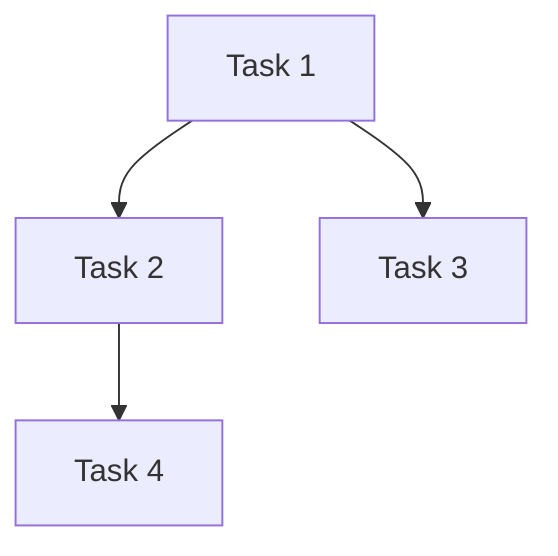

# Multi-Team Coordinator

## 概述

协调多个 agent team 并发执行独立任务，通过分析用户意图生成结构化的 Guard 文档来指导协作。

## 触发条件

- 用户明确说"分析这个任务并分配给多个团队"
- 用户说"帮我规划一下这个项目"
- 用户提供复杂的任务列表需要拆分
- 用户需要并发执行多个独立功能

## 工作流程

```
用户意图
    │
    ▼
┌─────────────────────┐
│  1. 意图分析          │
│ - 识别任务类型        │
│ - 分析依赖关系        │
│ - 评估优先级和复杂度   │
└──────────┬────────────┘
           │
           ▼
┌─────────────────────┐
│  2. 生成 Guard 文档    │
│ - 输出到固定路径       │
│ - 包含任务列表         │
│ - 依赖图              │
│ - 团队分配             │
└──────────┬────────────┘
           │
           ▼
┌─────────────────────┐
│  3. 启动 Agent Teams  │
│ - 创建 team           │
│ - 分配任务             │
│ - 并发执行             │
└──────────┬────────────┘
           │
           ▼
┌─────────────────────┐
│  4. 监控与记录         │
│ - 追踪进度             │
│ - 更新 Guard 文档       │
│ - 完成后退出           │
└─────────────────────┘
```

## 1. 意图分析

### 任务类型识别

| 类型 | 说明 | 示例 |
|-----|------|------|
| `frontend` | UI 组件、页面、交互 | 实现登录页、添加按钮组件 |
| `backend` | API、服务、数据层 | 创建用户服务、实现 CRUD API |
| `database` | Schema、迁移、查询 | 设计用户表、添加索引 |
| `infra` | 配置、部署、CI/CD | 设置 Docker、配置 GitHub Actions |
| `docs` | 文档、注释、README | 编写 API 文档 |

### 优先级评估

| 优先级 | 规则 |
|--------|------|
| `高` | 阻塞其他任务、用户明确要求紧急、安全相关 |
| `中` | 常规功能、按计划执行 |
| `低` | 优化项、可延后的需求 |

### 复杂度评估

| 复杂度 | 预估工时 |
|--------|----------|
| `简单` | < 4 小时 |
| `中等` | 4 - 16 小时（1-2 人日） |
| `复杂` | > 16 小时（> 2 人日） |

### 依赖关系分析

- **显式依赖**：用户明确标记"**依赖**: Task 1, Task 2"
- **隐式依赖**：分析任务内容推断（如"前端页面"依赖"API 接口"）
- **循环依赖检测**：构建 DAG 时检测并报告

## 2. Guard 文档结构

### 输出路径

固定路径：`docs/guards/YYYY-MM-DD-<name>-guard.md`

### 文档模板

```markdown
# <项目名称> Guard 文档

**创建时间**: YYYY-MM-DD HH:mm
**状态**: 进行中

---

## 概述

### 项目目标
[1-2 句描述项目要达成的目标]

### 约束条件
- 时间：[如果有时间限制]
- 资源：[团队规模、技术栈限制]
- 其他：[依赖的外部系统、特殊要求]

---

## 任务列表

### [待开始] Task 1: <任务名称>

**描述**: [详细描述]
**类型**: frontend/backend/database/infra/docs
**优先级**: 高/中/低
**复杂度**: 简单/中等/复杂
**预估工时**: [X 人日/人时]
**依赖**: [依赖的任务列表，无则写"无"]
**指派**: [Team A/B/C 或 "未分配"]
**进度**: [进行中的进度描述，如 "50% - 组件已创建"]

---

## 依赖图



---

## 团队分配

| Team | 负责任务 | 状态 |
|-------|---------|------|
| Team A | Task 1, Task 4 | 进行中 |
| Team B | Task 2 | 待开始 |
| Team C | Task 3, Task 5 | 待开始 |

---

## 风险标注

| 风险 | 影响 | 缓解措施 |
|-----|------|---------|
| [描述风险] | [影响范围] | [如何应对] |

---

## 变更记录

| 时间 | 变更 |
|-----|------|
| YYYY-MM-DD HH:mm | [记录内容] |
```

---

## 3. Agent Team 结构(重要‼️ 务必严格分配 agent 角色)

### Team 组成

每个 Team 包含三个 Agent：

```
Team X/
├── planner      # 规划专家
├── coder         # 代码实现专家
└── code-reviewer # 代码审查专家
```

### Agent 规范

参考 `.claude/agents/` 目录下的定义：

#### Planner（规化专家）
- **文件**: `.claude/agents/planner/planner.md`
- **职责**: 分析需求并创建详细的实施计划
- **输出**: 结构化的实施方案，包含步骤、依赖、风险

#### Coder（代码实现专家）
- **文件**: `.claude/agents/coder/coder.md`
- **职责**: Angular 组件和功能实现
- **约束**: 严格遵循 STANDARDS.md

#### Code-Reviewer（代码审查专家）
- **文件**: `.claude/agents/code-reviewer/code-reviewer.md`
- **职责**: 审查代码质量、安全性和可维护性
- **时机**: 编写或修改代码后立即使用

### Agent 工具

| Agent | 可用工具 |
|--------|---------|
| planner | Read, Grep, Glob |
| coder | Read, Grep, Glob, Edit, Write, Bash |
| code-reviewer | Read, Grep, Glob, Bash |

---

## 4. Team 启动流程

### 创建 Team

```bash
# 使用 Task tool 启动 team
Task(
  subagent_type: "general-purpose",
  name: "team-<name>",
  prompt: "你是 <team-name> 的协调者...",
)
```

### 任务分配

1. Coordinator 从 Guard 文档读取待分配任务
2. 根据依赖关系确定可并行任务
3. 为每个任务创建对应的 Team
4. 将任务信息传递给 Team 的 planner

### 进度监控

- Team 完成任务后更新 Guard 文档状态
- Coordinator 定期检查所有 Team 状态
- 发现阻塞时及时调整

---

## 5. 状态转换规则

| 当前状态 | 可转换到 | 条件 |
|---------|---------|------|
| `[待开始]` | `[进行中]` | 依赖已满足，分配了 Team |
| `[进行中]` | `[完成]` | Team 报告完成 |
| `[进行中]` | `[阻塞]` | 发现依赖问题 |
| `[阻塞]` | `[待开始]` | 阻塞解除 |
| `[完成]` | - | 终态 |

---

## 6. 并发控制

### 并发参数

| 参数 | 默认值 | 说明 |
|-----|--------|------|
| `max_teams` | 3 | 同时运行的最大 Team 数 |
| `max_per_type` | 2 | 同类型任务的最大并发数 |

### 优先级调度

1. 高优先级任务优先分配
2. 同优先级按依赖顺序
3. 无依赖任务可并行

---

## 实施步骤

### 步骤 1: 分析用户意图

1. 用户提供任务描述或列表
2. Coordinator 识别任务类型和依赖
3. 询问澄清性问题（如果有）

### 步骤 2: 生成 Guard 文档

1. 运行 `scripts/create_guard.py` 生成初始文档
2. 填充任务详情、依赖图
3. 输出到 `docs/guards/YYYY-MM-DD-<name>-guard.md`

### 步骤 3: 启动 Teams

1. 读取 Guard 文档
2. 分析可并行任务
3. 为每个任务创建 Team
4. 传递任务信息给 Team

### 步骤 4: 监控执行

1. 监听 Team 进度
2. 更新 Guard 文档状态
3. 处理阻塞和问题
4. 任务完成后销毁 Team
5. 继续分配新任务

---

## 参考资料

### 依赖文件

- `references/task-types.md` - 任务类型详细定义
- `references/priority-rules.md` - 优先级判断规则
- `references/agent-specs.md` - Agent 规范说明

### 模板文件

- `assets/guard-template.md` - Guard 文档模板

---

## 最佳实践

1. **明确依赖**：尽量让用户显式标记依赖，减少推断
2. **合理拆分**：单个任务不超过 2 人日，过大任务需进一步拆分
3. **及时更新**：Guard 文档是唯一的进度真相来源，及时更新
4. **异常处理**：Team 阻塞或失败时，及时记录并通知
5. **完成任务**：所有任务完成后，整理最终的变更记录
