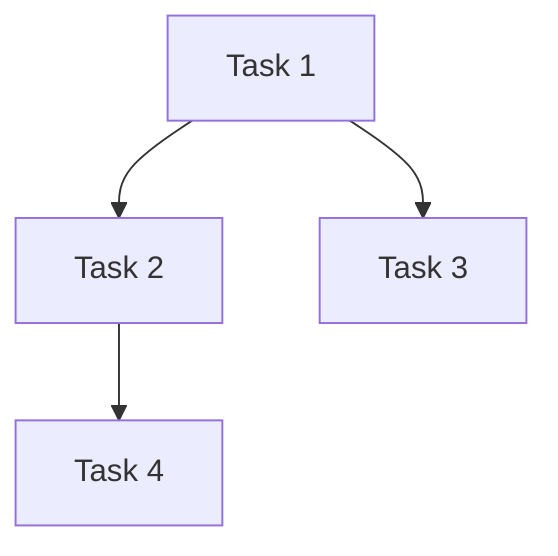

# {{项目名称}} Guard 文档

**创建时间**: {{YYYY-MM-DD HH:mm}}
**状态**: 进行中

---

## 概述

### 项目目标
{{1-2 句描述项目要达成的目标}}

### 约束条件
- **时间**: {{如果有时间限制}}
- **资源**: {{团队规模、技术栈限制}}
- **其他**: {{依赖的外部系统、特殊要求}}

---

## 任务列表

### [待开始] Task 1: {{任务名称}}

**描述**: {{详细描述}}
**类型**: frontend/backend/database/infra/docs
**优先级**: 高/中/低
**复杂度**: 简单/中等/复杂
**预估工时**: {{X 人日/人时}}
**依赖**: {{依赖的任务列表，无则写"无"}}
**指派**: {{Team A/B/C 或 "未分配"}}
**进度**: {{进行中的进度描述，如 "50% - 组件已创建"}}

### [待开始] Task 2: {{任务名称}}

**描述**: {{详细描述}}
**类型**: frontend/backend/database/infra/docs
**优先级**: 高/中/低
**复杂度**: 简单/中等/复杂
**预估工时**: {{X 人日/人时}}
**依赖**: {{依赖的任务列表}}
**指派**: {{Team A/B/C 或 "未分配"}}
**进度**: {{进行中的进度描述}}

---

## 依赖图

---

## 团队分配

| Team | 责责任务 | 状态 | 需求对齐 | 代码质量审核 | 质量状态 |
|-------|---------|------|-----------|-------------|---------|
| {{Team A}} | {{Task 1, Task 4}} | {{进行中}} | {{对齐/待审核/未对齐}} | {{通过/待修复/待审核}} | {{审查通过/修复中}} |
| {{Team B}} | {{Task 2}} | {{待开始}} | {{-}} | {{-}} | {{-}} |
| {{Team C}} | {{Task 3, Task 5}} | {{待开始}} | {{-}} | {{-}} | {{-}} |

**列说明**：
- **需求对齐**：Code-Reviewer 审查后上报，值：`对齐` / `待审核` / `未对齐`
- **代码质量审核**：Code-Reviewer 审查后上报，值：`通过` / `待修复` / `待审核`
- **质量状态**：综合状态，如：`审查通过` / `修复中` / `待开始`

**核心工作流**：每个 Team 是 code + code-review 的闭环，由 Team Leader 驱动：
1. **编码**：Coder 实现功能
2. **审查**：Code-Reviewer 审查需求准确性、代码质量
3. **迭代**：不通过则修复再审查，直到通过

---

## 质量记录

**重要**：每个 Team 必須确保代码无编译错误，并通过 code-review 审查。

| Team | 时间 | 记录项 | 状态 | 协同方 |
|-------|------|--------|------|--------|
| Team A | {{YYYY-MM-DD HH:mm}} | {{具体记录项}} | {{通过/修复中}} | {{Coder/Code-Reviewer}} |
| Team A | {{YYYY-MM-DD HH:mm}} | {{具体记录项}} | {{通过/修复中}} | {{Coder/Code-Reviewer}} |
| Team B | {{YYYY-MM-DD HH:mm}} | {{具体记录项}} | {{通过/修复中}} | {{Coder/Code-Reviewer}} |

### 编译错误协同记录

当遇到编译错误时，记录协同过程：

| Team | 时间 | 错误类型 | 协同方 | 结果 |
|-------|------|---------|--------|------|
| {{Team X}} | {{YYYY-MM-DD HH:mm}} | {{类型/语法/依赖等}} | {{Code-Reviewer 分析 + Coder 修复}} | {{已修复/进行中}} |

**记录说明**：
- **协同方**：记录谁参与了问题解决（Coder 独立解决 / Code-Reviewer 协同分析）
- **错误类型**：类型错误、语法错误、依赖问题、配置错误、API 变更
- **结果**：问题已解决、修复进行中、需要 Planner 重新评估

### 质量标准

| 维度 | 标准 | 验证方式 | 上报方 |
|-----|------|---------|--------|
| **编译** | 无任何编译错误 | 运行 `ng build` 或 `ng test` | Coder |
| **需求** | 功能对齐 Guard 文档 | 对照 Guard 文档任务描述 | Code-Reviewer |
| **安全** | 无 OWASP Top 10 漏洞 | code-reviewer 审查 | Code-Reviewer |
| **质量** | 代码可维护、可读 | code-reviewer 审查 | Code-Reviewer |
| **测试** | 关键路径有测试 | 运行 `ng test` | Coder |

**上报说明**：
- **需求对齐**：Code-Reviewer 在审查后确认功能是否与 Guard 文档任务描述对齐，上报「对齐/未对齐」
- **代码质量审核**：Code-Reviewer 审查后上报「通过/待修复」
- Coder 完成编码后需主动请求 Code-Reviewer 审查

---

## 风险标注

| 风险 | 影响 | 缓解措施 |
|-----|------|---------|
| {{描述风险}} | {{影响范围}} | {{如何应对}} |

---

## 变更记录

| 时间 | 变更 |
|-----|------|
| {{YYYY-MM-DD HH:mm}} | {{记录内容}} |
| {{YYYY-MM-DD HH:mm}} | {{记录内容}} |
