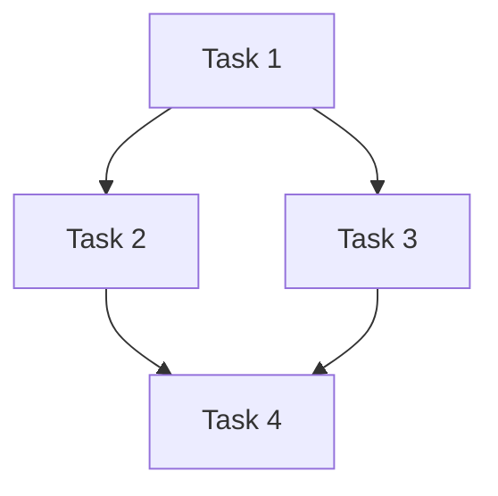

# {{项目名称}} Guard 文档

**创建时间**: {{YYYY-MM-DD HH:mm}}
**状态**: 进行中

---

## 概述

### 项目目标
{{1-2 句描述项目要达成的目标}}

### 约束条件
- **时间**: {{如果有时间限制}}
- **资源**: {{团队规模、技术栈限制}}
- **其他**: {{依赖的外部系统、特殊要求}}

---

## 任务列表

### [待开始] Task 1: {{任务名称}}

**描述**: {{详细描述}}
**类型**: frontend/backend/database/infra/docs
**优先级**: 高/中/低
**复杂度**: 简单/中等/复杂
**预估工时**: {{X 人日/人时}}
**依赖**: {{依赖的任务列表，无则写"无"}}
**指派**: {{Team A/B/C 或 "未分配"}}
**进度**: {{进行中的进度描述，如 "50% - 组件已创建"}}

### [待开始] Task 2: {{任务名称}}

**描述**: {{详细描述}}
**类型**: frontend/backend/database/infra/docs
**优先级**: 高/中/低
**复杂度**: 简单/中等/复杂
**预估工时**: {{X 人日/人时}}
**依赖**: {{依赖的任务列表}}
**指派**: {{Team A/B/C 或 "未分配"}}
**进度**: {{进行中的进度描述}}

---

## 依赖图

---

## 团队分配

| Team | 责责任务 | 状态 |
|-------|---------|------|
| Team A | Task 1, Task 4 | 进行中 |
| Team B | Task 2 | 待开始 |
| Team C | Task 3, Task 5 | 待开始 |

---

## 风险标注

| 风险 | 影响 | 缓解措施 |
|-----|------|---------|
| {{描述风险}} | {{影响范围}} | {{如何应对}} |

---

## 变更记录

| 时间 | 变更 |
|-----|------|
| {{YYYY-MM-DD HH:mm}} | {{记录内容}} |
| {{YYYY-MM-DD HH:mm}} | {{记录内容}} |
