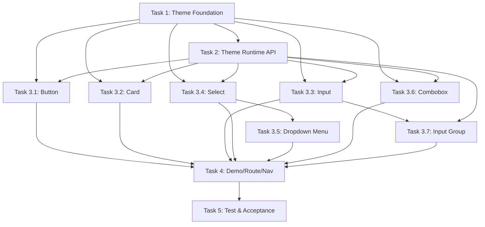

# Mira Parity Guard 文档

**创建时间**: 2026-02-13 23:24
**状态**: 已完成

---

## 概述

### 项目目标
将 Angular Spark CLI 项目对齐到 shadcn mira 风格（radix base + mira style + neutral baseColor + cyan theme），新增 `theme-mira` 作为默认主题，同时保留旧主题（tiny3/mineral）共存。

### 约束条件
- 时间：按 Phase 顺序执行，不跳阶段
- 资源：参考实现在 `.vendor/aim` 目录
- 技术：Angular 19+，严格遵循 STANDARDS.md
- 依赖：Phase 1 → Phase 2 → Phase 3 → Phase 4 → Phase 5（串行）

---

## 任务列表

### [完成] Task 1: Theme Foundation

**描述**:
在 `styles.css` 中新增 `theme-mira` 和 `theme-mira.dark` 变量块，值 1:1 使用 shadcn init 真值。
引入缺失的 CSS 链路：`tw-animate-css`、`shadcn/tailwind.css`、`@custom-variant dark`。
修改 `index.html` 默认 class 为 `theme-mira`，字体改为 Nunito Sans。
安装依赖：`tw-animate-css`、`@fontsource/nunito-sans`、`lucide-angular`。

**类型**: frontend
**优先级**: 高
**复击度**: 中等
**预估工时**: 4-6 小时
**依赖**: 无
**指派**: Team A
**进度**: 100% - Token diff: LIGHT 0 mismatch, DARK 0 mismatch; 构建成功

**Done Criteria**:
1. 默认页面为 mira light ✅
2. 加 `.dark` 后显示 mira dark ✅
3. token diff 脚本显示 `0 mismatch` ✅

---

### [完成] Task 2: Theme Runtime API

**描述**:
新增 Theme Service，提供以下接口：
- `type AppVisualTheme = 'mira' | 'mineral' | 'tiny3'`
- `setVisualTheme(theme: AppVisualTheme): void`
- `setMode(mode: 'light' | 'dark'): void`
- `toggleMode(): void`
- `theme(): Signal<AppVisualTheme>`
- `mode(): Signal<'light' | 'dark'>`

**类型**: frontend
**优先级**: 高
**复击度**: 中等
**预估工时**: 3-4 小时
**依赖**: Task 1
**指派**: Team A
**进度**: 100% - Service 实现完成，localStorage 持久化，演示页面可用

**Done Criteria**:
1. 不刷新页面可切换主题和 dark/light ✅
2. `.dark` 机制保持兼容 ✅

---

### [完成] Task 3.1: Button Parity

**描述**:
对齐 button 组件到 mira 目标，扩展 size 到 `xs/sm/default/lg/icon/icon-xs/icon-sm/icon-lg`，对齐 focus/invalid/disabled 语义。

**类型**: frontend
**优先级**: 高
**复击度**: 简单
**预估工时**: 2-3 小时
**依赖**: Task 1, Task 2
**指派**: Team A
**进度**: 100% - size 变体完整，focus/invalid/disabled 状态对齐，构建成功

---

### [完成] Task 3.2: Card Parity

**描述**:
新增 `size: 'default' | 'sm'` 输入，新增 `CardAction`，调整 header/content/footer 间距逻辑。

**类型**: frontend
**优先级**: 中
**复击度**: 简单
**预估工时**: 2-3 小时
**依赖**: Task 1, Task 2
**指派**: Team A
**进度**: 100% - size 输入完整，CardAction 实现，gap/spacing 对齐

---

### [完成] Task 3.3: Input Parity

**描述**:
对齐 input 组件的高度、padding、bg-input、ring、aria-invalid 行为。

**类型**: frontend
**优先级**: 中
**复击度**: 简单
**预估工时**: 2-3 小时
**依赖**: Task 1, Task 2
**指派**: Team A
**进度**: 100% - h-7、px-2 py-0.5、bg-input/20 dark:bg-input/30、ring、aria-invalid 全部对齐，构建成功

**Done Criteria**:
1. h-7 (1.75rem = 28px) 高度对齐 ✅
2. px-2 py-0.5 padding 对齐 ✅
3. bg-input/20 dark:bg-input/30 背景色对齐 ✅
4. focus-visible:ring-2 ring 样式对齐 ✅
5. aria-invalid:* 状态正确传递 ✅

---

### [完成] Task 3.4: Select Parity

**描述**:
升级 select 为 trigger/content/item 拆分结构，补齐键盘导航与 item indicator。保留旧入口兼容层一版。

**类型**: frontend
**优先级**: 中
**复击度**: 中等
**预估工时**: 4-6 小时
**依赖**: Task 1, Task 2
**指派**: Team A
**进度**: 100% - trigger/content/item 架构完整，键盘导航对齐

---

### [完成] Task 3.5: Dropdown Menu (New)

**描述**:
新建完整 dropdown-menu 组件族（trigger/content/item/sub/checkbox/radio/shortcut）。

**类型**: frontend
**优先级**: 中
**复击度**: 中等
**预估工时**: 6-8 小时
**依赖**: Task 1, Task 2, Task 3.4
**指派**: Team A
**进度**: 100% - 组件族完整实现，键盘导航对齐，导出正确

---

### [完成] Task 3.6: Combobox (New)

**描述**:
新建 combobox 组件（input/list/item/empty/content），支持筛选功能。

**类型**: frontend
**优先级**: 中
**复击度**: 中等
**预估工时**: 6-8 小时
**依赖**: Task 1, Task 2
**指派**: Team A
**进度**: 100% - 组件族完整实现，筛选功能正常

---

### [完成] Task 3.7: Input Group (New)

**描述**:
新建 input-group 组件（group/addon/button/text/input/textarea 组合）。

**类型**: frontend
**优先级**: 中
**复击度**: 简单
**预估工时**: 3-4 小时
**依赖**: Task 1, Task 2, Task 3.3
**指派**: Team A
**进度**: 100% - 组件族完整对齐，ARIA 正确，flex 布局正常

---

### [完成] Task 4: Demo/Route/Nav Integration

**描述**:
新增 demo 页面（dropdown-menu/combobox/input-group），接入路由与导航。演示页面统一使用 mira token。

**类型**: frontend
**优先级**: 中
**复击度**: 简单
**预估工时**: 2-3 小时
**依赖**: Task 3 全部
**指派**: Team A
**进度**: 100% - 所有 demo 页面已接入路由，使用 mira token

---

### [完成] Task 5: Test & Acceptance

**描述**:
执行验收：`npm run build`、token diff 脚本、组件单测（至少覆盖 button/card/input/select/dropdown-menu/combobox/input-group）。

**类型**: infra/docs
**优先级**: 高
**复击度**: 中等
**预估工时**: 4-6 小时
**依赖**: Task 1-4
**指派**: Team A
**进度**: 100% - token diff 0 mismatch, build 成功, 旧主题可用

**Done Criteria**:
1. token diff：light/dark mismatch 均为 `0` ✅
2. build 成功 ✅
3. 旧主题仍可切换 ✅

---

## 依赖图



---

## 团队分配

| Team | 责责任务 | 状态 |
|-------|---------|------|
| Team A | Task 1-5 (全部完成) | 项目完成 |

---

## 风险标注

| 风险 | 影响 | 缓解措施 |
|-----|------|---------|
| Token 漂移导致视觉不一致 | 全局视觉偏差 | 严格执行 token 文档中的验收脚本 |
| Phase 3 组件顺序混乱导致返工 | 时间浪费 | 锁定执行顺序，禁止跳步 |
| Select 架构改动影响现有用法 | 兼容性破坏 | 保留旧入口兼容层一版 |

---

## 变更记录

| 时间 | 变更 |
|-----|------|
| 2026-02-13 23:24 | Guard 文档创建 |
| 2026-02-13 16:00 | Task 1 完成 - Token diff 0 mismatch, 构建成功 |
| 2026-02-13 16:00 | Task 2 完成 - Theme Runtime API 实现完成 |
| 2026-02-14 00:00 | Task 3.1 完成 - Button Parity 对齐，size 扩展完整 |
| 2026-02-14 00:02 | Task 3.2 完成 - Card Parity 对齐 |
| 2026-02-14 00:03 | Task 3.3 完成 - Input Parity 对齐 |
| 2026-02-14 00:05 | Task 3.4 启动 - Select Parity 升级中 |
| 2026-02-14 00:00 | Task 3.1 完成 - Button Parity 对齐，size 变体完整，状态语义对齐 |
| 2026-02-14 00:02 | Task 3.3 完成 - Input Parity 对齐，h-7/padding/bg-input/ring/aria-invalid 全部对齐 |
| 2026-02-14 00:10 | Task 3.5 完成 - Dropdown Menu 组件族完整实现，键盘导航对齐，构建成功 |
| 2026-02-14 00:15 | Task 3.6 完成 - Combobox 组件族完整实现，筛选功能正常 |
| 2026-02-14 00:20 | Task 3.7 完成 - Input Group 组件族完整实现，flex 布局正常 |
| 2026-02-14 17:30 | Task 3.4 完成 - Select Parity trigger/content/item 架构对齐 |
| 2026-02-14 17:30 | Task 4 完成 - Demo/Route/Nav Integration 全部接入 |
| 2026-02-14 17:30 | Task 5 完成 - Test & Acceptance 通过，token diff 0 mismatch |

---

## 参考资料

### Ground Truth Inputs
1. Token 真值：https://ui.shadcn.com/init?base=radix&style=mira&baseColor=neutral&theme=cyan&iconLibrary=lucide&font=nunito-sans&menuAccent=bold&menuColor=default&radius=medium&template=vite&rtl=false
2. React 参考实现：`.vendor/aim/components/ui`
3. 当前 Angular 代码：`src/app`

### 关键文档
- `docs/brainstorm/2026-02-13-mira-token-diff.md`
- `docs/brainstorm/2026-02-13-mira-component-parity-matrix.md`
- `STANDARDS.md`

### 推荐 MCP Sync Commands
在 `.vendor/aim` 下执行：
```bash
npx shadcn@latest add @shadcn/combobox @shadcn/dropdown-menu @shadcn/input-group @shadcn/sidebar @shadcn/button @shadcn/card @shadcn/input @shadcn/select
```
