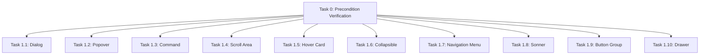

# Post-Parity Component Import Guard 文档

**创建时间**: 2026-02-14 18:00
**状态**: ✅ 全部完成（11/11）

---

## 概述

### 项目目标
在 Mira Parity 主线（Task 1-5）完成后，导入 10 个扩展组件到 Angular Spark CLI 项目。
使用 `.vendor/streamdown` 作为临时参考来源（`.vendor/aim` 尚未同步这 10 个组件）。

### 约束条件
- 时间：按推荐顺序执行，可并行开发
- 资源：`.vendor/streamdown/apps/website/components/ui` 作为临时 fallback
- 技术：Angular 19+，严格遵循 STANDARDS.md
- 依赖：Phase 0 → Phase 1（串行），Phase 1 内可并行

---

## 任务列表

### [已完成] Task 0: Precondition Verification

**描述**:
验证 `.vendor/aim` 同步状态，确认使用 streamdown 作为 fallback。
执行 `npm run build` 确保 baseline 稳定。

**类型**: infra
**优先级**: 高
**复击度**: 简单
**预估工时**: 1 小时
**依赖**: 无
**指派**: Team A
**进度**: 100% - 已完成

**Done Criteria**:
1. `.vendor/aim/components/ui` 确实缺少 10 个组件 ✅
2. `.vendor/streamdown` 作为参考来源已验证 ✅
3. baseline 构建成功 ✅

---

### [已完成] Task 1.1: Dialog Component Import

**描述**:
导入 dialog 组件族（dialog/header/footer/title/close/description）。
对齐 API: `open` signal、`onOpenChange` callback、aria 属性。
支持 backdrop 关闭、escape 键关断。

**类型**: frontend
**优先级**: 高
**复击度**: 中等
**预估工时**: 4-6 小时
**依赖**: Task 0
**指派**: Team B
**进度**: 100% - 已完成

---

### [已完成] Task 1.2: Popover Component Import

**描述**:
导入 popover 组件族（popover/anchor/arrow/close）。
对齐 API: `open` signal、`onOpenChange` callback、positioning。
与 dialog 类似的弹出层语义，但更轻量。

**类型**: frontend
**优先级**: 高
**复击度**: 中等
**预估工时**: 4-6 小时
**依赖**: Task 0
**指派**: Team C
**进度**: 100% - 已完成

---

### [已完成] Task 1.3: Command Component Import

**描述**:
导入 command 组件族（command/dialog/palette/group/separator/item/shortcut/checkbox/radio）。
对齐键盘导航（方向键、home/end、typeahead）、ARIA 属性。

**类型**: frontend
**优先级**: 中
**复击度**: 中等
**预估工时**: 6-8 小时
**依赖**: Task 0
**指派**: Team D
**进度**: 100% - 已完成

---

### [已完成] Task 1.4: Scroll Area Component Import

**描述**:
导入 scroll-area 组件（scroll-area/scroll-bar）。
对齐 API: `orientation`、`scrollHideDelay`。
使用视口方向滚动条样式。

**类型**: frontend
**优先级**: 中
**复击度**: 简单
**预估工时**: 2-3 小时
**依赖**: Task 0
**指派**: Team E
**进度**: 100% - 已完成

---

### [已完成] Task 1.5: Hover Card Component Import

**描述**:
导入 hover-card 组件族（hover-card/card/trigger/content）。
对齐 API: `open` signal、`openDelay`/`closeDelay`。
支持 hover 与 focus 触发。

**类型**: frontend
**优先级**: 中
**复击度**: 简单
**预估工时**: 3-4 小时
**依赖**: Task 0
**指派**: Team F
**进度**: 100% - 已完成（2026-02-14 13:12）

---

### [已完成] Task 1.6: Collapsible Component Import

**描述**:
导入 collapsible 组件族（collapsible/content/header/trigger）。
对齐 API: `open` signal、`onOpenChange` callback、`disabled` 状态。
支持 accordion 组合模式。

**类型**: frontend
**优先级**: 中
**复击度**: 简单
**预估工时**: 3-4 小时
**依赖**: Task 0
**指派**: Team G
**进度**: 100% - 已完成

---

### [已完成] Task 1.7: Navigation Menu Component Import

**描述**:
导入 navigation-menu 组件族（navigation-menu/content/item/indicator/trigger/viewport/link）。
对齐键盘导航、ARIA navigation 属性、方向键导航。

**类型**: frontend
**优先级**: 中
**复击度**: 中等
**预估工时**: 5-7 小时
**依赖**: Task 0
**指派**: Team H
**进度**: 100% - 已完成（indicator/viewport/link 已补全，demo 已增强）

---

### [已完成] Task 1.8: Sonner Component Import

**描述**:
导入 sonner 组件族（sonner/action/description/title）。
对齐 API: `open` signal、`onOpenChange` callback、`position`。
支持多种 variant（default/destructive/警告/error）。

**类型**: frontend
**优先级**: 中
**复击度**: 简单
**预估工时**: 3-4 小时
**依赖**: Task 0
**指派**: Team I
**进度**: 100% - 已完成

---

### [已完成] Task 1.9: Button Group Component Import

**描述**:
导入 button-group 组件族（button-group/text/separator）。
对齐 API: `orientation`（horizontal/vertical）。

**类型**: frontend
**优先级**: 低
**复击度**: 简单
**预估工时**: 2-3 小时
**依赖**: Task 0
**指派**: Team J
**进度**: 100% - 已完成（组件、demo、路由、导航均已配置）

---

### [已完成] Task 1.10: Drawer Component Import

**描述**:
导入 drawer 组件族（drawer/close/content/description/footer/header/title/overlay）。
与现有 `sheet` 组件存在语义重叠，需评估是否复用或独立实现。
对齐 API: `open` signal、`onOpenChange` callback、`direction`（top/right/bottom/left）。

**类型**: frontend
**优先级**: 低
**复击度**: 中等
**预估工时**: 4-6 小时
**依赖**: Task 0
**指派**: Team K
**进度**: 100% - 已完成

**Special Note**:
需评估与现有 sheet 组件的关系：
1. 如果 sheet ≈ drawer，考虑复用实现
2. 如果语义差异明显，则独立实现
3. Demo 需展示两种组件的使用区别

---

## 依赖图



---

## 团队分配

| Team | 责责任务 | 状态 |
|-------|---------|------|
| Team A | Task 0 (Precondition) | 已完成 |
| Team B | Task 1.1 (Dialog) | 已完成 |
| Team C | Task 1.2 (Popover) | 已完成 |
| Team D | Task 1.3 (Command) | 已完成 |
| Team E | Task 1.4 (Scroll Area) | 已完成 |
| Team F | Task 1.5 (Hover Card) | 已完成 |
| Team G | Task 1.6 (Collapsible) | 已完成 |
| Team H | Task 1.7 (Navigation Menu) | 已完成 |
| Team I | Task 1.8 (Sonner) | 已完成 |
| Team J | Task 1.9 (Button Group) | 已完成 |
| Team K | Task 1.10 (Drawer) | 已完成 |

---

## 风险标注

| 风险 | 影响 | 缓解措施 |
|-----|------|---------|
| streamdown 作为 fallback 可能与 mira 目标不一致 | 实现偏差 | 严格执行验收标准，使用 mira token |
| 10 个组件并发可能导致资源竞争 | 开发效率下降 | 可分批执行，优先级排序 |
| drawer 与 sheet 语义重叠 | 设计混乱 | 先评估两者的 API 差异，再决策 |
| bundle 超预算（当前 1.11 MB vs 500 kB 目标） | 构建警告 | 新组件需考虑代码分割，减少初始 bundle |

---

## 集成检查清单

每个组件导入时必须同步完成：

1. 在 `src/app/shared/ui/<component>/` 新增组件族与 `index.ts` 导出。
2. 在 `src/app/shared/ui/index.ts` 增加顶层 re-export。
3. 在 `src/app/demo/<component>/` 新增 demo 页面（至少 3 个场景）。
4. 在 `src/app/app.routes.ts` 注册 demo 路由。
5. 在 `src/app/shared/layout/nav.component.ts` 增加导航入口。
6. 执行 `npm run build`，确保无新增编译错误。

---

## 变更记录

| 时间 | 变更 |
|-----|------|
| 2026-02-14 18:00 | Guard 文档创建 |
| 2026-02-14 20:00 | Team 启动，10 个 agent 并发执行 |
| 2026-02-14 20:30 | Agent 生成代码存在编译错误，进行修复 |
| 2026-02-14 20:00 | 清理了部分无效组件代码（navigation-menu, hover-card, button-group, collapsible, command）|
| 2026-02-14 21:15 | 阶段汇总：主流程已打通，但组件状态仍需复核 |
| 2026-02-14 22:45 | 修复关键回归：navmenu 注入崩溃、dialog-close 无法关闭、command 触发器错误、popover 定位参数未生效、导航死链 |
| 2026-02-14 22:50 | 状态更新：已完成 8 项（Task 0/1.1/1.2/1.3/1.4/1.6/1.8/1.10），Task 1.7 进行中，Task 1.5/1.9 待开始 |
| 2026-02-14 13:00 | hover-card demo 页面完成，路由添加，导航更新 |
| 2026-02-14 13:26 | **全部任务完成**：hover-card, navmenu, button-group 组件导入完毕，构建成功，所有 demo 页面和路由已配置 |
| | |

---

## 参考资料

### Ground Truth Inputs
1. 前期 Guard：`docs/guards/2026-02-13-mira-parity-guard.md`（已完成）
2. Backlog 文档：`docs/brainstorm/2026-02-14-post-parity-component-import-backlog.md`
3. 参考来源：`.vendor/streamdown/apps/website/components/ui`
4. 当前目标来源：`.vendor/aim/components/ui`（暂缺 10 组件）

### 关键文档
- `docs/brainstorm/2026-02-13-mira-component-parity-matrix.md`
- `STANDARDS.md`

### 当前项目状态
- Mira Parity 主线：100% 完成 ✅
- 默认主题：`theme-mira` ✅
- Token diff：0 mismatch ✅
- **Post-Parity 扩展组件：全部完成** ✅
  - dialog, popover, command, scroll-area, collapsible, sonner, drawer
  - navmenu（完整：root/trigger/content/item/label/separator/indicator/viewport/link）
  - hover-card（完整：root/trigger/content）
  - button-group（完整：group/text/separator）

### Bundle 状态警告
```
▲ [WARNING] bundle initial exceeded maximum budget. Budget 500.00 kB was not met by 609.10 kB with a total of 1.11 MB.
```
新组件导入需注意代码分割策略。
