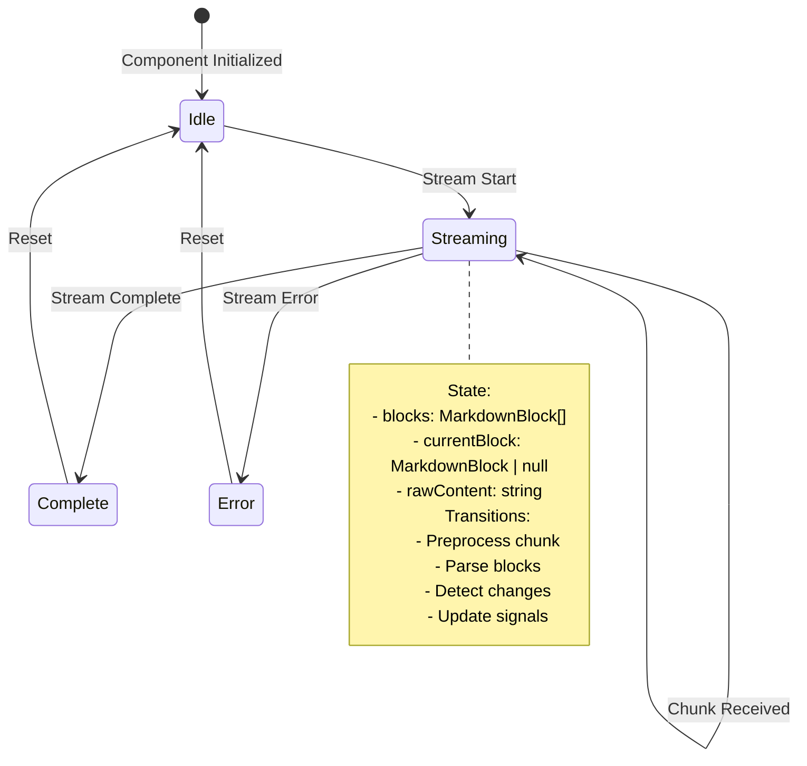
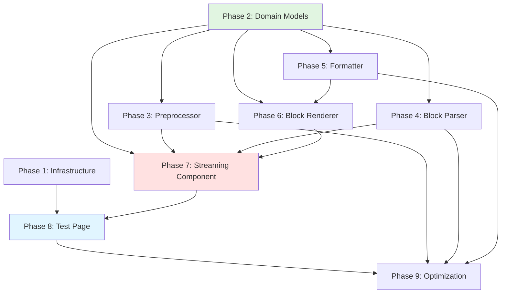

# Streaming Markdown Component - Architectural Implementation Plan

**Goal:** Build a block-based streaming markdown renderer for Angular 20+ that replicates StreamDown's perfect streaming UX
**Architecture:** Block-based streaming with RxJS + Signals hybrid state management

## Master Status Tracker

| Phase | Independence | Dependencies | Status |
| :--- | :--- | :--- | :--- |
| **P1: Project Infrastructure** | High | None | 🔴 To Do |
| **P2: Core Domain Models** | High | None | 🔴 To Do |
| **P3: Preprocessor Service** | Medium | P2 | 🔴 To Do |
| **P4: Block Parser Service** | Medium | P2 | 🔴 To Do |
| **P5: Formatter Service** | Medium | P2 | 🔴 To Do |
| **P6: Block Renderer Component** | Low | P2, P5 | 🔴 To Do |
| **P7: Streaming Component** | Low | P2, P3, P4, P6 | 🔴 To Do |
| **P8: Test Page & Routes** | Low | P7 | 🔴 To Do |
| **P9: Optimization & Testing** | Low | All | 🔴 To Do |

> **Status Legend:** 🔴 To Do, 🟡 In Progress, 🟢 Done

---

## Phase 1: Project Infrastructure

**Independence:** High (Can start immediately)
**Goal:** Set up routes, dependencies, and build configuration

### Task 1.1: Install Dependencies
**Output:** `package.json` updated with new dependencies
**Duration:** 5 minutes

Install required packages:
```json
{
  "dependencies": {
    "marked": "^12.0.0",
    "dompurify": "^3.0.0"
  },
  "devDependencies": {
    "@tailwindcss/typography": "^0.5.10",
    "@types/dompurify": "^3.0.0"
  }
}
```

### Task 1.2: Configure Tailwind Typography Plugin
**Output:** Updated `tailwind.config.js`
**Duration:** 5 minutes

```javascript
module.exports = {
  content: ['./src/**/*.{html,ts}'],
  theme: { extend: {} },
  plugins: [require('@tailwindcss/typography')]
};
```

### Task 1.3: Create Route Structure
**Output:** `src/app/app.routes.ts` and `src/app/test/` directory
**Duration:** 10 minutes

Files to create:
- `src/app/app.routes.ts` - Root routes with `/test` lazy loading
- `src/app/test/test.routes.ts` - Test route configuration
- `src/app/test/test.component.ts` - Stub component
- `src/app/test/test.component.html` - Stub template

**Checkpoint:** Can navigate to `/test` route (shows empty page)

---

## Phase 2: Core Domain Models

**Independence:** High (Can start immediately)
**Goal:** Define all types, interfaces, and domain models

### Task 2.1: Define Block Type Enum
**Output:** `src/app/shared/components/streaming-markdown/core/models.ts`
**Duration:** 10 minutes

```typescript
export enum BlockType {
  PARAGRAPH = 'paragraph',
  HEADING = 'heading',
  CODE_BLOCK = 'code',
  LIST = 'list',
  BLOCKQUOTE = 'blockquote',
  THEMATIC_BREAK = 'hr',
  HTML = 'html'
}
```

### Task 2.2: Define MarkdownBlock Interface
**Output:** Extend `models.ts`
**Duration:** 10 minutes

```typescript
export interface MarkdownBlock {
  id: string;              // Unique identifier (UUID)
  type: BlockType;         // Block type enum
  content: string;         // Block content (markdown text)
  isComplete: boolean;     // Completion status
  position: number;        // Position in document
  level?: number;          // For headings (1-6)
  language?: string;       // For code blocks
}
```

### Task 2.3: Define StreamingState Interface
**Output:** Extend `models.ts`
**Duration:** 10 minutes

```typescript
export interface StreamingState {
  blocks: MarkdownBlock[];            // Completed blocks
  currentBlock: MarkdownBlock | null; // Current streaming block
  rawContent: string;                 // Accumulated raw text
}
```

### Task 2.4: Define ParserResult Interface
**Output:** Extend `models.ts`
**Duration:** 5 minutes

```typescript
export interface ParserResult {
  blocks: MarkdownBlock[];
  hasIncompleteBlock: boolean;
}
```

### Task 2.5: Create Empty State Factory
**Output:** Extend `models.ts`
**Duration:** 5 minutes

```typescript
export const createEmptyState = (): StreamingState => ({
  blocks: [],
  currentBlock: null,
  rawContent: ''
});
```

**Checkpoint:** `models.ts` compiles successfully with all types exported

---

## Phase 3: Preprocessor Service

**Independence:** Medium (Depends on P2 for types)
**Goal:** Implement markdown syntax self-healing (remend-like)

### Task 3.1: Define MarkdownPreprocessor Interface
**Output:** `src/app/shared/components/streaming-markdown/core/markdown-preprocessor.ts`
**Duration:** 10 minutes

```typescript
export interface IMarkdownPreprocessor {
  process(text: string): string;
}

export class MarkdownPreprocessor implements IMarkdownPreprocessor {
  process(text: string): string {
    // Implementation in later phase
    return text;
  }
}
```

### Task 3.2: Define UnclosedMarkerDetector Interface
**Output:** Extend `markdown-preprocessor.ts`
**Duration:** 10 minutes

```typescript
interface MarkerMatch {
  marker: string;
  startIndex: number;
  endIndex: number;
  isClosed: boolean;
}

interface IMarkerDetector {
  detectUnclosedMarkers(text: string): MarkerMatch[];
  closeMarkers(text: string, matches: MarkerMatch[]): string;
}
```

### Task 3.3: Define Marker Priority Configuration
**Output:** Extend `markdown-preprocessor.ts`
**Duration:** 10 minutes

```typescript
type MarkerType = 'code_block' | 'math_block' | 'link' | 'bold' | 'italic' | 'strikethrough';

interface MarkerRule {
  type: MarkerType;
  opening: string;
  closing: string;
  priority: number;
}

const MARKER_RULES: readonly MarkerRule[] = [
  { type: 'code_block', opening: '```', closing: '```', priority: 0 },
  { type: 'math_block', opening: '$$', closing: '$$', priority: 10 },
  // ... more rules
] as const;
```

**Checkpoint:** Service interface compiles, can be instantiated with stub implementation

---

## Phase 4: Block Parser Service

**Independence:** Medium (Depends on P2 for types)
**Goal:** Implement block parsing and splitting logic

### Task 4.1: Define BlockParser Interface
**Output:** `src/app/shared/components/streaming-markdown/core/block-parser.ts`
**Duration:** 10 minutes

```typescript
export interface IBlockParser {
  parse(text: string): ParserResult;
  parseIncremental(previousText: string, newText: string): ParserResult;
}

export class BlockParser implements IBlockParser {
  parse(text: string): ParserResult {
    // Stub implementation
    return { blocks: [], hasIncompleteBlock: false };
  }

  parseIncremental(previousText: string, newText: string): ParserResult {
    // Stub implementation
    return { blocks: [], hasIncompleteBlock: false };
  }
}
```

### Task 4.2: Define TokenMergeStrategy Interface
**Output:** Extend `block-parser.ts`
**Duration:** 10 minutes

```typescript
import { marked } from 'marked';

type MarkedToken = marked.Token;

interface TokenMergeStrategy {
  canMerge(token: MarkedToken, nextToken: MarkedToken): boolean;
  merge(tokens: MarkedToken[]): MarkdownBlock;
}
```

### Task 4.3: Define BlockFactory Interface
**Output:** Extend `block-parser.ts`
**Duration:** 10 minutes

```typescript
interface IBlockFactory {
  createParagraph(content: string, position: number): MarkdownBlock;
  createHeading(content: string, level: number, position: number): MarkdownBlock;
  createCodeBlock(content: string, language: string | null, position: number): MarkdownBlock;
  createList(items: string[], position: number): MarkdownBlock;
  createBlockquote(content: string, position: number): MarkdownBlock;
  createHr(position: number): MarkdownBlock;
  createHtmlBlock(content: string, position: number): MarkdownBlock;
}
```

### Task 4.4: Define ParsingState Interface
**Output:** Extend `block-parser.ts`
**Duration:** 10 minutes

```typescript
interface ParsingState {
  blocks: MarkdownBlock[];
  currentBuffer: string;
  inCodeBlock: boolean;
  inHtmlBlock: boolean;
  codeBlockLanguage?: string;
}
```

**Checkpoint:** Parser interface compiles, can be instantiated with stub returning empty ParserResult

---

## Phase 5: Formatter Service

**Independence:** Medium (Depends on P2 for types)
**Goal:** Implement markdown to HTML conversion with sanitization

### Task 5.1: Define MarkdownFormatterService Interface
**Output:** `src/app/shared/components/streaming-markdown/renderers/markdown-formatter.service.ts`
**Duration:** 10 minutes

```typescript
export interface IMarkdownFormatter {
  format(block: MarkdownBlock): string;
  formatInline(text: string): string;
}

@Injectable({ providedIn: 'root' })
export class MarkdownFormatterService implements IMarkdownFormatter {
  format(block: MarkdownBlock): string {
    // Stub: return sanitized HTML
    return '';
  }

  formatInline(text: string): string {
    // Stub: return sanitized HTML
    return '';
  }
}
```

### Task 5.2: Define HTMLSanitizer Interface
**Output:** Extend `markdown-formatter.service.ts`
**Duration:** 10 minutes

```typescript
import DOMPurify from 'dompurify';

interface IHTMLSanitizer {
  sanitize(html: string): string;
  sanitizeWithConfig(html: string, config: DOMPurify.Config): string;
}

class HTMLSanitizer implements IHTMLSanitizer {
  sanitize(html: string): string {
    return DOMPurify.sanitize(html);
  }

  sanitizeWithConfig(html: string, config: DOMPurify.Config): string {
    return DOMPurify.sanitize(html, config);
  }
}
```

### Task 5.3: Define MarkedConfig Interface
**Output:** Extend `markdown-formatter.service.ts`
**Duration:** 5 minutes

```typescript
interface FormatterConfig {
  enableGfm: boolean;
  enableBreaks: boolean;
  sanitize: boolean;
}
```

**Checkpoint:** Formatter service compiles, can be injected, returns empty strings

---

## Phase 6: Block Renderer Component

**Independence:** Low (Depends on P2, P5)
**Goal:** Create component for rendering individual blocks

### Task 6.1: Define BlockRendererComponent Interface
**Output:** `src/app/shared/components/streaming-markdown/renderers/block-renderer.component.ts`
**Duration:** 15 minutes

```typescript
@Component({
  selector: 'app-block-renderer',
  standalone: true,
  imports: [CommonModule],
  changeDetection: ChangeDetectionStrategy.OnPush,
  template: `
    <div [class]="containerClasses" [attr.data-block-type]="block.type">
      <!-- Template implementation in later phase -->
      <div [innerHTML]="formattedContent"></div>
    </div>
  `
})
export class BlockRendererComponent {
  @Input() block!: MarkdownBlock;
  @Input() isComplete: boolean = true;

  // Signals and computed properties
  protected formattedContent = computed(() => '');
  protected containerClasses = computed(() => '');
}
```

### Task 6.2: Define StyleMapping Interface
**Output:** Extend `block-renderer.component.ts`
**Duration:** 10 minutes

```typescript
interface BlockStyleClasses {
  container: string;
  content: string;
  streaming?: string;
}

type BlockTypeToClasses = Record<BlockType, BlockStyleClasses>;
```

### Task 6.3: Define ComponentState Interface
**Output:** Extend `block-renderer.component.ts`
**Duration:** 5 minutes

```typescript
interface ComponentState {
  block: MarkdownBlock;
  isComplete: boolean;
  formattedHtml: string;
}
```

**Checkpoint:** Component compiles, can be used in template with stub rendering

---

## Phase 7: Streaming Component

**Independence:** Low (Depends on P2, P3, P4, P6)
**Goal:** Create main streaming component with RxJS pipeline

### Task 7.1: Define StreamingMarkdownComponent Interface
**Output:** `src/app/shared/components/streaming-markdown/streaming-markdown.component.ts`
**Duration:** 15 minutes

```typescript
@Component({
  selector: 'app-streaming-markdown',
  standalone: true,
  imports: [BlockRendererComponent, CommonModule],
  changeDetection: ChangeDetectionStrategy.OnPush,
  template: `
    <div class="streaming-markdown-container">
      <app-block-renderer
        *ngFor="let block of blocks(); trackBy: trackById"
        [block]="block"
        [isComplete]="true" />

      @if (currentBlock()) {
        <app-block-renderer
          [block]="currentBlock()"
          [isComplete]="false" />
      }
    </div>
  `
})
export class StreamingMarkdownComponent implements OnInit {
  @Input() stream$!: Observable<string>;

  // Signals
  protected blocks = computed(() => [] as MarkdownBlock[]);
  protected currentBlock = computed(() => null as MarkdownBlock | null);

  // Dependencies
  constructor(
    private preprocessor: IMarkdownPreprocessor,
    private parser: IBlockParser,
    private cdr: ChangeDetectorRef
  ) {}

  ngOnInit(): void {
    // RxJS pipeline setup in later phase
  }

  trackById(index: number, block: MarkdownBlock): string {
    return block.id;
  }
}
```

### Task 7.2: Define RxJS Pipeline Interface
**Output:** Extend `streaming-markdown.component.ts`
**Duration:** 10 minutes

```typescript
interface PipelineConfig {
  debounceTime?: number;
  enableChangeDetectionOptimization: boolean;
}

interface StreamingPipeline {
  processedState$: Signal<StreamingState>;
  destroy$: Subject<void>;
}
```

### Task 7.3: Define ChangeDetectionStrategy Interface
**Output:** Extend `streaming-markdown.component.ts`
**Duration:** 10 minutes

```typescript
interface BlockDiff {
  added: MarkdownBlock[];
  updated: MarkdownBlock[];
  removed: string[]; // block ids
}

interface IChangeDetector {
  detectChanges(previous: ParserResult, current: ParserResult): BlockDiff;
}
```

**Checkpoint:** Component compiles, can accept @Input stream$, renders empty container

---

## Phase 8: Test Page & Routes

**Independence:** Low (Depends on P7)
**Goal:** Create test page with mock AI API

### Task 8.1: Define MockAIApi Interface
**Output:** `src/app/test/mock-ai.service.ts`
**Duration:** 10 minutes

```typescript
interface IMockAIApi {
  streamMarkdown(): Observable<string>;
  streamMarkdownWithPattern(pattern: StreamPattern): Observable<string>;
}

type StreamPattern =
  | { type: 'simple'; content: string }
  | { type: 'chunks'; chunks: string[]; delay: number };

@Injectable({ providedIn: 'root' })
export class MockAIApi implements IMockAIApi {
  streamMarkdown(): Observable<string> {
    // Stub implementation
    return new Observable<string>();
  }
}
```

### Task 8.2: Define TestComponent Interface
**Output:** `src/app/test/test.component.ts`
**Duration:** 15 minutes

```typescript
@Component({
  selector: 'app-test',
  standalone: true,
  imports: [StreamingMarkdownComponent, CommonModule],
  template: `
    <div class="test-container">
      <h1>Streaming Markdown Demo</h1>

      <div class="controls">
        <button (click)="startStreaming()">Start Streaming</button>
        <button (click)="stopStreaming()">Stop</button>
        <button (click)="reset()">Reset</button>
      </div>

      <app-streaming-markdown [stream$]="aiStream$"></app-streaming-markdown>
    </div>
  `
})
export class TestComponent {
  aiStream$ = new Observable<string>();

  constructor(private mockApi: IMockAIApi) {}

  startStreaming(): void {
    this.aiStream$ = this.mockApi.streamMarkdown();
  }

  stopStreaming(): void {
    // Implementation in later phase
  }

  reset(): void {
    // Implementation in later phase
  }
}
```

### Task 8.3: Define StreamControl Interface
**Output:** Extend `test.component.ts`
**Duration:** 5 minutes

```typescript
interface StreamControl {
  start(): void;
  stop(): void;
  reset(): void;
  isActive(): boolean;
}
```

**Checkpoint:** Test page renders, buttons visible, component displays but no streaming yet

---

## Phase 9: Optimization & Testing

**Independence:** Low (Depends on all phases)
**Goal:** Performance optimization and testing

### Task 9.1: Define Performance Metrics Interface
**Output:** `src/app/shared/components/streaming-markdown/core/performance-monitor.ts`
**Duration:** 10 minutes

```typescript
interface PerformanceMetrics {
  averageRenderTime: number;
  blockCount: number;
  memoryUsage?: number;
}

interface IPerformanceMonitor {
  startMeasure(): void;
  endMeasure(): PerformanceMetrics;
  reset(): void;
}
```

### Task 9.2: Define UnitTest Interfaces
**Output:** Test files for each service
**Duration:** 15 minutes

```typescript
// Test interface definitions
describe('MarkdownPreprocessor', () => {
  interface TestCase {
    input: string;
    expected: string;
    description: string;
  }

  const testCases: TestCase[] = [
    // Test cases defined here
  ];
});

describe('BlockParser', () => {
  interface ParseTestCase {
    input: string;
    expectedBlockCount: number;
    description: string;
  }
});

describe('MarkdownFormatterService', () => {
  interface FormatTestCase {
    input: MarkdownBlock;
    shouldContain: string[];
    description: string;
  }
});
```

### Task 9.3: Define IntegrationTest Interfaces
**Output:** `src/app/shared/components/streaming-markdown/streaming-markdown.component.spec.ts`
**Duration:** 15 minutes

```typescript
interface StreamingTestCase {
  chunks: string[];
  expectedFinalBlocks: number;
  description: string;
}

interface IntegrationTestSuite {
  simpleParagraph: StreamingTestCase;
  headingThenParagraph: StreamingTestCase;
  codeBlock: StreamingTestCase;
  incompleteBold: StreamingTestCase;
}
```

**Checkpoint:** All test files compile with interface definitions, ready for test implementation

---

## State Machine: Streaming Lifecycle



---

## Dependency Graph



---

## Parallel Execution Opportunities

**Can be built simultaneously (High Independence):**
- P1 (Infrastructure) + P2 (Domain Models) → Start these together
- P3 (Preprocessor) + P4 (Block Parser) + P5 (Formatter) → After P2 completes

**Sequential execution required (Low Independence):**
- P6 → P7 → P8 → P9 (Must wait for dependencies)

---

## Compilation Checkpoints

✅ **After Phase 1:** Can navigate to `/test`, see empty page
✅ **After Phase 2:** All TypeScript types compile, exported properly
✅ **After Phase 3:** Preprocessor can be injected, returns stub output
✅ **After Phase 4:** Parser can be injected, returns empty ParserResult
✅ **After Phase 5:** Formatter can be injected, returns empty strings
✅ **After Phase 6:** BlockRenderer can be used in templates, renders stub
✅ **After Phase 7:** StreamingComponent accepts stream$, renders container
✅ **After Phase 8:** Test page functional with mock API
✅ **After Phase 9:** All tests pass, performance optimized

---

## Implementation Order (Recommended)

**Sprint 1:** P1 + P2 (Foundation)
**Sprint 2:** P3 + P4 + P5 (Core Services)
**Sprint 3:** P6 + P7 (Components)
**Sprint 4:** P8 (Test Page)
**Sprint 5:** P9 (Polish)

---

## Notes

- **No Logic Implementation:** This plan defines interfaces and types only. Function bodies come during implementation.
- **Compilation-First:** Every task ensures the code compiles, even with stub implementations.
- **Incremental Progress:** Each phase adds buildable, type-safe code.
- **Parallel-Ready:** Phases with High independence can be assigned to concurrent subagents.
