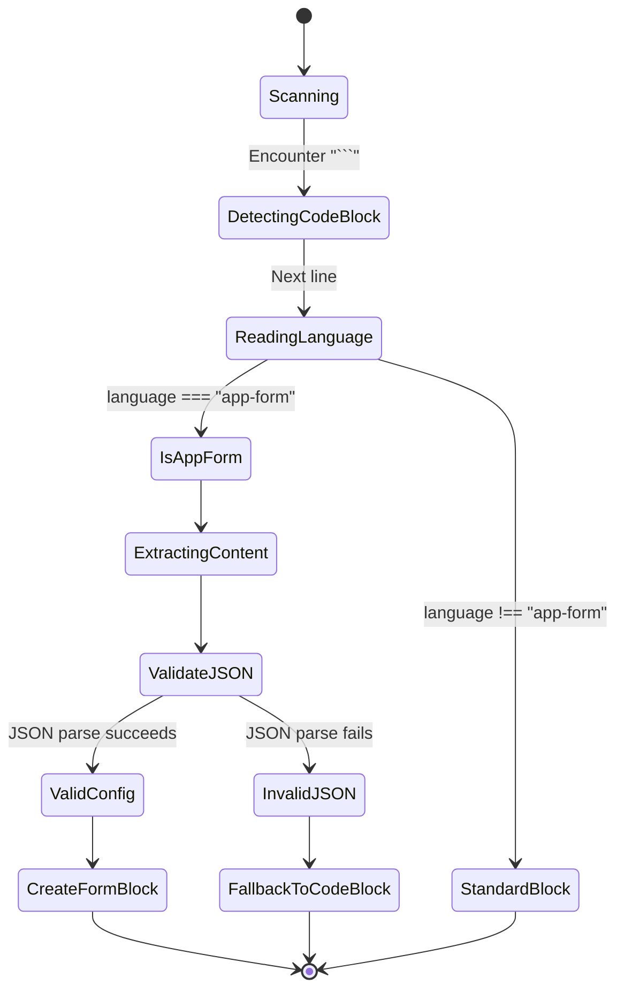
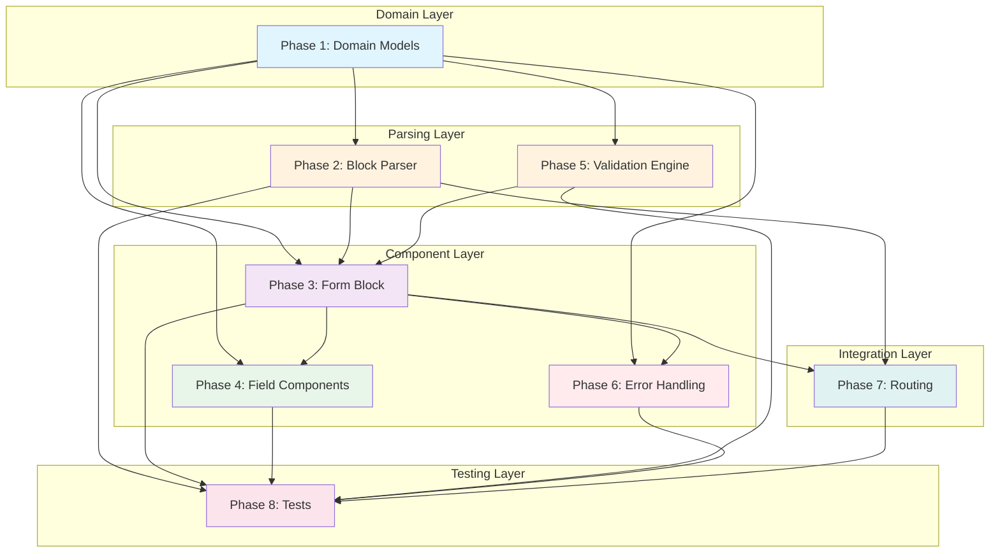
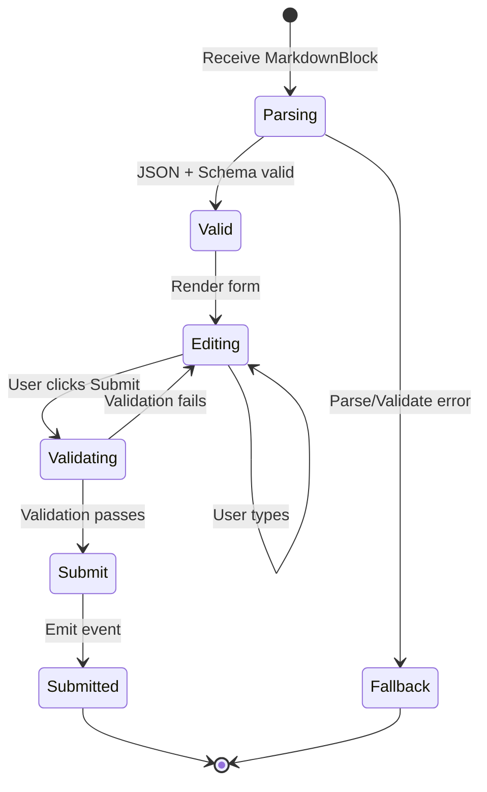
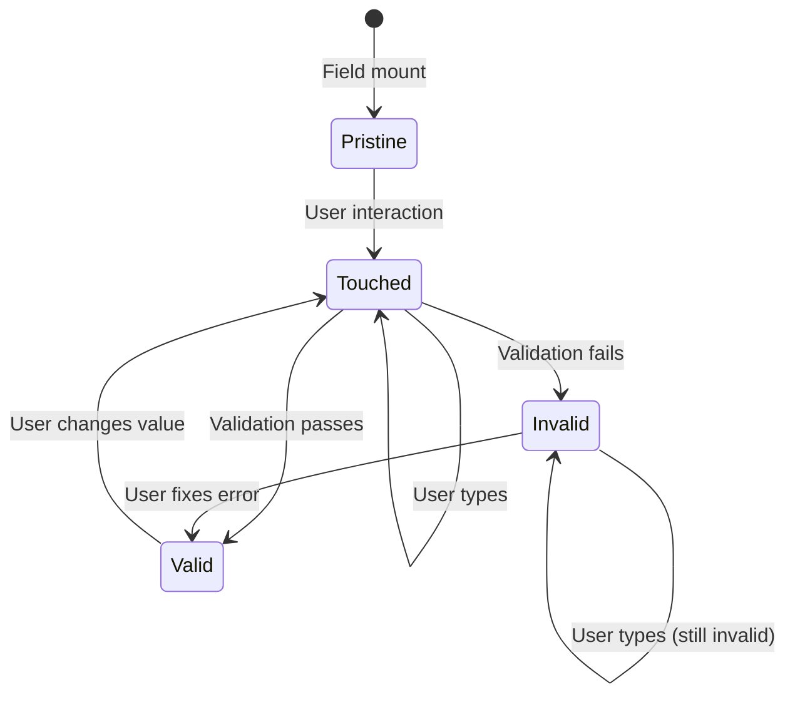
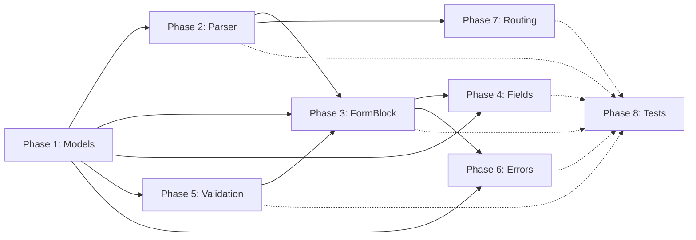

# Streaming Form Block - Architectural Implementation Plan

**Goal:** Extend streaming-markdown component to recognize and render interactive forms from `app-form` code blocks using simple JSON configuration.

**Architecture:** Component-based architecture with template slot pattern, graceful degradation, and type-safe domain models.

**Date:** 2025-02-03
**Status:** Ready for Implementation
**MVP Scope:** Phase 1 - Basic JSON Configuration with 6 field types

---

## Master Status Tracker

| Phase | Independence | Dependencies | Status |
| :--- | :--- | :--- | :--- |
| **P1: Core Domain Models** | High | None | 🔴 To Do |
| **P2: Block Parser Extension** | High | P1 | 🔴 To Do |
| **P3: Form Block Component** | Medium | P1, P2 | 🔴 To Do |
| **P4: Field Components** | Medium | P1, P3 | 🔴 To Do |
| **P5: Validation Engine** | High | P1 | 🔴 To Do |
| **P6: Error Handling & Fallback** | Low | P1, P2, P3, P5 | 🔴 To Do |
| **P7: Integration & Routing** | Low | P2, P3 | 🔴 To Do |
| **P8: Testing Suite** | Low | All Phases | 🔴 To Do |

> **Status Legend:** 🔴 To Do, 🟡 In Progress, 🟢 Done
> **Independence:** High = Can be built in parallel with other High phases

---

## Phase 1: Core Domain Models

**Independence:** High | **Dependencies:** None | **Estimated Tasks:** 3

Define the type system and domain interfaces that drive the entire feature. This is the foundation - all other phases consume these types.

### Task 1.1: Form Configuration Types
**Output:** `src/app/shared/components/streaming-markdown/blocks/form-block/types/form-config.interface.ts`

```typescript
// Form configuration (parsed from JSON)
export interface FormConfig {
  title: string;
  fields: FormField[];
}

// Individual field definition
export interface FormField {
  name: string;
  label: string;
  type: FieldType;
  required?: boolean;
  options?: string[];  // For select/radio/checkbox
}

// Supported field types (MVP)
export type FieldType =
  | 'text'       // Single-line text input
  | 'email'      // Email input with validation
  | 'textarea'   // Multi-line text input
  | 'select'     // Dropdown (single select)
  | 'radio'      // Radio button group (single select)
  | 'checkbox';  // Checkbox group (multi-select)

// Form submission data
export interface FormSubmitData {
  [fieldName: string]: string | string[];
  // Example: { name: "张三", hobbies: ["阅读", "运动"] }
}
```

**Checkpoint:** TypeScript compiles, no implementation logic needed.

---

### Task 1.2: Markdown Block Types
**Output:** `src/app/shared/components/streaming-markdown/core/types/block.type.ts`

```typescript
// Extend existing block types to include app-form
export type MarkdownBlockType =
  | 'app-form'    // NEW: Interactive form block
  | 'code'        // Standard code block
  | 'heading'
  | 'paragraph'
  | 'list'
  // ... existing types

// Block data structure
export interface MarkdownBlock {
  id: string;
  type: MarkdownBlockType;
  content: string;  // JSON string for app-form
  metadata?: Record<string, unknown>;
  language?: string;  // For code blocks: 'app-form', 'typescript', etc.
}
```

**Checkpoint:** TypeScript compiles, extends existing type system.

---

### Task 1.3: Error State Types
**Output:** `src/app/shared/components/streaming-markdown/blocks/form-block/types/form-errors.interface.ts`

```typescript
// Error types for form handling
export enum FormErrorType {
  JSON_PARSE_ERROR = 'JSON_PARSE_ERROR',
  CONFIG_VALIDATION_ERROR = 'CONFIG_VALIDATION_ERROR',
  UNSUPPORTED_FIELD_TYPE = 'UNSUPPORTED_FIELD_TYPE',
  VALIDATION_ERROR = 'VALIDATION_ERROR',
  SUBMISSION_ERROR = 'SUBMISSION_ERROR'
}

// Form error state
export interface FormError {
  type: FormErrorType;
  message: string;
  fieldName?: string;  // For field-level validation errors
  originalContent?: string;  // For fallback display
}

// Validation result
export interface ValidationResult {
  isValid: boolean;
  errors: ValidationError[];
}

export interface ValidationError {
  fieldName: string;
  message: string;
}
```

**Checkpoint:** TypeScript compiles, enum and interfaces defined.

---

## Phase 2: Block Parser Extension

**Independence:** High | **Dependencies:** P1 | **Estimated Tasks:** 2

Extend the existing markdown parser to recognize and handle `app-form` code blocks.

### Task 2.1: App-Form Block Detection
**Output:** `src/app/shared/components/streaming-markdown/core/block-parser.ts` (modify)

**Interface Definition:**
```typescript
export interface CodeBlockMatch {
  language: string;
  content: string;
  startIndex: number;
  endIndex: number;
}

export interface BlockParseResult {
  block: MarkdownBlock;
  remainingText: string;
}
```

**State Machine:**


**Function Signature:**
```typescript
export class BlockParser {
  /**
   * Parse a potential app-form code block
   * @param text - Markdown text to parse
   * @param startIndex - Starting position in text
   * @returns BlockParseResult or null if not an app-form block
   */
  parseAppFormBlock(
    text: string,
    startIndex: number
  ): BlockParseResult | null {
    // Implementation in next phase
    throw new Error('Not implemented');
  }
}
```

**Checkpoint:** TypeScript compiles, signatures defined.

---

### Task 2.2: JSON Validation Schema
**Output:** `src/app/shared/components/streaming-markdown/blocks/form-block/core/form-config.validator.ts`

**Interface:**
```typescript
export interface ValidationResult {
  isValid: boolean;
  errors: string[];
}

export class FormConfigValidator {
  /**
   * Validate FormConfig structure
   * @param config - Parsed JSON object
   * @returns Validation result with error messages
   */
  static validate(config: unknown): ValidationResult {
    // Implementation in next phase
    throw new Error('Not implemented');
  }

  /**
   * Check if field type is supported
   * @param type - Field type string
   */
  static isSupportedFieldType(type: string): boolean {
    // Implementation in next phase
    throw new Error('Not implemented');
  }
}
```

**Checkpoint:** TypeScript compiles, class skeleton ready.

---

## Phase 3: Form Block Component

**Independence:** Medium | **Dependencies:** P1, P2 | **Estimated Tasks:** 3

Create the main form block component that renders the parsed form configuration.

### Task 3.1: Component Shell & Signals
**Output:** `src/app/shared/components/streaming-markdown/blocks/form-block/form-block.component.ts`

**Component Interface:**
```typescript
@Component({
  selector: 'app-form-block',
  standalone: true,
  templateUrl: './form-block.component.html',
  styleUrls: ['./form-block.component.css']
})
export class FormBlockComponent implements OnInit {
  // Inputs
  @Input() block!: MarkdownBlock;
  @Input() isComplete!: boolean;

  // Outputs
  @Output() formSubmit = new EventEmitter<FormSubmitData>();
  @Output() formCancel = new EventEmitter<void>();

  // State
  protected config = signal<FormConfig | null>(null);
  protected formData = signal<FormSubmitData>({});
  protected errors = signal<ValidationError[]>([]);
  protected isLoading = signal<boolean>(false);
  protected fallbackMode = signal<boolean>(false);

  // Lifecycle
  ngOnInit(): void {
    this.parseBlockContent();
  }

  // Core methods (signatures only)
  protected parseBlockContent(): void {
    throw new Error('Not implemented');
  }

  protected updateField(fieldName: string, value: string | string[]): void {
    throw new Error('Not implemented');
  }

  protected handleSubmit(): void {
    throw new Error('Not implemented');
  }

  protected handleCancel(): void {
    throw new Error('Not implemented');
  }
}
```

**Checkpoint:** TypeScript compiles, component structure ready.

---

### Task 3.2: Template Structure
**Output:** `src/app/shared/components/streaming-markdown/blocks/form-block/form-block.component.html`

```html
<!-- Form Block Template -->
<div class="form-block-container" [class.fallback-mode]="fallbackMode()">

  <!-- Error / Fallback Display -->
  @if (fallbackMode()) {
    <div class="form-error">
      <span class="error-icon">⚠️</span>
      <span class="error-message">表单配置无效，无法解析</span>
      <pre class="fallback-code"><code>{{ block.content }}</code></pre>
    </div>
  }

  <!-- Form Display -->
  @if (config() && !fallbackMode()) {
    <form class="streaming-form" (ngSubmit)="handleSubmit()">
      <!-- Form Title -->
      <h3 class="form-title">{{ config()!.title }}</h3>

      <!-- Form Fields -->
      @for (field of config()!.fields; track field.name) {
        <div class="form-field" [class.required]="field.required">
          <app-field-renderer
            [field]="field"
            [value]="formData()[field.name]"
            [error]="getFieldError(field.name)"
            (valueChange)="updateField(field.name, $event)" />
        </div>
      }

      <!-- Form Actions -->
      <div class="form-actions">
        <button
          type="submit"
          [disabled]="isLoading()"
          class="submit-btn">
          @if (isLoading()) { 提交中... } @else { 提交 }
        </button>
        <button
          type="button"
          (click)="handleCancel()"
          class="cancel-btn">
          取消
        </button>
      </div>
    </form>
  }
</div>
```

**Checkpoint:** Template compiles with Angular signals syntax.

---

### Task 3.3: Styles with Design System
**Output:** `src/app/shared/components/streaming-markdown/blocks/form-block/form-block.component.css`

```css
/* Use CSS variables from design system */
.form-block-container {
  --form-bg: var(--background);
  --form-border: var(--border);
  --form-text: var(--foreground);
  --form-primary: var(--primary);

  background: var(--form-bg);
  border: 1px solid var(--form-border);
  border-radius: var(--radius-md);
  padding: var(--spacing-lg);
  margin: var(--spacing-md) 0;
}

/* Additional styles... */
```

**Checkpoint:** CSS compiles with design system variables.

---

## Phase 4: Field Components

**Independence:** Medium | **Dependencies:** P1, P3 | **Estimated Tasks:** 7

Create individual field type components and the dispatcher router.

### Task 4.1: Base Field Component Interface
**Output:** `src/app/shared/components/streaming-markdown/blocks/form-block/fields/base-field.interface.ts`

```typescript
export interface BaseFieldComponent {
  @Input() field: FormField;
  @Input() value: string | string[];
  @Input() error?: string;
  @Output() valueChange: EventEmitter<string | string[]>;
}
```

**Checkpoint:** TypeScript compiles.

---

### Task 4.2: Field Renderer Dispatcher
**Output:** `src/app/shared/components/streaming-markdown/blocks/form-block/fields/field-renderer.component.ts`

**Component Interface:**
```typescript
@Component({
  selector: 'app-field-renderer',
  standalone: true,
  templateUrl: './field-renderer.component.html'
})
export class FieldRendererComponent {
  @Input() field!: FormField;
  @Input() value: string | string[] = '';
  @Input() error?: string;
  @Output() valueChange = new EventEmitter<string | string[]>();

  // Field type mapping (signals or switch)
  protected getComponent() {
    // Implementation uses @Switch or dynamic component loader
    throw new Error('Not implemented');
  }
}
```

**Checkpoint:** TypeScript compiles, dispatcher shell ready.

---

### Task 4.3-4.8: Individual Field Components (6 types)

**Components to Create:**
- 4.3: `text-field.component.ts` - Text input
- 4.4: `email-field.component.ts` - Email input
- 4.5: `textarea-field.component.ts` - Multi-line text
- 4.6: `select-field.component.ts` - Dropdown
- 4.7: `radio-field.component.ts` - Radio button group
- 4.8: `checkbox-field.component.ts` - Checkbox group

**Template for all field components:**
```typescript
@Component({
  selector: 'app-text-field',
  standalone: true,
  templateUrl: './text-field.component.html'
})
export class TextFieldComponent {
  @Input() field!: FormField;
  @Input() value: string = '';
  @Input() error?: string;
  @Output() valueChange = new EventEmitter<string>();

  protected handleInput(event: Event): void {
    // Implementation in next phase
    throw new Error('Not implemented');
  }
}
```

**Checkpoint:** TypeScript compiles for all 6 field components.

---

## Phase 5: Validation Engine

**Independence:** High | **Dependencies:** P1 | **Estimated Tasks:** 2

Implement form validation logic independent of UI components.

### Task 5.1: Validation Rules Engine
**Output:** `src/app/shared/components/streaming-markdown/blocks/form-block/core/validation-rules.ts`

**Interface:**
```typescript
export interface ValidationRule {
  validate(value: string | string[], field: FormField): ValidationResult;
}

export class ValidationEngine {
  /**
   * Validate all form fields
   * @param formData - Current form data
   * @param config - Form configuration
   * @returns Validation result with all errors
   */
  static validateForm(
    formData: FormSubmitData,
    config: FormConfig
  ): ValidationResult {
    throw new Error('Not implemented');
  }

  /**
   * Validate single field
   * @param fieldName - Field name
   * @param value - Field value
   * @param field - Field configuration
   */
  static validateField(
    fieldName: string,
    value: string | string[],
    field: FormField
  ): ValidationResult {
    throw new Error('Not implemented');
  }
}
```

**Checkpoint:** TypeScript compiles, validation signatures ready.

---

### Task 5.2: Built-in Validators
**Output:** `src/app/shared/components/streaming-markdown/blocks/form-block/core/validators/`

**Validators to Implement:**
```typescript
// RequiredValidator
export class RequiredValidator {
  static validate(value: string | string[]): boolean {
    throw new Error('Not implemented');
  }
}

// EmailValidator
export class EmailValidator {
  static validate(value: string): boolean {
    throw new Error('Not implemented');
  }
}

// OptionsValidator (for select/radio/checkbox)
export class OptionsValidator {
  static validate(value: string | string[], options: string[]): boolean {
    throw new Error('Not implemented');
  }
}
```

**Checkpoint:** TypeScript compiles, validator class skeletons ready.

---

## Phase 6: Error Handling & Fallback

**Independence:** Low | **Dependencies:** P1, P2, P3, P5 | **Estimated Tasks:** 2

Implement graceful error handling and fallback display mechanism.

### Task 6.1: Error Handler Service
**Output:** `src/app/shared/components/streaming-markdown/blocks/form-block/core/form-error-handler.ts`

**Interface:**
```typescript
export class FormErrorHandler {
  /**
   * Handle JSON parse error
   * @param error - Parse error
   * @param originalContent - Original block content
   * @returns FormError for fallback display
   */
  static handleParseError(
    error: SyntaxError,
    originalContent: string
  ): FormError {
    throw new Error('Not implemented');
  }

  /**
   * Handle config validation error
   * @param errors - Validation errors
   * @param originalContent - Original block content
   */
  static handleValidationError(
    errors: string[],
    originalContent: string
  ): FormError {
    throw new Error('Not implemented');
  }

  /**
   * Handle unsupported field type
   * @param typeName - Invalid type name
   * @param fieldName - Field name
   */
  static handleUnsupportedType(
    typeName: string,
    fieldName: string
  ): FormError {
    throw new Error('Not implemented');
  }
}
```

**Checkpoint:** TypeScript compiles, error handler signatures ready.

---

### Task 6.2: Fallback Display Component
**Output:** `src/app/shared/components/streaming-markdown/blocks/form-block/fallback-display.component.ts`

**Component Interface:**
```typescript
@Component({
  selector: 'app-fallback-display',
  standalone: true,
  templateUrl: './fallback-display.component.html'
})
export class FallbackDisplayComponent {
  @Input() error!: FormError;

  protected get errorMessage(): string {
    // Format error for display
    throw new Error('Not implemented');
  }

  protected get showCodeBlock(): boolean {
    // Determine if original content should be shown
    throw new Error('Not implemented');
  }
}
```

**Checkpoint:** TypeScript compiles, fallback component shell ready.

---

## Phase 7: Integration & Routing

**Independence:** Low | **Dependencies:** P2, P3 | **Estimated Tasks:** 2

Wire the form block into the existing streaming-markdown component router.

### Task 7.1: Block Router Integration
**Output:** `src/app/shared/components/streaming-markdown/core/block-router.ts` (modify)

**Interface Definition:**
```typescript
export type BlockComponent =
  | FormBlockComponent      // NEW
  | CodeBlockComponent
  | HeadingComponent
  // ... existing blocks

export class BlockRouter {
  /**
   * Route block to appropriate component
   * @param block - Markdown block to route
   * @returns Component type to render
   */
  route(block: MarkdownBlock): Type<BlockComponent> {
    // Implementation in next phase
    throw new Error('Not implemented');
  }
}
```

**Checkpoint:** TypeScript compiles, router interface extended.

---

### Task 7.2: StreamingMarkdown Integration
**Output:** `src/app/shared/components/streaming-markdown/streaming-markdown.component.ts` (modify)

**Integration Points:**
```typescript
@Component({
  // ...
})
export class StreamingMarkdownComponent {
  // Add to existing component
  @Output() formSubmit = new EventEmitter<FormSubmitData>();

  // Modify template to include FormBlockComponent
  // Modify imports to include FormBlockComponent
}
```

**Checkpoint:** TypeScript compiles, integration points identified.

---

## Phase 8: Testing Suite

**Independence:** Low | **Dependencies:** All Phases | **Estimated Tasks:** 5

Create comprehensive test coverage for all components.

### Task 8.1: Unit Test Setup
**Output:** Test configuration files

```typescript
// src/app/shared/components/streaming-markdown/blocks/form-block/form-block.component.spec.ts

describe('FormBlockComponent', () => {
  beforeEach(() => {
    TestBed.configureTestingModule({
      imports: [FormBlockComponent, /* dependencies */]
    });
  });

  // Test skeleton
  it('should create', () => {
    // Implementation in next phase
  });
});
```

**Checkpoint:** Test files compile, can run `ng test`.

---

### Task 8.2: BlockParser Tests
**Output:** `block-parser.spec.ts`

**Test Cases:**
```typescript
describe('BlockParser - app-form', () => {
  it('should parse valid app-form block', () => {
    throw new Error('Not implemented');
  });

  it('should fallback to code block on invalid JSON', () => {
    throw new Error('Not implemented');
  });

  it('should validate required config fields', () => {
    throw new Error('Not implemented');
  });

  it('should reject unsupported field types', () => {
    throw new Error('Not implemented');
  });

  it('should handle multiple app-form blocks', () => {
    throw new Error('Not implemented');
  });
});
```

**Checkpoint:** Test skeleton compiles, tests fail (TDD).

---

### Task 8.3: FormBlockComponent Tests
**Output:** `form-block.component.spec.ts`

**Test Cases:**
```typescript
describe('FormBlockComponent', () => {
  it('should render all 6 field types', () => {
    throw new Error('Not implemented');
  });

  it('should validate required fields', () => {
    throw new Error('Not implemented');
  });

  it('should bind form data correctly', () => {
    throw new Error('Not implemented');
  });

  it('should emit formSubmit with correct data', () => {
    throw new Error('Not implemented');
  });

  it('should fallback on parse error', () => {
    throw new Error('Not implemented');
  });
});
```

**Checkpoint:** Test skeleton compiles, tests fail (TDD).

---

### Task 8.4: Field Component Tests
**Output:** Test files for all 6 field types

```typescript
describe('TextFieldComponent', () => {
  it('should bind input value', () => {
    throw new Error('Not implemented');
  });

  it('should emit valueChange on input', () => {
    throw new Error('Not implemented');
  });
});

describe('EmailFieldComponent', () => {
  it('should validate email format', () => {
    throw new Error('Not implemented');
  });
});

// ... similar for other field types
```

**Checkpoint:** Test skeletons compile, tests fail (TDD).

---

### Task 8.5: Integration Tests
**Output:** `form-block.integration.spec.ts`

```typescript
describe('Form Block Integration', () => {
  it('should render form from markdown stream', () => {
    throw new Error('Not implemented');
  });

  it('should fallback on invalid JSON', () => {
    throw new Error('Not implemented');
  });

  it('should handle form submission end-to-end', () => {
    throw new Error('Not implemented');
  });
});
```

**Checkpoint:** Integration test skeleton compiles.

---

## Implementation Order (Sequential)

**Recommended execution strategy:**

1. **Start with Phase 1** (Foundation) - All other phases depend on types
2. **Parallel:** Phase 2 + Phase 5 (High independence, both depend on P1)
3. **Sequential:** Phase 3 (Depends on P1, P2)
4. **Parallel:** Phase 4 + Phase 6 (Medium independence, depend on P1, P3)
5. **Sequential:** Phase 7 (Depends on P2, P3)
6. **Final:** Phase 8 (Depends on all phases)

**Critical Path:** P1 → P2 → P3 → P7 → P8

**Parallel Opportunities:**
- After P1: P2 + P5 (Parser + Validation)
- After P3: P4 + P6 (Fields + Error Handling)

---

## Mermaid Architecture Diagram



---

## State Machine: Form Lifecycle



---

## State Machine: Field Validation



---

## Dependency Graph



---

## Key Interfaces Summary

### Core Data Structures
- `FormConfig` - Parsed form configuration
- `FormField` - Individual field definition
- `FormSubmitData` - Submitted form data
- `MarkdownBlock` - Extended to include app-form
- `FormError` - Error state representation

### Component Interfaces
- `FormBlockComponent` - Main form container
- `FieldRendererComponent` - Field dispatcher
- `BaseFieldComponent` - Field component interface
- `FallbackDisplayComponent` - Error fallback

### Service Interfaces
- `FormConfigValidator` - JSON schema validation
- `ValidationEngine` - Form validation logic
- `FormErrorHandler` - Error handling service

---

## Technical Constraints

1. **No function bodies in plan** - Only signatures, interfaces, and type definitions
2. **Every task must be compilable** - TypeScript must pass after each task
3. **Test-Driven Development** - Write failing tests before implementation
4. **Design System Compliance** - Use CSS variables from `styles.css`
5. **Angular Signals** - Use signals for reactive state management
6. **Graceful Degradation** - All errors fallback to code block display

---

## Success Criteria

**Phase 1 Complete:**
- ✅ All TypeScript interfaces compile
- ✅ No circular dependencies
- ✅ Type safety across all domain models

**Phase 2 Complete:**
- ✅ Parser recognizes `app-form` blocks
- ✅ JSON validation works
- ✅ Tests pass for parsing logic

**Phase 3 Complete:**
- ✅ FormBlockComponent renders
- ✅ Signals update correctly
- ✅ Template compiles with Angular syntax

**Phase 4 Complete:**
- ✅ All 6 field types render
- ✅ Two-way binding works
- ✅ Field components are reusable

**Phase 5 Complete:**
- ✅ Required field validation
- ✅ Email validation
- ✅ Options validation

**Phase 6 Complete:**
- ✅ Parse errors fallback gracefully
- ✅ Error messages display correctly
- ✅ No unhandled exceptions

**Phase 7 Complete:**
- ✅ Form blocks render in streaming markdown
- ✅ Routing works for all block types
- ✅ Events propagate correctly

**Phase 8 Complete:**
- ✅ >80% unit test coverage
- ✅ All integration tests pass
- ✅ E2E tests for critical paths

---

## File Structure

```
src/app/shared/components/streaming-markdown/
├── blocks/
│   └── form-block/
│       ├── types/
│       │   ├── form-config.interface.ts
│       │   └── form-errors.interface.ts
│       ├── core/
│       │   ├── form-config.validator.ts
│       │   ├── form-error-handler.ts
│       │   └── validators/
│       │       ├── required.validator.ts
│       │       ├── email.validator.ts
│       │       └── options.validator.ts
│       ├── fields/
│       │   ├── base-field.interface.ts
│       │   ├── field-renderer.component.ts
│       │   ├── text-field.component.ts
│       │   ├── email-field.component.ts
│       │   ├── textarea-field.component.ts
│       │   ├── select-field.component.ts
│       │   ├── radio-field.component.ts
│       │   └── checkbox-field.component.ts
│       ├── form-block.component.ts
│       ├── form-block.component.html
│       ├── form-block.component.css
│       └── fallback-display.component.ts
├── core/
│   ├── block-parser.ts (modify)
│   ├── block-router.ts (modify)
│   └── types/
│       └── block.type.ts (modify)
└── streaming-markdown.component.ts (modify)
```

---

**Document Version:** 1.0
**Last Updated:** 2025-02-03
**Status:** ✅ Ready for Implementation
**Next Step:** Begin Phase 1, Task 1.1
