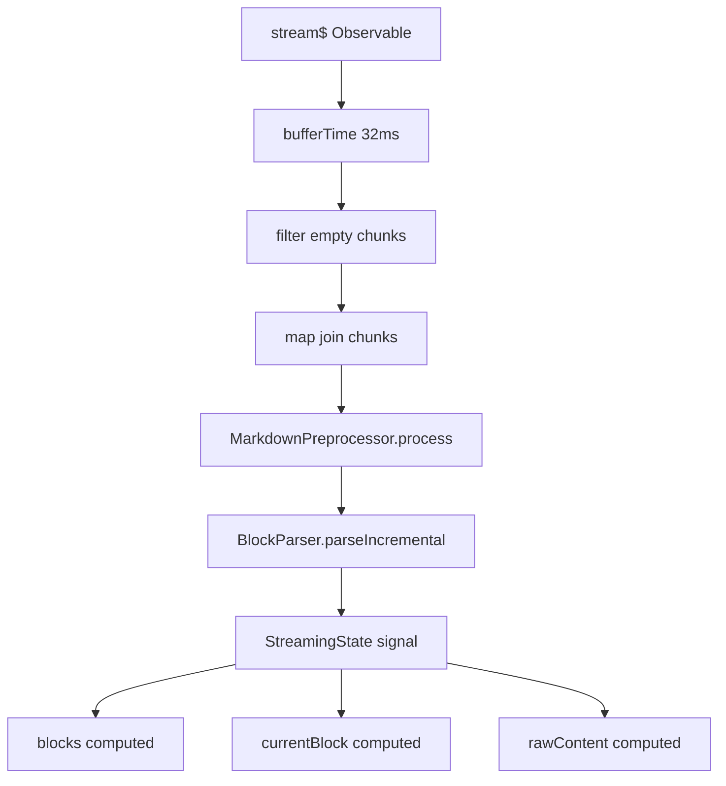
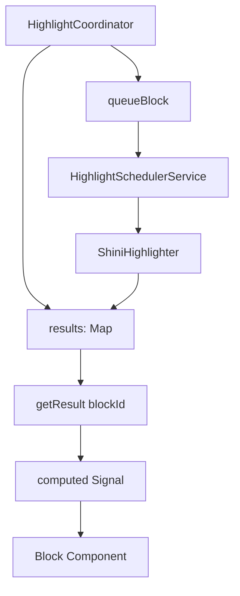
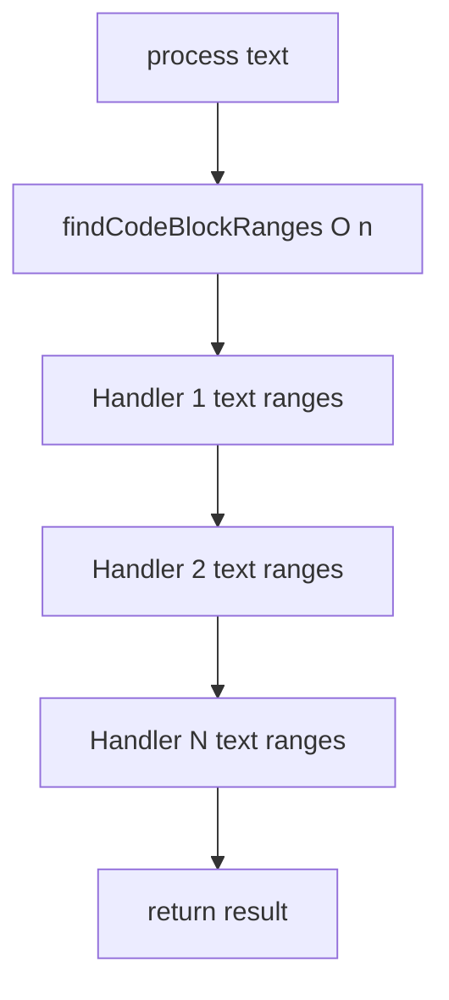
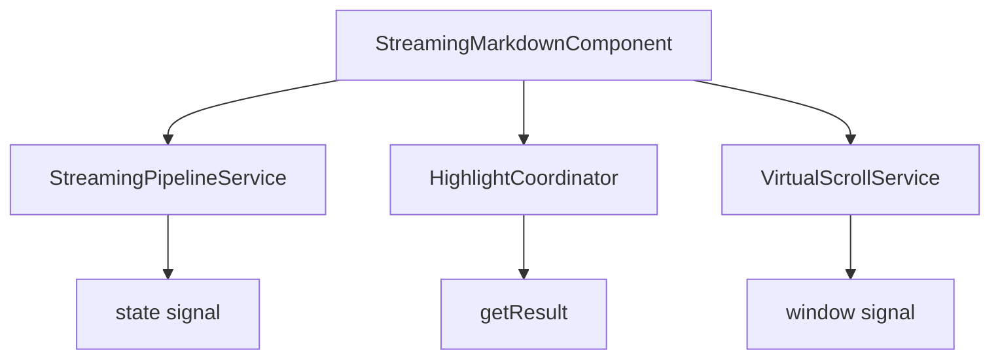
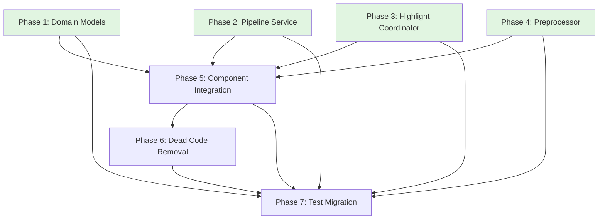

# Streaming Markdown Engine Refactoring — Architectural Implementation Plan

**Goal:** Refactor streaming-markdown architecture to fix structural problems (God Component, highlight state chaos, type safety) while preserving all features
**Architecture:** Service-oriented with discriminated union domain models and Signal-based reactive state
**Status:** Ready for Implementation

---

## Master Status Tracker

| Phase | Independence | Dependencies | Status |
| :--- | :--- | :--- | :--- |
| **P1: Domain Models (Discriminated Unions)** | High | None | 🔴 To Do |
| **P2: StreamingPipelineService** | High | P1 (types) | 🔴 To Do |
| **P3: HighlightCoordinator** | High | P1 (types) | 🔴 To Do |
| **P4: Preprocessor Optimization** | High | None | 🔴 To Do |
| **P5: Component Integration** | Low | P1, P2, P3 | 🔴 To Do |
| **P6: Dead Code Removal** | Low | P1, P2, P3, P4, P5 | 🔴 To Do |
| **P7: Test Migration** | Low | All | 🔴 To Do |

> **Status Legend:** 🔴 To Do, 🟡 In Progress, 🟢 Done
> **Parallelizable:** P1, P2 (partial), P3 (partial), P4 can start immediately. P5 waits for P1-P3. P6 after P5. P7 after all.

---

## Phase 1: Domain Models (Discriminated Unions)

**Independence:** High — No dependencies on other phases
**Files:** `src/app/shared/components/streaming-markdown/core/models.ts`

### Architecture Overview

Transform the monolithic `MarkdownBlock` interface with 15+ optional fields into a discriminated union where each block type has only its relevant fields.

```typescript
// Before: Single interface with optional fields
interface MarkdownBlock {
  id: string;
  type: BlockType;
  content: string;
  isComplete: boolean;
  position: number;
  level?: number;           // Only for HEADING
  language?: string;        // Only for CODE_BLOCK
  subtype?: string;         // Only for LIST
  rawContent?: string;      // Only for CODE_BLOCK
  children?: MarkdownInline[];  // Only for PARAGRAPH, HEADING
  items?: MarkdownBlock[];   // Only for LIST
  tableData?: { ... };       // Only for TABLE
  highlightResult?: Signal<HighlightResult | null>;  // Only for CODE_BLOCK
  isHighlighted?: boolean;   // Only for CODE_BLOCK
  canLazyHighlight?: boolean;  // Only for CODE_BLOCK
  blocks?: MarkdownBlock[];   // Only for BLOCKQUOTE
  footnoteDefs?: Map<string, string>;  // Only for FOOTNOTE_DEF
  streaming?: boolean;      // REDUNDANT with isComplete
}

// After: Discriminated union with type-specific fields
interface MarkdownBlockBase {
  id: string;
  type: BlockType;
  content: string;
  isComplete: boolean;
  position: number;
}

type MarkdownBlock =
  | ParagraphBlock
  | HeadingBlock
  | CodeBlock
  | ListBlock
  | BlockquoteBlock
  | TableBlock
  | ThematicBreakBlock
  | HtmlBlock
  | FootnoteDefBlock
  | UnknownBlock
  | RawBlock;
```

### Task 1.1: Define Base Interface

**File:** `core/models.ts`
**Output:** Compilable `MarkdownBlockBase` interface

```typescript
interface MarkdownBlockBase {
  id: string;
  type: BlockType;
  content: string;
  isComplete: boolean;
  position: number;
}
```

### Task 1.2: Define Paragraph Block Type

**File:** `core/models.ts`
**Output:** Compilable `ParagraphBlock` interface

```typescript
interface ParagraphBlock extends MarkdownBlockBase {
  type: BlockType.PARAGRAPH;
  children?: MarkdownInline[];
}
```

### Task 1.3: Define Heading Block Type

**File:** `core/models.ts`
**Output:** Compilable `HeadingBlock` interface

```typescript
interface HeadingBlock extends MarkdownBlockBase {
  type: BlockType.HEADING;
  level: 1 | 2 | 3 | 4 | 5 | 6;
  children?: MarkdownInline[];
}
```

### Task 1.4: Define Code Block Type

**File:** `core/models.ts`
**Output:** Compilable `CodeBlock` interface
**Note:** Remove `highlightResult`, `isHighlighted`, `canLazyHighlight` — these move to `HighlightCoordinator`

```typescript
interface CodeBlock extends MarkdownBlockBase {
  type: BlockType.CODE_BLOCK;
  language?: string;
  rawContent?: string;
  // NOTE: No highlightResult, isHighlighted, canLazyHighlight
}
```

### Task 1.5: Define List Block Type

**File:** `core/models.ts`
**Output:** Compilable `ListBlock` interface

```typescript
interface ListBlock extends MarkdownBlockBase {
  type: BlockType.LIST;
  subtype: 'ordered' | 'unordered';
  items: MarkdownBlock[];
}
```

### Task 1.6: Define Blockquote Block Type

**File:** `core/models.ts`
**Output:** Compilable `BlockquoteBlock` interface

```typescript
interface BlockquoteBlock extends MarkdownBlockBase {
  type: BlockType.BLOCKQUOTE;
  blocks: MarkdownBlock[];
}
```

### Task 1.7: Define Table Block Type

**File:** `core/models.ts`
**Output:** Compilable `TableBlock` interface

```typescript
interface TableBlock extends MarkdownBlockBase {
  type: BlockType.TABLE;
  tableData: {
    headers: string[];
    rows: string[][];
    align?: (string | null)[];
  };
}
```

### Task 1.8: Define Remaining Block Types

**File:** `core/models.ts`
**Output:** Compilable interfaces for `ThematicBreakBlock`, `HtmlBlock`, `FootnoteDefBlock`, `UnknownBlock`, `RawBlock`

```typescript
interface ThematicBreakBlock extends MarkdownBlockBase {
  type: BlockType.THEMATIC_BREAK;
}

interface HtmlBlock extends MarkdownBlockBase {
  type: BlockType.HTML;
}

interface FootnoteDefBlock extends MarkdownBlockBase {
  type: BlockType.FOOTNOTE_DEF;
  footnoteId?: string;
  footnoteDefs: Map<string, string>;
}

interface UnknownBlock extends MarkdownBlockBase {
  type: BlockType.UNKNOWN;
}

interface RawBlock extends MarkdownBlockBase {
  type: BlockType.RAW;
}
```

### Task 1.9: Export Union Type and Type Guards

**File:** `core/models.ts`
**Output:** Compilable exports

```typescript
// The union type — exported as `MarkdownBlock`
type MarkdownBlock =
  | ParagraphBlock
  | HeadingBlock
  | CodeBlock
  | ListBlock
  | BlockquoteBlock
  | TableBlock
  | ThematicBreakBlock
  | HtmlBlock
  | FootnoteDefBlock
  | UnknownBlock
  | RawBlock;

// Type guard helpers for runtime narrowing
function isCodeBlock(block: MarkdownBlock): block is CodeBlock {
  return block.type === BlockType.CODE_BLOCK;
}

function isHeadingBlock(block: MarkdownBlock): block is HeadingBlock {
  return block.type === BlockType.HEADING;
}

function isListBlock(block: MarkdownBlock): block is ListBlock {
  return block.type === BlockType.LIST;
}

function isBlockquoteBlock(block: MarkdownBlock): block is BlockquoteBlock {
  return block.type === BlockType.BLOCKQUOTE;
}

function isTableBlock(block: MarkdownBlock): block is TableBlock {
  return block.type === BlockType.TABLE;
}

function isFootnoteDefBlock(block: MarkdownBlock): block is FootnoteDefBlock {
  return block.type === BlockType.FOOTNOTE_DEF;
}
```

### Task 1.10: Remove Dead Fields

**File:** `core/models.ts`
**Output:** Clean exports
**Remove:**
- `streaming` field from old interface
- `highlightedHTML` field
- `BlockRenderState` interface
- `isHighlighted`, `canLazyHighlight`, `highlightResult` from domain model

---

## Phase 2: StreamingPipelineService

**Independence:** High — Can start after Task 1.1 (base interface defined)
**Files:** `src/app/shared/components/streaming-markdown/core/streaming-pipeline.service.ts` (NEW)

### Architecture Overview

Extract stream subscription, buffering, preprocessing, and parsing logic from `StreamingMarkdownComponent` into a dedicated service.



### Task 2.1: Define Service Interface

**File:** `core/streaming-pipeline.service.ts` (NEW)
**Output:** Compilable service class with empty methods

```typescript
@Injectable({ providedIn: 'root' })
export class StreamingPipelineService implements OnDestroy {
  // Public API
  readonly state: Signal<StreamingState>;
  readonly status: Signal<StreamingStatus>;
  readonly rawContent: Signal<string>;
  readonly blocks: Signal<MarkdownBlock[]>;
  readonly currentBlock: Signal<MarkdownBlock | null>;

  start(stream$: Observable<string>): void;
  reset(): void;
  ngOnDestroy(): void;
}

type StreamingStatus = 'idle' | 'streaming' | 'completed' | 'error';
```

### Task 2.2: Define Internal State

**File:** `core/streaming-pipeline.service.ts`
**Output:** Compilable with state signals

```typescript
@Injectable({ providedIn: 'root' })
export class StreamingPipelineService implements OnDestroy {
  private preprocessor = inject(MarkdownPreprocessor);
  private parser = inject(BlockParser);

  // State
  private state = signal<StreamingState>(createEmptyState());
  private status = signal<StreamingStatus>('idle');
  private destroy$ = new Subject<void>();
  private subscription: Subscription | null = null;

  // Public computed
  readonly state = computed(() => this.state());
  readonly status = computed(() => this.status());
  readonly rawContent = computed(() => this.state().rawContent);
  readonly blocks = computed(() => this.state().blocks);
  readonly currentBlock = computed(() => this.state().currentBlock);
}
```

### Task 2.3: Implement start() Method

**File:** `core/streaming-pipeline.service.ts`
**Output:** Compilable with stream subscription logic

```typescript
start(stream$: Observable<string>): void {
  this.reset();
  this.status.set('streaming');

  this.subscription = stream$.pipe(
    bufferTime(32),
    filter(chunks => chunks.length > 0),
    map(chunks => chunks.join('')),
    takeUntil(this.destroy$)
  ).subscribe({
    next: (chunk) => this.processChunk(chunk),
    error: (err) => this.handleError(err),
    complete: () => this.status.set('completed')
  });
}
```

### Task 2.4: Implement processChunk() Method

**File:** `core/streaming-pipeline.service.ts`
**Output:** Compilable with chunk processing logic

```typescript
private processChunk(chunk: string): void {
  const current = this.state();
  const updatedRaw = current.rawContent + chunk;
  const prevInput = this.preprocessor.process(current.rawContent);
  const nextInput = this.preprocessor.process(updatedRaw);
  const result = this.parser.parseIncremental(prevInput, nextInput);

  let currentBlock: MarkdownBlock | null = null;
  let blocks = result.blocks;

  if (result.hasIncompleteBlock && blocks.length > 0) {
    currentBlock = blocks[blocks.length - 1];
    blocks = blocks.slice(0, -1);
  }

  this.state.set({ blocks, currentBlock, rawContent: updatedRaw });
}
```

### Task 2.5: Implement reset() and ngOnDestroy()

**File:** `core/streaming-pipeline.service.ts`
**Output:** Complete service

```typescript
reset(): void {
  this.subscription?.unsubscribe();
  this.subscription = null;
  this.parser.reset();
  this.status.set('idle');
  this.state.set(createEmptyState());
}

private handleError(error: Error): void {
  console.error('[StreamingPipeline] Stream error:', error);
  this.status.set('error');
}

ngOnDestroy(): void {
  this.destroy$.next();
  this.destroy$.complete();
  this.subscription?.unsubscribe();
}
```

### Task 2.6: Export from Core Index

**File:** `core/index.ts`
**Output:** Export `StreamingPipelineService`

---

## Phase 3: HighlightCoordinator

**Independence:** High — Can start in parallel with Phase 2
**Files:** `src/app/shared/components/streaming-markdown/core/highlight-coordinator.service.ts` (NEW)

### Architecture Overview

Create a single source of truth for highlight state, eliminating the 4-way split (highlightSignals map, scheduler.highlightResults, scheduler.highlightedBlockIds, block.isHighlighted).



### Task 3.1: Define Service Interface

**File:** `core/highlight-coordinator.service.ts` (NEW)
**Output:** Compilable service class with empty methods

```typescript
@Injectable({ providedIn: 'root' })
export class HighlightCoordinator implements OnDestroy {
  // Public API
  initialize(): Promise<void>;
  getResult(blockId: string): Signal<HighlightResult | null>;
  queueBlock(block: CodeBlock, index: number): void;
  queueVisibleBlocks(window: VirtualWindow, blocks: MarkdownBlock[]): void;
  initializeAll(blocks: MarkdownBlock[]): void;
  reset(): void;
  ngOnDestroy(): void;
}
```

### Task 3.2: Define Internal State

**File:** `core/highlight-coordinator.service.ts`
**Output:** Compilable with state

```typescript
@Injectable({ providedIn: 'root' })
export class HighlightCoordinator implements OnDestroy {
  private shini = inject(ShiniHighlighter);
  private scheduler = inject(HighlightSchedulerService);

  // THE single source of truth
  private results = signal<Map<string, HighlightResult>>(new Map());

  // Per-block derived signals (cached)
  private blockSignals = new Map<string, Signal<HighlightResult | null>>();
}
```

### Task 3.3: Implement getResult() Method

**File:** `core/highlight-coordinator.service.ts`
**Output:** Compilable with derived signal creation

```typescript
getResult(blockId: string): Signal<HighlightResult | null> {
  let cached = this.blockSignals.get(blockId);
  if (cached) return cached;

  // Create a computed that derives from the single results map
  cached = computed(() => this.results().get(blockId) ?? null);
  this.blockSignals.set(blockId, cached);
  return cached;
}
```

### Task 3.4: Implement Queue Methods

**File:** `core/highlight-coordinator.service.ts`
**Output:** Compilable with queue logic

```typescript
queueBlock(block: CodeBlock, index: number): void {
  if (this.results().has(block.id)) return;  // already highlighted
  this.scheduler.queueBlock(block, index);
}

queueVisibleBlocks(window: VirtualWindow, blocks: MarkdownBlock[]): void {
  const start = Math.max(0, window.start - 5);
  const end = Math.min(blocks.length, window.end + 6);
  for (let i = start; i < end; i++) {
    const block = blocks[i];
    if (isCodeBlock(block) && !this.results().has(block.id)) {
      this.scheduler.queueBlock(block, i);
    }
  }
}

initializeAll(blocks: MarkdownBlock[]): void {
  for (let i = 0; i < blocks.length; i++) {
    const block = blocks[i];
    if (isCodeBlock(block) && !this.results().has(block.id)) {
      this.scheduler.queueBlock(block, i);
    }
  }
}
```

### Task 3.5: Implement Lifecycle Methods

**File:** `core/highlight-coordinator.service.ts`
**Output:** Complete service

```typescript
async initialize(): Promise<void> {
  return this.shini.initialize();
}

reset(): void {
  this.scheduler.reset();
  this.results.set(new Map());
  this.blockSignals.clear();
}

ngOnDestroy(): void {
  this.reset();
}
```

### Task 3.6: Export from Core Index

**File:** `core/index.ts`
**Output:** Export `HighlightCoordinator`

---

## Phase 4: Preprocessor Optimization

**Independence:** High — No dependencies
**Files:** `src/app/shared/components/streaming-markdown/core/markdown-preprocessor.ts`

### Architecture Overview

Compute code block ranges once per chunk instead of once per handler (12 handlers × O(n) → O(n) + 12 × O(1)).



### Task 4.1: Update Handler Interface

**File:** `core/markdown-preprocessor.ts`
**Output:** Compilable updated interface

```typescript
// Before:
interface PreprocessorHandler {
  name: string;
  priority: number;
  handle: (text: string) => string;
}

// After:
interface PreprocessorHandler {
  name: string;
  priority: number;
  handle: (text: string, codeBlockRanges: [number, number][]) => string;
}
```

### Task 4.2: Update process() Method

**File:** `core/markdown-preprocessor.ts`
**Output:** Compilable with range sharing

```typescript
process(text: string): string {
  if (!text || text.length === 0) {
    return text;
  }

  // Compute ranges ONCE
  const ranges = findCodeBlockRanges(text);

  let result = text;
  for (const handler of this.handlers) {
    result = handler.handle(result, ranges);
  }
  return result;
}
```

### Task 4.3: Update All Handler Functions

**File:** `core/markdown-preprocessor.ts`
**Output:** All handlers accept ranges parameter

**Handlers to update:**
- `sextetHeadingHandler(text)` → `sextetHeadingHandler(text, ranges)`
- `incompleteLinkHandler(text, codeRanges)` → `incompleteLinkHandler(text, ranges)` (rename param)
- `incompleteImageHandler(text, codeRanges)` → `incompleteImageHandler(text, ranges)`
- `boldItalicHandler(text, codeRanges)` → `boldItalicHandler(text, ranges)`
- `boldHandler(text, codeRanges)` → `boldHandler(text, ranges)`
- `italicUnderscoreDoubleHandler(text, codeRanges)` → `italicUnderscoreDoubleHandler(text, ranges)`
- `italicAsteriskHandler(text, codeRanges)` → `italicAsteriskHandler(text, ranges)`
- `italicUnderscoreHandler(text, codeRanges)` → `italicUnderscoreHandler(text, ranges)`
- `inlineCodeHandler(text, codeRanges)` → `inlineCodeHandler(text, ranges)`
- `strikethroughHandler(text, codeRanges)` → `strikethroughHandler(text, ranges)`
- `blockMathHandler(text, codeRanges)` → `blockMathHandler(text, ranges)`

**Note:** `codeBlockHandler` does NOT need ranges (it counts fences independently).

### Task 4.4: Remove Internal findCodeBlockRanges Calls

**File:** `core/markdown-preprocessor.ts`
**Output:** Handlers no longer call `findCodeBlockRanges` internally

**Remove these lines from each handler:**
```typescript
const codeRanges = findCodeBlockRanges(text);
```

---

## Phase 5: Component Integration

**Independence:** Low — Depends on P1, P2, P3
**Files:** `src/app/shared/components/streaming-markdown/streaming-markdown.component.ts`, `blocks/block-router/block-router.component.ts`

### Architecture Overview

Slim down `StreamingMarkdownComponent` from 725 lines to ~150 lines by delegating to new services.



### Task 5.1: Add New Service Providers

**File:** `streaming-markdown.component.ts`
**Output:** Compilable with providers array

```typescript
@Component({
  selector: 'app-streaming-markdown',
  providers: [
    StreamingPipelineService,
    HighlightCoordinator,
    MarkdownPreprocessor,
    BlockParser,
    VirtualScrollService,
    HighlightSchedulerService
  ],
  // ... existing
})
export class StreamingMarkdownComponent { }
```

### Task 5.2: Inject New Services

**File:** `streaming-markdown.component.ts`
**Output:** Compilable with service injections

```typescript
export class StreamingMarkdownComponent implements OnInit, OnChanges, OnDestroy {
  private pipeline = inject(StreamingPipelineService);
  private highlightCoordinator = inject(HighlightCoordinator);
  private virtualScrollService = inject(VirtualScrollService);
  private cdr = inject(ChangeDetectorRef);

  // Remove old injections: preprocessor, parser, shini, highlightScheduler
}
```

### Task 5.3: Delegate State Signals

**File:** `streaming-markdown.component.ts`
**Output:** Compilable with delegated computed

```typescript
// Replace local state with delegation
readonly state = computed(() => this.pipeline.state());
readonly status = computed(() => this.pipeline.status());
readonly rawContent = computed(() => this.pipeline.rawContent());
readonly blocks = computed(() => this.pipeline.blocks());
readonly currentBlock = computed(() => this.pipeline.currentBlock());

// Remove local state management
```

### Task 5.4: Update ngOnInit

**File:** `streaming-markdown.component.ts`
**Output:** Compilable with service delegation

```typescript
ngOnInit(): void {
  this.highlightCoordinator.initialize().then(() => {
    if (this.stream$()) {
      this.pipeline.start(this.stream$());
    }
  });
}
```

### Task 5.5: Update ngOnChanges

**File:** `streaming-markdown.component.ts`
**Output:** Compilable with stream restart

```typescript
ngOnChanges(changes: SimpleChanges): void {
  if (changes['stream$'] && this.stream$()) {
    this.pipeline.reset();
    this.pipeline.start(this.stream$());
  }
}
```

### Task 5.6: Remove Decorate/Highlight Methods

**File:** `streaming-markdown.component.ts`
**Output:** Remove these methods (moved to HighlightCoordinator)

**Remove:**
- `decorateBlocks()`
- `ensureHighlightSignal()`
- `hasHighlightResult()`
- `applyHighlightResult()`
- `initializeLazyHighlighting()`
- `queueVisibleCodeBlocks()`
- `highlightSignals` Map

### Task 5.7: Update BlockRouter Component

**File:** `blocks/block-router/block-router.component.ts`
**Output:** Pass highlight signal from coordinator

```typescript
export class MarkdownBlockRouterComponent {
  @Input() block!: MarkdownBlock;
  @Input() isComplete = true;
  @Input() blockIndex = -1;
  @Input() enableLazyHighlight = false;
  @Input() allowHighlight = true;

  // NEW: Inject highlight coordinator
  private highlightCoordinator = inject(HighlightCoordinator);

  // Get highlight signal for code blocks
  readonly highlightSignal = computed(() =>
    isCodeBlock(this.block)
      ? this.highlightCoordinator.getResult(this.block.id)
      : null
  );
}
```

### Task 5.8: Update BlockRouter Template

**File:** `blocks/block-router/block-router.component.ts`
**Output:** Pass highlight signal to code component

```typescript
// In template, pass highlight signal:
// [highlightResult]="highlightSignal()"
```

### Task 5.9: Update Code Component Inputs

**File:** `blocks/code/code.component.ts`
**Output:** Accept highlight signal as input

```typescript
export class MarkdownCodeComponent {
  @Input() block!: CodeBlock;  // Changed from MarkdownBlock
  @Input() isComplete = true;
  @Input() blockIndex = -1;
  @Input() highlightResult!: Signal<HighlightResult | null>;  // NEW

  // Remove: highlightScheduler injection, subscription logic
  // Remove: accessing block.highlightResult, block.isHighlighted
}
```

---

## Phase 6: Dead Code Removal

**Independence:** Low — After P5 complete
**Files:** Multiple

### Task 6.1: Remove Unused Error Types

**File:** `core/error-handling.types.ts`
**Remove:**
- `StreamingMarkdownError` interface
- `IErrorHandler` interface
- `ErrorHandlerResult` interface
- Related error factory interfaces

**Keep:**
- `ComponentErrorType` enum
- `ErrorCategory`, `ErrorSeverity`

### Task 6.2: Remove DefaultErrorHandler

**File:** `core/default-error-handler.ts`
**Action:** Delete entire file (only logs to console, unused)

### Task 6.3: Remove Dead Interfaces from Models

**File:** `core/models.ts`
**Remove:**
- `BlockRenderState`
- `StreamingPipeline` interface (if defined)
- `BlockDiff` interface
- `IChangeDetector` interface

### Task 6.4: Remove Dead Exports

**File:** `core/index.ts`
**Remove:**
- Exports for deleted types/interfaces
- `DefaultErrorHandler` export

---

## Phase 7: Test Migration

**Independence:** Low — After all phases complete
**Files:** `**/*.spec.ts`

### Task 7.1: Create StreamingPipelineService Tests

**File:** `core/streaming-pipeline.service.spec.ts` (NEW)
**Tests:**
- `start()` should subscribe to stream and buffer chunks
- `start()` should set status to 'streaming'
- `processChunk()` should preprocess and parse incrementally
- `reset()` should clear state and unsubscribe
- `ngOnDestroy()` should complete destroy$ subject

### Task 7.2: Create HighlightCoordinator Tests

**File:** `core/highlight-coordinator.service.spec.ts` (NEW)
**Tests:**
- `getResult()` should return computed signal for block ID
- `getResult()` should cache computed signals
- `queueBlock()` should not queue already-highlighted blocks
- `queueVisibleBlocks()` should queue visible code blocks
- `initializeAll()` should queue all code blocks
- `reset()` should clear results and signal cache

### Task 7.3: Update StreamingMarkdownComponent Tests

**File:** `streaming-markdown.component.spec.ts`
**Changes:**
- Remove tests for methods moved to services
- Add tests for service wiring
- Mock `StreamingPipelineService` and `HighlightCoordinator`

### Task 7.4: Update BlockRenderer Tests

**Files:** `blocks/code/code.component.spec.ts`, `blocks/heading/heading.component.spec.ts`, etc.
**Changes:**
- Update to use specific block types instead of generic `MarkdownBlock`
- Mock `Signal<HighlightResult | null>` for code component

### Task 7.5: Update Integration Tests

**File:** `streaming-markdown.component.integration.spec.ts`
**Changes:**
- Verify full pipeline: stream → preprocess → parse → render → highlight
- Test highlight coordinator integration
- Test virtual scroll with highlight coordinator

---

## External Consumer Impact

**No Breaking Changes:** The public API remains stable. External consumers continue to work without modifications.

### Verified External Consumers

| File | Imports | Impact |
|------|---------|--------|
| `app.config.ts` | `provideStreamingMarkdown`, builtin plugin | NONE — provider unchanged |
| `ai-chat-panel.component.ts` | `StreamingMarkdownComponent` | NONE — component interface unchanged |
| `static-markdown.component.ts` | `BlockRouter`, `MarkdownBlock`, `Preprocessor`, `BlockParser` | NONE — types remain compatible |
| `demo-streaming-markdown.component.ts` | `StreamingMarkdownComponent`, `StaticMarkdownComponent` | NONE — component interface unchanged |

---

## Implementation Dependencies



**Parallelizable Paths:**
- **Path A:** P1 → P5 → P6 → P7 (types → integration → cleanup → tests)
- **Path B:** P2 → P5 (can develop in parallel with P1, P3)
- **Path C:** P3 → P5 (can develop in parallel with P1, P2)
- **Path D:** P4 → P5 (completely independent)

---

## Risk Assessment

| Phase | Risk | Mitigation |
|-------|------|------------|
| P1: Domain Models | HIGH — Breaking change for all block consumers | Additive approach: define new types, migrate incrementally, remove old types last |
| P2: Pipeline Service | LOW — Extraction only, no API change | Test stream buffering and incremental parsing thoroughly |
| P3: Highlight Coordinator | MEDIUM — State consolidation tricky | Verify single source of truth with integration tests |
| P4: Preprocessor | LOW — Simple optimization | Verify each handler still works with shared ranges |
| P5: Component Integration | HIGH — Many files, complex wiring | Update block renderers first, then main component |
| P6: Dead Code Removal | LOW — Cleanup only | Verify no remaining references before deletion |
| P7: Test Migration | MEDIUM — Test maintenance | Run full test suite after each migration batch |

---

## Verification Checklist

After implementation, verify:

- [ ] All TypeScript compilation errors resolved
- [ ] All unit tests pass
- [ ] All integration tests pass
- [ ] No console errors during streaming
- [ ] Virtual scroll works with highlighted code
- [ ] Lazy highlighting queues visible blocks first
- [ ] Preprocessor handlers still fix incomplete syntax
- [ ] External consumers (ai-chat-panel, static-markdown) work unchanged
- [ ] No regressions in markdown rendering
- [ ] Performance: preprocessor O(n) not O(12n)

---

## File Creation Summary

**New Files:**
- `core/streaming-pipeline.service.ts` (~150 lines)
- `core/highlight-coordinator.service.ts` (~120 lines)
- `core/streaming-pipeline.service.spec.ts` (~200 lines)
- `core/highlight-coordinator.service.spec.ts` (~150 lines)

**Modified Files:**
- `core/models.ts` (add discriminated unions, remove dead types)
- `core/markdown-preprocessor.ts` (range sharing optimization)
- `streaming-markdown.component.ts` (725 → ~150 lines)
- `blocks/block-router/block-router.component.ts` (highlight coordinator integration)
- `blocks/code/code.component.ts` (specific block type, highlight signal input)
- `blocks/*/heading|list|etc. component.ts` (specific block types)
- `core/index.ts` (export new services, remove dead exports)
- `**/*.spec.ts` (test updates)

**Deleted Files:**
- `core/default-error-handler.ts`

---

## Rollback Strategy

If critical issues arise:

1. **Revert Phase 5** (component integration) — keeps new services but uses old component
2. **Revert Phase 3** (highlight coordinator) — restore 4-way split state
3. **Revert Phase 2** (pipeline service) — restore in-component stream handling
4. **Keep Phase 4** (preprocessor optimization) — low risk, independent
5. **Keep Phase 1** (discriminated unions) — can be adopted incrementally by consumers

---

## Success Criteria

1. `StreamingMarkdownComponent` reduced from 725 to ~150 lines
2. Highlight state has single source of truth (no dual signals, no block mutations)
3. All block types use discriminated unions (type-safe field access)
4. Preprocessor computes code ranges once per chunk
5. All tests pass
6. External consumers work unchanged
7. No performance regressions
