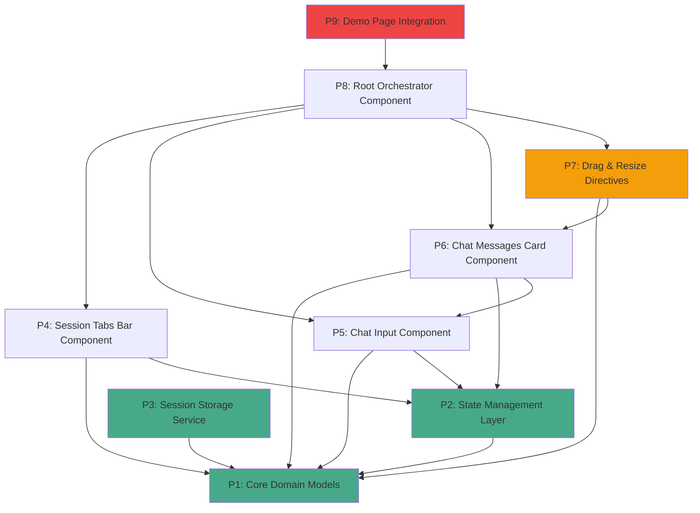
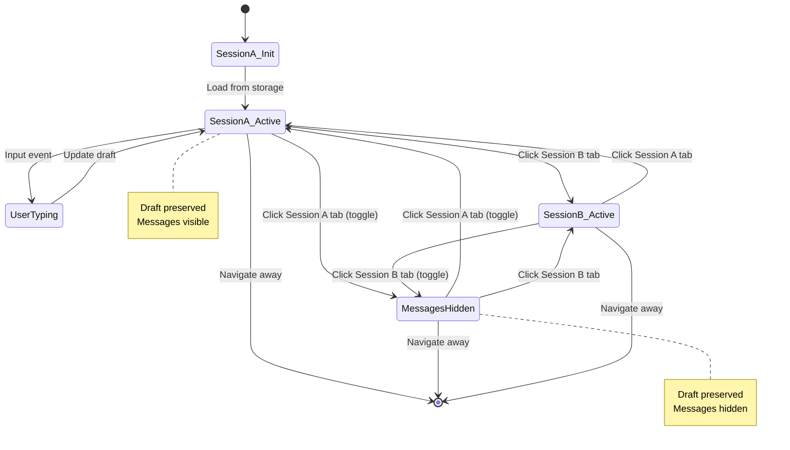

# AI Chat Panel Refactoring - Architectural Implementation Plan

**Goal:** Refactor the AI chat panel to support multiple sessions with always-visible input and session tabs, following the "Minimal Toggle" approach where only the messages card toggles visibility.

**Architecture:** Component-Based Architecture with Angular Signals for state management, per-session state isolation, and localStorage persistence.

**Design Approach:** Minimal Toggle - Session tabs + input are permanent fixtures; messages card is the only toggleable element.

---

## Master Status Tracker

| Phase | Independence | Dependencies | Status |
| :--- | :--- | :--- | :--- |
| **P1: Core Domain Models** | High | None | 🔴 To Do |
| **P2: State Management Layer** | High | P1 | 🔴 To Do |
| **P3: Session Storage Service** | High | P1 | 🔴 To Do |
| **P4: Session Tabs Bar Component** | Medium | P1, P2 | 🔴 To Do |
| **P5: Chat Input Component** | Medium | P1, P2 | 🔴 To Do |
| **P6: Chat Messages Card Component** | Low | P1, P2, P5 | 🔴 To Do |
| **P7: Drag & Resize Directives** | High | P1, P6 | 🔴 To Do |
| **P8: Root Orchestrator Component** | Low | P4, P5, P6, P7 | 🔴 To Do |
| **P9: Demo Page Integration** | Low | All | 🔴 To Do |

> **Status Legend:** 🔴 To Do, 🟡 In Progress, 🟢 Done

---

## Architecture Overview

### Component Hierarchy

```
AiChatPanel (Root Orchestrator)
├── SessionTabsBar
│   ├── SessionTabButton (repeated per session)
│   └── [Add Session Button] (parked feature)
├── ChatMessagesCard
│   ├── MessageList
│   ├── DragHandleDirective
│   └── ResizeHandleDirective
├── StatusBadgesComponent (parked feature)
└── ChatInputComponent
    ├── TextArea
    ├── ToolbarButtons (parked feature)
    └── SendButton
```

### State Management Strategy

- **Angular Signals** for reactive state management
- **Per-session state isolation** - each session maintains independent messages, input draft, position, and size
- **localStorage persistence** via effect-based synchronization
- **Computed signals** for derived state (active session, visibility flags)

### Design Token Integration

All styling must use CSS variables from `styles.css`:
- Colors: `var(--primary)`, `var(--background)`, etc.
- Spacing: `var(--spacing-*)` series
- Radius: `var(--radius-*)` series
- Duration: `var(--duration-*)` series

---

## Phase 1: Core Domain Models

**Independence:** High | **Dependencies:** None

Define the foundational interfaces and types that will be used across the entire application.

### Task 1.1: Chat Message Interface

**Output:** `src/app/shared/models/chat-message.interface.ts`

```typescript
export interface ChatMessage {
  id: string;
  role: 'user' | 'assistant' | 'system';
  content: string;
  timestamp: number;
  actions?: MessageAction[];
}

export interface MessageAction {
  id: string;
  label: string;
  icon?: string;
  callback: () => void;
}
```

### Task 1.2: Session Data Interface

**Output:** `src/app/shared/models/session-data.interface.ts`

```typescript
import { ChatMessage } from './chat-message.interface';

export interface SessionData {
  id: string;
  name: string;
  messages: ChatMessage[];
  inputValue: string;  // Draft state preservation
  position: PanelPosition;
  size: PanelSize;
  lastUpdated: number;
}

export interface PanelPosition {
  x: number;
  y: number;
}

export interface PanelSize {
  width: number;
  height: number;
}
```

### Task 1.3: Panel State Interface

**Output:** `src/app/shared/models/panel-state.interface.ts`

```typescript
import { SessionData } from './session-data.interface';

export interface PanelState {
  sessions: Map<string, SessionData>;
  activeSessionId: string;
  isMessagesVisible: boolean;
}
```

### Task 1.4: Component Input/Output Interfaces

**Output:** `src/app/shared/models/ai-chat-panel.interface.ts`

```typescript
import { EventEmitter } from '@angular/core';
import { ChatMessage } from './chat-message.interface';

export interface AiChatPanelInputs {
  initialSessions?: string;
  apiEndpoint?: string;
}

export interface AiChatPanelOutputs {
  messageSend: EventEmitter<ChatMessage>;
  sessionChange: EventEmitter<string>;
  panelToggle: EventEmitter<boolean>;
}
```

---

## Phase 2: State Management Layer

**Independence:** High | **Dependencies:** P1 (Core Domain Models)

Implement the reactive state management using Angular Signals.

### Task 2.1: Session State Service

**Output:** `src/app/shared/services/session-state.service.ts`

**Responsibilities:**
- Manage sessions Map with signals
- Provide computed signals for active session
- Handle session switching logic with draft preservation
- Emit events for external consumers

**Interface Signature:**

```typescript
@Injectable({ providedIn: 'root' })
export class SessionStateService {
  // Core state signals
  readonly sessions: Signal<Map<string, SessionData>>;
  readonly activeSessionId: Signal<string>;
  readonly isMessagesVisible: Signal<boolean>;

  // Computed signals
  readonly activeSession: Signal<SessionData | undefined>;
  readonly activeMessages: Signal<ChatMessage[]>;
  readonly activeInputValue: Signal<string>;
  readonly canSendMessage: Signal<boolean>;

  // State mutations
  switchSession(sessionId: string): void;
  toggleMessagesVisibility(): void;
  updateInputValue(value: string): void;
  addMessage(sessionId: string, message: ChatMessage): void;

  // Session CRUD
  createSession(name?: string): string;
  deleteSession(sessionId: string): void;
  renameSession(sessionId: string, newName: string): void;
}
```

### Task 2.2: ID Generator Utility

**Output:** `src/app/shared/utils/id-generator.util.ts`

**Responsibilities:**
- Generate unique session IDs
- Handle collision detection

**Interface Signature:**

```typescript
export class IdGenerator {
  static generateSessionId(): string;
  static generateMessageId(): string;
  private static checkCollision(id: string): boolean;
}
```

---

## Phase 3: Session Storage Service

**Independence:** High | **Dependencies:** P1 (Core Domain Models)

Implement localStorage persistence with fallback to in-memory storage.

### Task 3.1: Storage Service Interface

**Output:** `src/app/shared/services/session-storage.service.ts`

**Responsibilities:**
- Load/save sessions from localStorage
- Handle privacy mode (localStorage unavailable)
- Serialize/deserialize state

**Interface Signature:**

```typescript
@Injectable({ providedIn: 'root' })
export class SessionStorageService {
  private readonly STORAGE_KEY = 'ai-chat-panel-preferences';

  loadSessions(): Map<string, SessionData> | null;
  saveSessions(sessions: Map<string, SessionData>): void;

  loadActiveSessionId(): string | null;
  saveActiveSessionId(sessionId: string): void;

  loadMessagesVisibility(): boolean | null;
  saveMessagesVisibility(visible: boolean): void;

  clearAll(): void;
  isAvailable(): boolean;
}
```

### Task 3.2: Storage Sync Effect

**Output:** Integrated in `SessionStateService`

**Responsibilities:**
- Auto-sync state changes to localStorage via Angular effect
- Debounce writes to avoid performance issues

**Interface Signature:**

```typescript
private setupStorageSyncEffect(): void;
// Uses effect() to watch state changes and persist to localStorage
```

---

## Phase 4: Session Tabs Bar Component

**Independence:** Medium | **Dependencies:** P1, P2

Implement the horizontal session tabs that are always visible.

### Task 4.1: SessionTabsBar Component Definition

**Output:** `src/app/shared/ui/session-tabs-bar/`

**Files:**
- `session-tabs-bar.component.ts`
- `session-tabs-bar.component.html`
- `session-tabs-bar.component.css`

**Interface Signature:**

```typescript
@Component({ ... })
export class SessionTabsBarComponent {
  @Input() sessions: Signal<Map<string, SessionData>>;
  @Input() activeSessionId: Signal<string>;
  @Output() sessionSelect = new EventEmitter<string>();
  @Output() sessionToggle = new EventEmitter<void>();

  readonly sortedSessions: Signal<SessionData[]>;
}
```

**Template Structure:**

```html
<div class="session-tabs-container">
  @for (session of sortedSessions(); track session.id) {
    <button
      [class.active]="session.id === activeSessionId()"
      (click)="handleSessionClick($event, session.id)"
      class="session-tab"
    >
      <span class="session-name">{{ session.name }}</span>
    </button>
  }
</div>
```

### Task 4.2: SessionTabsBar Styling

**CSS Design Tokens Usage:**

```css
.session-tabs-container {
  position: fixed;
  bottom: calc(var(--spacing-xl) * 3);  /* ~48px */
  left: 50%;
  transform: translateX(-50%);
  display: flex;
  gap: var(--spacing-sm);  /* 4px */
  z-index: 1000;
}

.session-tab {
  background: var(--primary / 15%);
  color: var(--primary);
  padding: var(--spacing-sm) var(--spacing-md);
  border-radius: var(--radius-lg);
  transition: all var(--duration-normal) ease;
}

.session-tab.active {
  background: var(--primary);
  color: var(--primary-foreground);
}

.session-tab:hover {
  background: var(--primary / 25%);
}
```

---

## Phase 5: Chat Input Component

**Independence:** Medium | **Dependencies:** P1, P2

Implement the always-visible input box with auto-expanding textarea.

### Task 5.1: ChatInputComponent Definition

**Output:** `src/app/shared/ui/chat-input/`

**Files:**
- `chat-input.component.ts`
- `chat-input.component.html`
- `chat-input.component.css`

**Interface Signature:**

```typescript
@Component({ ... })
export class ChatInputComponent {
  @Input() inputValue: Signal<string>;
  @Input() canSend: Signal<boolean>;
  @Output() inputChange = new EventEmitter<string>();
  @Output() messageSend = new EventEmitter<void>();

  readonly MAX_HEIGHT = 120;  // 5 lines max
  readonly MIN_HEIGHT = 24;   // 1 line min

  textareaHeight: number;
  isFocused: boolean;
}
```

**Template Structure:**

```html
<div class="input-container">
  <textarea
    [style.height.px]="textareaHeight"
    [value]="inputValue()"
    (input)="handleInput($event)"
    (keydown)="handleKeydown($event)"
    placeholder="Ask AI anything..."
    class="chat-textarea"
  ></textarea>
  <button
    [disabled]="!canSend()"
    (click)="sendMessage()"
    class="send-button"
  >
    Send
  </button>
</div>
```

### Task 5.2: Auto-Expanding Textarea Logic

**Responsibilities:**
- Calculate height based on scrollHeight
- Enforce MIN_HEIGHT and MAX_HEIGHT constraints
- Reset height when input is cleared

**Interface Signature:**

```typescript
private calculateTextareaHeight(scrollHeight: number): number;
private adjustHeight(element: HTMLTextAreaElement): void;
```

### Task 5.3: Keyboard Interactions

**Key Bindings:**
- `Enter` → Send message
- `Shift+Enter` → New line
- `Escape` → Collapse messages card (optional)

**Interface Signature:**

```typescript
handleKeydown(event: KeyboardEvent): void;
private isSendKey(event: KeyboardEvent): boolean;
```

### Task 5.4: ChatInput Styling

**CSS Design Tokens:**

```css
.input-container {
  position: fixed;
  bottom: var(--spacing-xl);  /* 16px */
  left: 50%;
  transform: translateX(-50%);
  display: flex;
  gap: var(--spacing-sm);
  z-index: 1000;
}

.chat-textarea {
  min-height: var(--spacing-xl);  /* 24px */
  max-height: calc(var(--spacing-xl) * 7.5);  /* 120px */
  width: 600px;
  padding: var(--spacing-sm) var(--spacing-md);
  border-radius: var(--radius-lg);
  background: var(--card);
  color: var(--foreground);
  border: 1px solid var(--border);
}

.send-button {
  height: var(--spacing-xl);  /* 24px */
  padding: var(--spacing-sm) var(--spacing-md);
  border-radius: var(--radius-md);
  background: var(--primary);
  color: var(--primary-foreground);
}

.send-button:disabled {
  background: var(--muted);
  color: var(--muted-foreground);
}
```

---

## Phase 6: Chat Messages Card Component

**Independence:** Low | **Dependencies:** P1, P2, P5

Implement the toggleable messages card with drag and resize support.

### Task 6.1: ChatMessagesCard Component Definition

**Output:** `src/app/shared/ui/chat-messages-card/`

**Files:**
- `chat-messages-card.component.ts`
- `chat-messages-card.component.html`
- `chat-messages-card.component.css`

**Interface Signature:**

```typescript
@Component({ ... })
export class ChatMessagesCardComponent {
  @Input() messages: Signal<ChatMessage[]>;
  @Input() isVisible: Signal<boolean>;
  @Input() position: Signal<PanelPosition>;
  @Input() size: Signal<PanelSize>;
  @Output() positionChange = new EventEmitter<PanelPosition>();
  @Output() sizeChange = new EventEmitter<PanelSize>();

  readonly messageListRef = viewChild<ElementRef<HTMLDivElement>>('messageList');

  scrollToBottom(): void;
  private smoothScrollToBottom(): void;
}
```

**Template Structure:**

```html
<div
  [class.visible]="isVisible()"
  [style.left.px]="position().x"
  [style.top.px]="position().y"
  [style.width.px]="size().width"
  [style.height.px]="size().height"
  class="messages-card"
>
  <div class="drag-handle" appDragHandle>
    <span class="drag-icon">≡ ≡ ≡</span>
  </div>

  <div #messageList class="message-list">
    @for (message of messages(); track message.id) {
      <div [class.role]="message.role" class="message">
        <div class="message-content">{{ message.content }}</div>
        <div class="message-timestamp">{{ message.timestamp | date:'short' }}</div>
      </div>
    }
  </div>

  <div class="resize-handle" appResizeHandle></div>
</div>
```

### Task 6.2: Message List Scroll Behavior

**Responsibilities:**
- Auto-scroll to bottom on new message
- Preserve scroll position on session switch
- Smooth scroll animation

**Interface Signature:**

```typescript
scrollToBottom(behavior: 'smooth' | 'auto' = 'smooth'): void;
private getScrollContainer(): HTMLElement | null;
```

### Task 6.3: ChatMessagesCard Styling

**CSS Design Tokens:**

```css
.messages-card {
  position: fixed;
  bottom: calc(var(--spacing-xl) * 5);  /* ~80px */
  left: 50%;
  transform: translateX(-50%);
  width: 600px;
  height: 400px;
  border-radius: var(--radius-xl);
  background: var(--card / 90%);
  backdrop-filter: blur(8px);
  border: 1px solid var(--border);
  display: flex;
  flex-direction: column;
  transition: opacity var(--duration-slow) ease,
              transform var(--duration-slow) ease;
}

.messages-card:not(.visible) {
  opacity: 0;
  transform: translateX(-50%) translateY(20px);
  pointer-events: none;
}

.drag-handle {
  padding: var(--spacing-sm);
  cursor: move;
  text-align: center;
  color: var(--muted-foreground);
}

.message-list {
  flex: 1;
  overflow-y: auto;
  padding: var(--spacing-md);
  display: flex;
  flex-direction: column;
  gap: var(--spacing-md);
}

.message.role-user {
  align-self: flex-end;
  background: var(--primary / 15%);
  padding: var(--spacing-sm) var(--spacing-md);
  border-radius: var(--radius-md);
}

.message.role-assistant {
  align-self: flex-start;
  background: var(--muted);
  padding: var(--spacing-sm) var(--spacing-md);
  border-radius: var(--radius-md);
}

.resize-handle {
  position: absolute;
  bottom: 0;
  right: 0;
  width: 16px;
  height: 16px;
  cursor: nwse-resize;
  background: linear-gradient(135deg, transparent 50%, var(--primary) 50%);
}
```

---

## Phase 7: Drag & Resize Directives

**Independence:** High | **Dependencies:** P1, P6

Implement the interactive drag and resize functionality for the messages card.

### Task 7.1: DragHandleDirective

**Output:** `src/app/shared/directives/drag-handle.directive.ts`

**Responsibilities:**
- Handle mouse events for dragging
- Update position in real-time
- Emit position changes
- Disable transitions during drag

**Interface Signature:**

```typescript
@Directive({ selector: '[appDragHandle]' })
export class DragHandleDirective implements OnInit, OnDestroy {
  @Input() position!: Signal<PanelPosition>;
  @Output() positionChange = new EventEmitter<PanelPosition>();
  @Output() dragStart = new EventEmitter<void>();
  @Output() dragEnd = new EventEmitter<void>();

  private isDragging = false;
  private startPosition!: PanelPosition;
  private startMousePosition!: { x: number; y: number };

  ngOnInit(): void;
  ngOnDestroy(): void;
  private onMouseDown(event: MouseEvent): void;
  private onMouseMove(event: MouseEvent): void;
  private onMouseUp(): void;
}
```

### Task 7.2: ResizeHandleDirective

**Output:** `src/app/shared/directives/resize-handle.directive.ts`

**Responsibilities:**
- Handle mouse events for resizing
- Enforce min/max constraints
- Emit size changes
- Disable transitions during resize

**Interface Signature:**

```typescript
@Directive({ selector: '[appResizeHandle]' })
export class ResizeHandleDirective implements OnInit, OnDestroy {
  @Input() size!: Signal<PanelSize>;
  @Input() minSize = { width: 300, height: 200 };
  @Input() maxSize = { width: window.innerWidth * 0.9, height: window.innerHeight * 0.7 };
  @Output() sizeChange = new EventEmitter<PanelSize>();
  @Output() resizeStart = new EventEmitter<void>();
  @Output() resizeEnd = new EventEmitter<void>();

  private isResizing = false;
  private startSize!: PanelSize;
  private startMousePosition!: { x: number; y: number };

  ngOnInit(): void;
  ngOnDestroy(): void;
  private onMouseDown(event: MouseEvent): void;
  private onMouseMove(event: MouseEvent): void;
  private onMouseUp(): void;
  private clamp(value: number, min: number, max: number): number;
}
```

### Task 7.3: Constraint Constants

**Output:** `src/app/shared/constants/constraints.const.ts`

```typescript
export const PANEL_CONSTRAINTS = {
  MIN_WIDTH: 300,
  MIN_HEIGHT: 200,
  MAX_WIDTH_RATIO: 0.9,
  MAX_HEIGHT_RATIO: 0.7,
  DEFAULT_SIZE: {
    width: 600,
    height: 400
  },
  DEFAULT_POSITION: {
    x: 0,
    y: 0
  }
} as const;
```

---

## Phase 8: Root Orchestrator Component

**Independence:** Low | **Dependencies:** P4, P5, P6, P7

Implement the root AiChatPanel component that orchestrates all sub-components.

### Task 8.1: AiChatPanel Component Definition

**Output:** `src/app/shared/ui/ai-chat-panel/`

**Files:**
- `ai-chat-panel.component.ts`
- `ai-chat-panel.component.html`
- `ai-chat-panel.component.css`

**Interface Signature:**

```typescript
@Component({ ... })
export class AiChatPanelComponent {
  @Input() apiEndpoint?: string;
  @Output() messageSend = new EventEmitter<ChatMessage>();
  @Output() sessionChange = new EventEmitter<string>();
  @Output() panelToggle = new EventEmitter<boolean>();

  private sessionState = inject(SessionStateService);
  private storage = inject(SessionStorageService);

  readonly sessions = this.sessionState.sessions;
  readonly activeSessionId = this.sessionState.activeSessionId;
  readonly isMessagesVisible = this.sessionState.isMessagesVisible;
  readonly activeSession = this.sessionState.activeSession;

  ngOnInit(): void;
  sendMessage(): void;
  switchSession(sessionId: string): void;
  toggleMessagesVisibility(): void;
}
```

**Template Structure:**

```html
<div class="ai-chat-panel">
  <app-chat-messages-card
    [messages]="sessionState.activeMessages()"
    [isVisible]="isMessagesVisible()"
    [position]="activeSession()!.position"
    [size]="activeSession()!.size"
    (positionChange)="updatePosition($event)"
    (sizeChange)="updateSize($event)"
  />

  <app-session-tabs-bar
    [sessions]="sessions()"
    [activeSessionId]="activeSessionId()"
    (sessionSelect)="switchSession($event)"
    (sessionToggle)="toggleMessagesVisibility()"
  />

  <app-chat-input
    [inputValue]="sessionState.activeInputValue()"
    [canSend]="sessionState.canSendMessage()"
    (inputChange)="sessionState.updateInputValue($event)"
    (messageSend)="sendMessage()"
  />
</div>
```

### Task 8.2: Initialization Logic

**Responsibilities:**
- Load sessions from localStorage or create defaults
- Set up storage sync effect
- Initialize default session if none exists

**Interface Signature:**

```typescript
private initializeSessions(): void;
private createDefaultSessions(): Map<string, SessionData>;
private setupStorageSync(): void;
```

### Task 8.3: Position & Size Persistence

**Responsibilities:**
- Update session position/size on drag/resize
- Persist changes to session state
- Emit events for external consumers

**Interface Signature:**

```typescript
updatePosition(position: PanelPosition): void;
updateSize(size: PanelSize): void;
private persistSessionChanges(sessionId: string): void;
```

### Task 8.4: AiChatPanel Styling

**CSS Design Tokens:**

```css
.ai-chat-panel {
  position: fixed;
  bottom: 0;
  left: 0;
  right: 0;
  pointer-events: none;  /* Allow click-through to page */
}

.ai-chat-panel > * {
  pointer-events: auto;  /* Re-enable clicks for children */
}
```

---

## Phase 9: Demo Page Integration

**Independence:** Low | **Dependencies:** All Phases

Create a demo page to showcase the AI chat panel functionality.

### Task 9.1: Demo Page Component

**Output:** `src/app/demo/ai-chat-panel/`

**Files:**
- `demo-ai-chat-panel.component.ts`
- `demo-ai-chat-panel.component.html`
- `demo-ai-chat-panel.component.css`

**Interface Signature:**

```typescript
@Component({ ... })
export class DemoAiChatPanelComponent {
  readonly apiEndpoint = signal('/api/chat');
  readonly messageHistory = signal<ChatMessage[]>([]);

  handleMessageSend(message: ChatMessage): void {
    // Add user message to history
    this.messageHistory.update(messages => [...messages, message]);

    // Simulate AI response
    this.simulateAIResponse(message);
  }

  handleSessionChange(sessionId: string): void {
    console.log('Session changed to:', sessionId);
  }

  handlePanelToggle(isVisible: boolean): void {
    console.log('Panel toggled:', isVisible);
  }

  private simulateAIResponse(userMessage: ChatMessage): void;
}
```

**Template Structure:**

```html
<div class="demo-container">
  <header class="demo-header">
    <h1>AI Chat Panel Demo</h1>
    <p>Multiple sessions with always-visible input and session tabs</p>
  </header>

  <main class="demo-content">
    <section class="instructions">
      <h2>Features</h2>
      <ul>
        <li>✅ Session tabs always visible at bottom</li>
        <li>✅ Input box always ready</li>
        <li>✅ Click session tab to switch sessions</li>
        <li>✅ Click active tab to toggle messages card</li>
        <li>✅ Drag messages card by top handle</li>
        <li>✅ Resize messages card from bottom-right</li>
        <li>✅ Per-session position and size memory</li>
        <li>✅ localStorage persistence</li>
      </ul>
    </section>

    <app-ai-chat-panel
      [apiEndpoint]="apiEndpoint()"
      (messageSend)="handleMessageSend($event)"
      (sessionChange)="handleSessionChange($event)"
      (panelToggle)="handlePanelToggle($event)"
    />
  </main>
</div>
```

### Task 9.2: Demo Page Routing

**Output:** Update `src/app/app.routes.ts`

```typescript
{
  path: 'demo/ai-chat-panel',
  loadComponent: () => import('./demo/ai-chat-panel/demo-ai-chat-panel.component')
    .then(m => m.DemoAiChatPanelComponent)
}
```

### Task 9.3: Demo Page Styling

**CSS Design Tokens:**

```css
.demo-container {
  min-height: 100vh;
  background: var(--background);
  color: var(--foreground);
  padding: var(--spacing-xl);
}

.demo-header {
  text-align: center;
  margin-bottom: calc(var(--spacing-xl) * 2);
}

.demo-header h1 {
  font-size: var(--text-xl);
  font-weight: 600;
  color: var(--primary);
  margin-bottom: var(--spacing-md);
}

.demo-header p {
  font-size: var(--text-sm);
  color: var(--muted-foreground);
}

.instructions {
  max-width: 800px;
  margin: 0 auto;
  background: var(--card);
  padding: var(--spacing-lg);
  border-radius: var(--radius-lg);
  border: 1px solid var(--border);
}

.instructions h2 {
  font-size: var(--text-lg);
  font-weight: 500;
  margin-bottom: var(--spacing-md);
}

.instructions ul {
  list-style: none;
  padding: 0;
}

.instructions li {
  font-size: var(--text-sm);
  padding: var(--spacing-sm) 0;
  color: var(--foreground);
}

.demo-content {
  position: relative;
  min-height: 100vh;
}
```

---

## Dependency Graph



**Legend:**
- 🟢 Green (P1, P2, P3): Can start immediately
- 🟡 Yellow (P7): High independence, can start after P6
- 🔴 Red (P9): Final integration phase

---

## Parallel Execution Strategy

### Wave 1: Foundation (Can start immediately)
- **P1: Core Domain Models** (define all interfaces)
- **P2: State Management Layer** (after P1 types are defined)
- **P3: Session Storage Service** (after P1 types are defined)

**Agents:** 3 parallel agents

### Wave 2: Independent UI Components (After Wave 1)
- **P4: Session Tabs Bar Component**
- **P5: Chat Input Component**
- **P7: Drag & Resize Directives** (can start in parallel, doesn't block P4/P5)

**Agents:** 3 parallel agents

### Wave 3: Dependent Components (After Wave 2)
- **P6: Chat Messages Card Component** (depends on P5 for message flow)

**Agents:** 1 agent

### Wave 4: Integration (After Wave 3)
- **P8: Root Orchestrator Component** (depends on all UI components)

**Agents:** 1 agent

### Wave 5: Demo (After Wave 4)
- **P9: Demo Page Integration** (final integration)

**Agents:** 1 agent

---

## Testing Strategy

### Unit Tests (Per Phase)

**P1-P3:** Test domain models and services
- Session state transitions
- Storage serialization/deserialization
- ID collision handling

**P4-P5:** Test UI components in isolation
- Tab click behavior
- Input auto-expansion
- Keyboard interactions

**P6-P7:** Test interactive components
- Scroll behavior
- Drag position updates
- Resize constraints

**P8-P9:** Test integration
- Component orchestration
- Event propagation
- localStorage persistence

### Manual Testing Checklist

(Refer to brainstorming document, lines 574-624)

Key scenarios:
1. ✅ Session tabs display and switching
2. ✅ Messages card toggle
3. ✅ Input box always visible
4. ✅ Message sending and attribution
5. ✅ Drag and resize functionality
6. ✅ localStorage persistence
7. ✅ Edge cases (first visit, empty sessions, etc.)

---

## State Machine: Session Switching



---

## State Machine: Message Send Flow

```mermaid
stateDiagram-v2
    [*] --> InputReady

    InputReady --> Validating: User types + Enter

    Validating --> InputReady: Empty input (reject)
    Validating --> CreatingMessage: Non-empty input

    CreatingMessage --> UserMessage: Create message object
    UserMessage --> UpdatingState: Add to messages array
    UpdatingState --> ClearingInput: Clear input value
    ClearingInput -> EmittingEvent: Emit messageSend

    EmittingEvent --> AwaitingResponse: External API call
    AwaitingResponse --> AddingAIResponse: Receive AI response
    AddingAIResponse --> ScrollingToBottom: Update UI

    ScrollingToBottom --> Persisting: Save to localStorage
    Persisting --> InputReady: Ready for next message

    note right of Validating
        Check !inputValue.trim()
    end note

    note right of Persisting
        Auto-sync via effect()
    end note
```

---

## Design Token Reference

### Spacing
```css
--spacing-xs: 0.125rem;  /* 2px */
--spacing-sm: 0.25rem;   /* 4px */
--spacing-md: 0.5rem;    /* 8px */
--spacing-lg: 0.75rem;   /* 12px */
--spacing-xl: 1rem;      /* 16px */
```

### Radius
```css
--radius-sm: 3px;
--radius-md: 4px;
--radius-lg: 5px;
--radius-xl: 6px;
```

### Duration
```css
--duration-fast: 150ms;
--duration-normal: 200ms;
--duration-slow: 300ms;
```

### Colors (Light Mode)
```css
--primary: oklch(0.48 0.07 195);           /* 石绿 */
--primary-foreground: oklch(0.98 0.01 85);  /* 白色 */
--background: oklch(0.91 0.015 85);        /* 绢黄 */
--foreground: oklch(0.28 0.03 185);        /* 深灰 */
--card: oklch(0.94 0.015 85);              /* 浅绢黄 */
--muted: oklch(0.92 0.02 85);              /* 柔和背景 */
--border: oklch(0.85 0.015 85);            /* 深绢黄 */
```

---

## Implementation Notes

### Key Technical Decisions

1. **Per-Session Position/Size**: Each session maintains its own position and size, allowing users to customize layout per conversation context
2. **No Container Border**: Messages card, session tabs, and input float independently without a wrapping container
3. **Draft Preservation**: Switching sessions preserves the current input draft, restored when returning to the session
4. **Desktop-Only Drag/Resize**: Mouse events only; touch gestures intentionally out of scope for MVP
5. **Effect-Based Storage Sync**: Automatic localStorage persistence via Angular effect, no manual save calls needed

### Edge Cases Handling

1. **First Visit**: Create default session with welcome message
2. **Empty Input**: Send button disabled; Enter key ignored
3. **localStorage Unavailable**: Graceful fallback to in-memory storage with console warning
4. **Session ID Collision**: Retry with new ID until unique
5. **Long Messages**: CSS text wrapping; textarea auto-expands to max height then scrolls
6. **Empty Session**: Show blank message list (no placeholder) with helpful input placeholder

### Performance Considerations

1. **Debounce Storage Sync**: Use RxJS debounceTime or similar to avoid excessive localStorage writes
2. **Virtual Scroll**: Consider virtual scrolling for message lists with 100+ messages (parked feature)
3. **Signal-Based Re-renders**: Leverage Angular Signals fine-grained reactivity to minimize unnecessary DOM updates
4. **Transition Optimization**: Disable transitions during drag/resize operations for smooth 60fps performance

---

## Migration Strategy

### Current State → Target State

**Current:**
- Single session, entire chat container toggles via FAB button
- Input hidden when panel closed
- No localStorage persistence

**Target:**
- Multiple sessions, tabs always visible
- Input always visible
- Only messages card toggles
- Full localStorage persistence

### Migration Steps

1. **Create new branch** (already done: `feature/ai-chat-panel-refactor`)
2. **Implement new components** following this architecture plan
3. **Create demo page** to validate new approach
4. **Run side-by-side comparison** (old vs new)
5. **Migrate existing users** (if any): Clear old localStorage key, initialize with default session
6. **Remove old code** after validation
7. **Update documentation** and examples

---

## Success Criteria

### Functional Requirements
- ✅ Multiple sessions (minimum 3 for demo)
- ✅ Session tabs always visible (horizontal row, bottom-aligned)
- ✅ Input box always visible and ready
- ✅ Clicking session tab switches active session
- ✅ Clicking active tab toggles messages card visibility
- ✅ Per-session message history
- ✅ Per-session input draft preservation
- ✅ Per-session position and size memory
- ✅ Drag messages card (desktop)
- ✅ Resize messages card (desktop)
- ✅ localStorage persistence (sessions, drafts, position, size)
- ✅ Auto-expanding textarea
- ✅ Smooth animations and transitions

### Non-Functional Requirements
- ✅ Follows "矿物与时光" design system
- ✅ Uses design tokens for all styling
- ✅ WCAG AA contrast compliance
- ✅ Responsive within constraints (desktop-only drag/resize)
- ✅ TypeScript strict mode compliance
- ✅ No console errors or warnings
- ✅ Performance: 60fps animations, <100ms input latency

---

**Document Version:** 1.0
**Last Updated:** 2026-01-31
**Author:** Claude (Writing Plans Skill)
**Status:** ✅ Architecture Complete, Ready for Implementation
