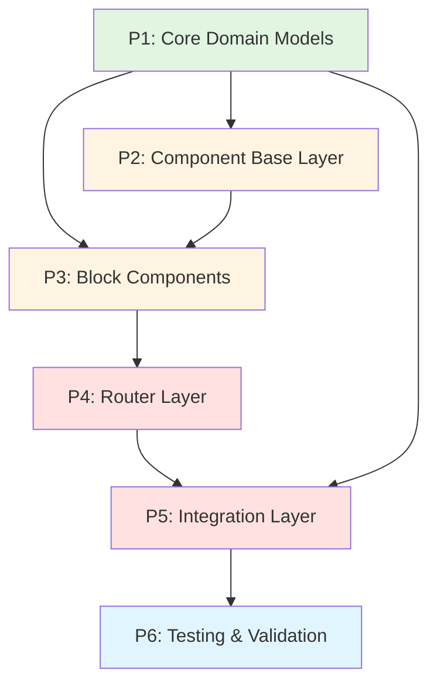
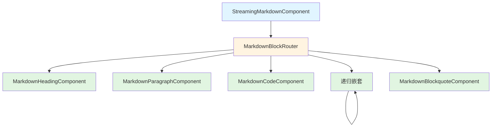
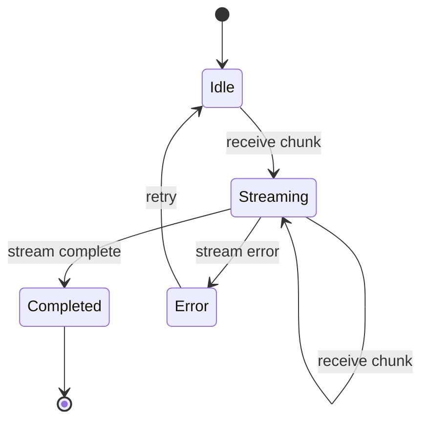

# Streaming Markdown 架构重构实施计划

**目标**: 将 innerHTML 渲染替换为结构化 Angular 模板，恢复样式封装并提升可维护性
**架构模式**: Component-Based Architecture with Smart Routing
**日期**: 2026-02-01
**预期工期**: Phase 1-3 (基础架构) + Phase 4-5 (集成) + Phase 6 (测试)

---

## Master Status Tracker

| Phase | Independence | Dependencies | Status |
| :--- | :--- | :--- | :--- |
| **P1: Core Domain Models** | **High** | None | 🔴 To Do |
| **P2: Component Base Layer** | **Medium** | P1 | 🔴 To Do |
| **P3: Block Components** | **Medium** | P1, P2 | 🔴 To Do |
| **P4: Router Layer** | **Low** | P3 | 🔴 To Do |
| **P5: Integration Layer** | **Low** | P1, P4 | 🔴 To Do |
| **P6: Testing & Validation** | **Medium** | P1-P5 | 🔴 To Do |

> **Status Legend**: 🔴 To Do | 🟡 In Progress | 🟢 Done | ✅ Verified

---

## Dependency Graph



**并行化策略**:
- ✅ Phase 1 可独立启动（无依赖）
- ⚠️ Phase 3 的各组件可并行开发（依赖共同的 P1, P2）
- ⚠️ Phase 6 测试可与 Phase 3-5 并行编写

---

## Phase 1: Core Domain Models

**独立性**: High | **依赖**: None | **预计时间**: 30-40 分钟

**目标**: 定义增强的数据结构，支持结构化渲染和流式更新

---

### Task 1.1: 增强 MarkdownBlock 接口

**文件**: `src/app/shared/components/streaming-markdown/core/models.ts`

**输出**: 可编译的类型定义

**操作**:
1. 在现有的 `MarkdownBlock` 接口基础上添加新字段
2. 定义 `MarkdownInline` 接口（内联元素）
3. 导出所有类型

**类型定义**:

```typescript
// === 新增类型 ===

/**
 * 内联元素（用于段落、列表项的富文本）
 */
export interface MarkdownInline {
  type: 'text' | 'bold' | 'italic' | 'code' | 'link' | 'hard-break';
  content: string;
  href?: string; // for link type
}

/**
 * 语法高亮 Token（未来扩展用）
 */
export interface SyntaxToken {
  type: string;
  content: string;
  color: string;
}

/**
 * 代码块高亮结果
 */
export interface HighlightResult {
  html: string;
  fallback: boolean; // 是否降级到纯文本
}

/**
 * 增强的 Markdown Block
 */
export interface MarkdownBlock {
  // === 现有字段（保持兼容） ===
  type: BlockType;
  content: string;
  level?: number;
  streaming?: boolean;

  // === 新增字段 ===
  id: string; // 唯一标识，用于 trackBy

  subtype?: 'heading' | 'ordered' | 'unordered';
  rawContent?: string; // 原始内容（用于代码块）

  children?: MarkdownInline[]; // 结构化内联元素
  items?: MarkdownBlock[]; // 嵌套列表

  language?: string; // code language

  // 高亮相关（代码块专用）
  highlightedHTML?: string;
  highlightResult?: Signal<HighlightResult | null>;
}

/**
 * 流式状态
 */
export type StreamingState = 'idle' | 'streaming' | 'completed' | 'error';
```

**验证标准**:
- ✅ `ng build` 无类型错误
- ✅ 现有组件仍可编译（向后兼容）

---

### Task 1.2: 更新 BlockType 枚举

**文件**: `src/app/shared/components/streaming-markdown/core/models.ts`

**操作**: 确保 BlockType 包含所有需要的类型

**类型定义**:

```typescript
/**
 * Markdown 块类型枚举
 */
export enum BlockType {
  HEADING = 'heading',
  PARAGRAPH = 'paragraph',
  CODE = 'code',
  LIST = 'list',
  BLOCKQUOTE = 'blockquote',
  // 未来扩展
  TABLE = 'table',
  CALLOUT = 'callout',
  // 降级类型
  UNKNOWN = 'unknown',
  RAW = 'raw'
}
```

**验证标准**:
- ✅ 枚举值与 brainstorm 设计一致
- ✅ 包含 UNKNOWN 和 RAW 降级类型

---

### Task 1.3: 创建 BlockFactory 接口

**文件**: `src/app/shared/components/streaming-markdown/core/block-factory.ts`

**目标**: 提供工厂方法创建规范的 Block 对象

**接口定义**:

```typescript
import { MarkdownBlock, BlockType } from './models';

/**
 * Block Factory 接口
 */
export interface IBlockFactory {
  createHeading(content: string, level: number, streaming?: boolean): MarkdownBlock;
  createParagraph(content: string, streaming?: boolean): MarkdownBlock;
  createCode(code: string, language?: string, streaming?: boolean): MarkdownBlock;
  createList(items: string[], ordered?: boolean, streaming?: boolean): MarkdownBlock;
  createBlockquote(content: string, streaming?: boolean): MarkdownBlock;
  createFallback(content: string): MarkdownBlock;
}

/**
 * ID 生成器
 */
export interface IBlockIdGenerator {
  generate(): string;
}
```

**实现骨架** (Task 2.3 详细实现，此处仅定义接口)

---

## Phase 2: Component Base Layer

**独立性**: Medium | **依赖**: P1 | **预计时间**: 20-30 分钟

**目标**: 定义组件基础接口和通用类型

---

### Task 2.1: 定义组件输入/输出接口

**文件**: `src/app/shared/components/streaming-markdown/core/component-interfaces.ts`

**接口定义**:

```typescript
import { MarkdownBlock, StreamingState } from './models';

/**
 * 通用 Block 组件输入
 */
export interface BlockComponentInput {
  block: MarkdownBlock;
  isStreaming?: boolean;
}

/**
 * Heading 组件输入
 */
export interface HeadingBlockInput {
  level: number;
  content: string;
  streaming?: boolean;
}

/**
 * Paragraph 组件输入
 */
export interface ParagraphBlockInput {
  content: string;
  inlines?: MarkdownInline[];
  streaming?: boolean;
}

/**
 * Code 组件输入
 */
export interface CodeBlockInput {
  code: string;
  language?: string;
  streaming?: boolean;
}

/**
 * List 组件输入
 */
export interface ListBlockInput {
  items: MarkdownBlock[];
  ordered?: boolean;
  depth?: number; // 嵌套深度
  streaming?: boolean;
}

/**
 * Blockquote 组件输入
 */
export interface BlockquoteBlockInput {
  content: string;
  streaming?: boolean;
}
```

**验证标准**:
- ✅ 所有接口编译通过
- ✅ 类型与 P1 的模型一致

---

### Task 2.2: 定义错误处理接口

**文件**: `src/app/shared/components/streaming-markdown/core/error-handling.ts`

**接口定义**:

```typescript
/**
 * 组件错误类型
 */
export enum ComponentErrorType {
  INVALID_INPUT = 'INVALID_INPUT',
  HIGHLIGHT_FAILED = 'HIGHLIGHT_FAILED',
  PARSE_FAILED = 'PARSE_FAILED',
  TIMEOUT = 'TIMEOUT'
}

/**
 * 组件错误
 */
export interface ComponentError {
  type: ComponentErrorType;
  message: string;
  originalError?: unknown;
}

/**
 * 错误处理器
 */
export interface IErrorHandler {
  handle(error: ComponentError): void;
  createFallback(content: string): MarkdownBlock;
}
```

**验证标准**:
- ✅ 错误类型枚举覆盖所有场景
- ✅ 接口定义清晰

---

### Task 2.3: 实现 BlockFactory

**文件**: `src/app/shared/components/streaming-markdown/core/block-factory.ts`

**目标**: 实现 P1.3 定义的工厂接口

**类定义**:

```typescript
import { Injectable } from '@angular/core';
import { MarkdownBlock, BlockType } from './models';
import { IBlockFactory, IBlockIdGenerator } from './block-factory';

@Injectable({ providedIn: 'root' })
export class BlockFactory implements IBlockFactory {
  constructor(private idGenerator: IBlockIdGenerator) {}

  createHeading(content: string, level: number, streaming = false): MarkdownBlock {
    return {
      id: this.idGenerator.generate(),
      type: BlockType.HEADING,
      content,
      level,
      streaming
    };
  }

  createParagraph(content: string, streaming = false): MarkdownBlock {
    return {
      id: this.idGenerator.generate(),
      type: BlockType.PARAGRAPH,
      content,
      streaming
    };
  }

  createCode(code: string, language = 'text', streaming = false): MarkdownBlock {
    return {
      id: this.idGenerator.generate(),
      type: BlockType.CODE,
      content: code,
      language,
      rawContent: code,
      streaming
    };
  }

  createList(items: string[], ordered = false, streaming = false): MarkdownBlock {
    // TODO: 在 Task 3.4 实现列表项转换逻辑
    return {
      id: this.idGenerator.generate(),
      type: BlockType.LIST,
      content: '',
      items: [],
      streaming
    };
  }

  createBlockquote(content: string, streaming = false): MarkdownBlock {
    return {
      id: this.idGenerator.generate(),
      type: BlockType.BLOCKQUOTE,
      content,
      streaming
    };
  }

  createFallback(content: string): MarkdownBlock {
    return {
      id: this.idGenerator.generate(),
      type: BlockType.UNKNOWN,
      content,
      streaming: false
    };
  }
}

@Injectable({ providedIn: 'root' })
export class BlockIdGenerator implements IBlockIdGenerator {
  private counter = 0;

  generate(): string {
    return `block-${Date.now()}-${this.counter++}`;
  }
}
```

**验证标准**:
- ✅ 工厂方法可创建所有类型的 Block
- ✅ 每个 Block 都有唯一 id
- ✅ 可编译通过

---

## Phase 3: Block Components Implementation

**独立性**: Medium | **依赖**: P1, P2 | **预计时间**: 2-3 小时

**目标**: 实现所有专用 Block 组件（5个）

**并行化**: Task 3.1-3.5 可以并行开发

---

### Task 3.1: MarkdownHeadingComponent

**文件**:
- `src/app/shared/components/streaming-markdown/blocks/heading/heading.component.ts`
- `src/app/shared/components/streaming-markdown/blocks/heading/heading.component.html`

**组件签名**:

```typescript
@Component({
  selector: 'app-markdown-heading',
  standalone: true,
  imports: [CommonModule],
  template: `
    @if (level >= 1 && level <= 6) {
      <h[level] [class]="headingClasses">{{ content }}</h[level]>
    } @else {
      <h6 class="markdown-heading fallback">{{ content }}</h6>
    }
  `,
  styleUrls: ['./heading.component.css']
})
export class MarkdownHeadingComponent implements OnChanges {
  @Input({ required: true }) level!: number;
  @Input({ required: true }) content!: string;
  @Input() streaming: boolean = false;

  headingClasses = signal<string>('markdown-heading');
}
```

**样式文件**: `heading.component.css`

```css
:host {
  display: block;
}

.markdown-heading {
  font-weight: 600;
  margin-top: var(--spacing-xl);
  margin-bottom: var(--spacing-md);
  color: var(--foreground);
}

.markdown-heading.fallback {
  color: var(--destructive); /* 警告色：无效 level */
}
```

**验证标准**:
- ✅ 组件编译通过
- ✅ 支持 level 1-6
- ✅ 无效 level 降级到 h6
- ✅ 样式使用 CSS 变量

---

### Task 3.2: MarkdownParagraphComponent

**文件**:
- `src/app/shared/components/streaming-markdown/blocks/paragraph/paragraph.component.ts`
- `src/app/shared/components/streaming-markdown/blocks/paragraph/paragraph.component.html`

**组件签名**:

```typescript
@Component({
  selector: 'app-markdown-paragraph',
  standalone: true,
  imports: [CommonModule],
  template: `
    <p [class]="paragraphClasses">
      @if (inlines && inlines.length > 0) {
        @for (inline of inlines; track inline.type) {
          <span [class]="getInlineClass(inline.type)">{{ inline.content }}</span>
        }
      } @else {
        {{ content }}
      }
    </p>
  `,
  styleUrls: ['./paragraph.component.css']
})
export class MarkdownParagraphComponent implements OnChanges {
  @Input({ required: true }) content!: string;
  @Input() inlines?: MarkdownInline[];
  @Input() streaming: boolean = false;

  paragraphClasses = signal<string>('markdown-paragraph block-paragraph');

  getInlineClass(type: string): string {
    // TODO: 在实现阶段完成
    return `inline-${type}`;
  }
}
```

**样式文件**: `paragraph.component.css`

```css
:host {
  display: block;
}

.markdown-paragraph {
  margin-top: var(--spacing-md);
  margin-bottom: var(--spacing-md);
  color: var(--foreground);
  line-height: 1.6;
}

.inline-bold {
  font-weight: 600;
}

.inline-italic {
  font-style: italic;
}

.inline-code {
  font-family: 'Monaco', 'Menlo', monospace;
  background: var(--muted);
  padding: 2px 4px;
  border-radius: var(--radius-sm);
}
```

**验证标准**:
- ✅ 组件编译通过
- ✅ 支持纯文本和内联元素
- ✅ 样式符合设计系统

---

### Task 3.3: MarkdownCodeComponent

**文件**:
- `src/app/shared/components/streaming-markdown/blocks/code/code.component.ts`
- `src/app/shared/components/streaming-markdown/blocks/code/code.component.html`

**组件签名**:

```typescript
@Component({
  selector: 'app-markdown-code',
  standalone: true,
  imports: [CommonModule],
  template: `
    <pre [class]="codeWrapperClasses" class="markdown-code">
      @if (highlightResult(); as result) {
        @if (result.fallback) {
          <code class="code-fallback">{{ code }}</code>
        } @else {
          <code [innerHTML]="result.html"></code>
        }
      } @else if (streaming) {
        <code class="code-streaming">{{ code }}</code>
      } @else {
        <code>{{ code }}</code>
      }
    </pre>
  `,
  styleUrls: ['./code.component.css'],
  changeDetection: ChangeDetectionStrategy.OnPush
})
export class MarkdownCodeComponent implements OnChanges {
  @Input({ required: true }) code!: string;
  @Input() language: string = 'text';
  @Input() streaming: boolean = false;

  highlightResult = signal<HighlightResult | null>(null);
  codeWrapperClasses = signal<string>('markdown-code block-code');

  constructor(
    private shiniHighlighter: ShiniHighlighter,
    private errorHandler: IErrorHandler
  ) {}

  ngOnChanges(changes: SimpleChanges): void {
    if (changes['code'] || changes['language']) {
      this.highlightCode();
    }
  }

  private highlightCode(): void {
    if (this.streaming) {
      return; // 流式状态下不高亮
    }

    this.shiniHighlighter.highlight(this.code, this.language)
      .pipe(
        timeout(5000),
        catchError((error) => {
          this.errorHandler.handle({
            type: ComponentErrorType.HIGHLIGHT_FAILED,
            message: `Failed to highlight ${this.language} code`,
            originalError: error
          });
          return of({ html: escapeHtml(this.code), fallback: true });
        })
      )
      .subscribe(result => {
        this.highlightResult.set(result);
      });
  }
}
```

**样式文件**: `code.component.css`

```css
:host {
  display: block;
}

.markdown-code {
  background: var(--muted);
  padding: var(--spacing-md);
  border-radius: var(--radius-md);
  font-family: 'Monaco', 'Menlo', monospace;
  font-size: 0.875rem;
  overflow-x: auto;
  margin-bottom: var(--spacing-lg);
}

.code-fallback {
  color: var(--muted-foreground);
}

.code-streaming {
  opacity: 0.8;
}

code {
  display: block;
  white-space: pre;
}
```

**验证标准**:
- ✅ 组件编译通过
- ✅ 调用 ShiniHighlighter
- ✅ 高亮失败降级到纯文本
- ✅ OnPush 变更检测策略
- ✅ 样式符合设计系统

---

### Task 3.4: MarkdownListComponent

**文件**:
- `src/app/shared/components/streaming-markdown/blocks/list/list.component.ts`
- `src/app/shared/components/streaming-markdown/blocks/list/list.component.html`

**组件签名**:

```typescript
@Component({
  selector: 'app-markdown-list',
  standalone: true,
  imports: [CommonModule, MarkdownListComponent],
  template: `
    @if (isValidList()) {
      @if (ordered) {
        <ol [class]="listClasses">
          @for (item of items; track item.id) {
            <li [class]="itemClasses">
              <span class="item-content">{{ item.content }}</span>
              @if (item.children && item.children.length > 0 && depth < 10) {
                <app-markdown-list
                  [items]="item.children"
                  [ordered]="ordered"
                  [depth]="depth + 1"
                />
              }
            </li>
          }
        </ol>
      } @else {
        <ul [class]="listClasses">
          @for (item of items; track item.id) {
            <li [class]="itemClasses">
              <span class="item-content">{{ item.content }}</span>
              @if (item.children && item.children.length > 0 && depth < 10) {
                <app-markdown-list
                  [items]="item.children"
                  [ordered]="ordered"
                  [depth]="depth + 1"
                />
              }
            </li>
          }
        </ul>
      }
    } @else {
      <p class="error-fallback">{{ rawListContent }}</p>
    }
  `,
  styleUrls: ['./list.component.css'],
  changeDetection: ChangeDetectionStrategy.OnPush
})
export class MarkdownListComponent implements OnChanges {
  @Input({ required: true }) items!: MarkdownBlock[];
  @Input() ordered: boolean = false;
  @Input() depth: number = 0;
  @Input() streaming: boolean = false;

  listClasses = signal<string>('markdown-list block-list');
  itemClasses = computed(() =>
    this.depth > 0 ? 'nested-item' : 'list-item'
  );
  rawListContent = signal<string>('');

  isValidList(): boolean {
    return Array.isArray(this.items) && this.items.length > 0;
  }
}
```

**样式文件**: `list.component.css`

```css
:host {
  display: block;
}

.markdown-list {
  margin-left: var(--spacing-md);
  margin-bottom: var(--spacing-md);
  padding-left: var(--spacing-xl);
}

.markdown-list ul {
  list-style-type: disc;
}

.markdown-list ol {
  list-style-type: decimal;
}

.list-item, .nested-item {
  margin-left: var(--spacing-md);
  padding-left: var(--spacing-sm);
  margin-bottom: var(--spacing-xs);
}

.list-item::marker, .nested-item::marker {
  color: var(--muted-foreground);
}

.nested-item {
  margin-left: var(--spacing-lg);
}

.error-fallback {
  color: var(--destructive);
  font-style: italic;
}
```

**验证标准**:
- ✅ 组件编译通过
- ✅ 支持嵌套列表（递归）
- ✅ 深度限制（最多10层）
- ✅ 无效列表降级到段落
- ✅ 样式使用 CSS 变量

---

### Task 3.5: MarkdownBlockquoteComponent

**文件**:
- `src/app/shared/components/streaming-markdown/blocks/blockquote/blockquote.component.ts`
- `src/app/shared/components/streaming-markdown/blocks/blockquote/blockquote.component.html`

**组件签名**:

```typescript
@Component({
  selector: 'app-markdown-blockquote',
  standalone: true,
  imports: [CommonModule],
  template: `
    <blockquote [class]="blockquoteClasses">
      {{ content }}
    </blockquote>
  `,
  styleUrls: ['./blockquote.component.css']
})
export class MarkdownBlockquoteComponent implements OnChanges {
  @Input({ required: true }) content!: string;
  @Input() streaming: boolean = false;

  blockquoteClasses = signal<string>(
    'markdown-blockquote block-blockquote'
  );
}
```

**样式文件**: `blockquote.component.css`

```css
:host {
  display: block;
}

.markdown-blockquote {
  border-left: 3px solid var(--primary);
  padding-left: var(--spacing-md);
  margin-left: var(--spacing-sm);
  margin-bottom: var(--spacing-md);
  color: var(--muted-foreground);
  font-style: italic;
}
```

**验证标准**:
- ✅ 组件编译通过
- ✅ 样式使用 `--primary` 边框
- ✅ 符合设计系统

---

## Phase 4: Router Layer

**独立性**: Low | **依赖**: P3 | **预计时间**: 40-50 分钟

**目标**: 实现智能路由器组件，分发到对应的 Block 组件

---

### Task 4.1: 创建 MarkdownBlockRouterComponent

**文件**: `src/app/shared/components/streaming-markdown/core/block-router.component.ts`

**组件签名**:

```typescript
@Component({
  selector: 'app-markdown-block-router',
  standalone: true,
  imports: [
    CommonModule,
    MarkdownHeadingComponent,
    MarkdownParagraphComponent,
    MarkdownCodeComponent,
    MarkdownListComponent,
    MarkdownBlockquoteComponent
  ],
  template: `
    @if (isValidBlock()) {
      @switch (block.type) {
        @case (BlockType.HEADING) {
          <app-markdown-heading
            [level]="block.level || 1"
            [content]="block.content || ''"
            [streaming]="block.streaming || isStreaming"
          />
        }
        @case (BlockType.PARAGRAPH) {
          <app-markdown-paragraph
            [content]="block.content || ''"
            [inlines]="block.children"
            [streaming]="block.streaming || isStreaming"
          />
        }
        @case (BlockType.CODE) {
          <app-markdown-code
            [code]="block.content || ''"
            [language]="block.language"
            [streaming]="block.streaming || isStreaming"
          />
        }
        @case (BlockType.LIST) {
          <app-markdown-list
            [items]="block.items || []"
            [ordered]="block.subtype === 'ordered'"
            [streaming]="block.streaming || isStreaming"
          />
        }
        @case (BlockType.BLOCKQUOTE) {
          <app-markdown-blockquote
            [content]="block.content || ''"
            [streaming]="block.streaming || isStreaming"
          />
        }
        @default {
          <app-markdown-paragraph
            [content]="block.raw || block.content || ''"
            [streaming]="false"
          />
        }
      }
    } @else {
      <app-markdown-paragraph
        [content]="block.raw || '[Invalid Block]'"
        [streaming]="false"
      />
    }
  `,
  changeDetection: ChangeDetectionStrategy.OnPush
})
export class MarkdownBlockRouterComponent implements OnChanges {
  @Input({ required: true }) block!: MarkdownBlock;
  @Input() isStreaming: boolean = false;

  isValidBlock(): boolean {
    return !!(
      this.block &&
      this.block.id &&
      this.block.type
    );
  }
}
```

**验证标准**:
- ✅ 组件编译通过
- ✅ 路由逻辑覆盖所有 BlockType
- ✅ 降级策略完善
- ✅ OnPush 变更检测

---

### Task 4.2: 更新导出索引

**文件**: `src/app/shared/components/streaming-markdown/index.ts`

**操作**: 导出所有新组件

```typescript
export * from './core/models';
export * from './core/block-factory';
export * from './core/component-interfaces';
export * from './core/block-router.component';
export * from './blocks/heading/heading.component';
export * from './blocks/paragraph/paragraph.component';
export * from './blocks/code/code.component';
export * from './blocks/list/list.component';
export * from './blocks/blockquote/blockquote.component';
```

**验证标准**:
- ✅ 导出路径正确
- ✅ 编译无错误

---

## Phase 5: Integration Layer

**独立性**: Low | **依赖**: P1, P4 | **预计时间**: 50-60 分钟

**目标**: 更新 StreamingMarkdownComponent，集成新的 Block Router

---

### Task 5.1: 更新 StreamingMarkdownComponent 模板

**文件**: `src/app/shared/components/streaming-markdown/streaming-markdown.component.html`

**当前模板**:
```html
<div class="markdown-container">
  @for (block of blocks(); track block.id) {
    <app-block-renderer [block]="block" />
  }
</div>
```

**新模板**:
```html
<div class="markdown-container">
  @if (error(); as err) {
    <div class="error-boundary">
      <p>{{ err.message }}</p>
      <button (click)="retry()">Retry</button>
    </div>
  } @else {
    @for (block of blocks(); track block.id) {
      <app-markdown-block-router
        [block]="block"
        [isStreaming]="isStreaming()"
      />
    }
  }
</div>
```

**验证标准**:
- ✅ 模板语法正确
- ✅ 使用 `track block.id` 优化性能
- ✅ 错误边界已集成

---

### Task 5.2: 更新 StreamingMarkdownComponent 类

**文件**: `src/app/shared/components/streaming-markdown/streaming-markdown.component.ts`

**操作**:
1. 移除 MarkdownFormatter 依赖
2. 添加 BlockFactory 依赖
3. 更新流处理逻辑
4. 添加错误边界

**类定义片段**:

```typescript
export class StreamingMarkdownComponent implements OnInit, OnDestroy {
  // 输入
  @Input() stream$!: Observable<string>;

  // 状态
  blocks = signal<MarkdownBlock[]>([]);
  isStreaming = signal<boolean>(true);
  error = signal<ComponentError | null>(null);

  constructor(
    private preprocessor: MarkdownPreprocessor,
    private parser: BlockParser,
    private blockFactory: BlockFactory,
    private errorHandler: IErrorHandler
  ) {}

  ngOnInit(): void {
    this.stream$.pipe(
      debounceTime(10),
      bufferTime(50),
      catchError((err) => {
        this.error.set({
          type: ComponentErrorType.PARSE_FAILED,
          message: 'Stream processing failed',
          originalError: err
        });
        return of([]);
      })
    ).subscribe(chunks => {
      this.processChunks(chunks);
    });
  }

  private processChunks(chunks: string[]): void {
    // TODO: 在实现阶段完成
    // 1. Preprocess
    // 2. Parse blocks
    // 3. Update Signal
  }

  retry(): void {
    this.error.set(null);
    // TODO: Restart stream
  }
}
```

**验证标准**:
- ✅ 不再依赖 MarkdownFormatter
- ✅ 使用 BlockFactory 创建 Blocks
- ✅ 错误处理逻辑完整
- ✅ 可编译通过

---

### Task 5.3: 移除 MarkdownFormatter

**文件**:
- `src/app/shared/components/streaming-markdown/renderers/markdown-formatter.service.ts`
- `src/app/shared/components/streaming-markdown/renderers/markdown-formatter.service.extended.ts`

**操作**:
1. 备份现有文件（重命名为 `.deprecated.ts`）
2. 从所有导入中移除
3. 删除 CodeBlockWrapper（如果不再需要）

**验证标准**:
- ✅ 编译无错误（所有引用已移除）
- ✅ 备份文件存在

---

### Task 5.4: 迁移全局 CSS 到组件样式

**文件**: `src/styles.css`

**操作**:
1. 识别与 markdown 相关的全局样式
2. 将样式移动到对应的组件 CSS 文件
3. 从全局样式中删除已迁移的样式

**迁移映射**:

| 样式规则 | 目标组件 |
|---------|---------|
| `.markdown-block` | 各 Block 组件 |
| `.markdown-block p` | MarkdownParagraphComponent |
| `.markdown-block h1-h6` | MarkdownHeadingComponent |
| `.markdown-block pre/code` | MarkdownCodeComponent |
| `.markdown-block ul/ol` | MarkdownListComponent |
| `.markdown-block blockquote` | MarkdownBlockquoteComponent |

**验证标准**:
- ✅ 全局样式已清理
- ✅ 组件样式独立
- ✅ 视觉效果保持一致

---

## Phase 6: Testing & Validation

**独立性**: Medium | **依赖**: P1-P5 | **预计时间**: 2-3 小时

**目标**: 编写单元测试、集成测试和 E2E 测试

---

### Task 6.1: 单元测试 - Block Components

**文件**: 各组件对应的 `.spec.ts` 文件

**测试模板** (以 MarkdownHeadingComponent 为例):

```typescript
describe('MarkdownHeadingComponent', () => {
  let component: MarkdownHeadingComponent;
  let fixture: ComponentFixture<MarkdownHeadingComponent>;

  beforeEach(async () => {
    await TestBed.configureTestingModule({
      imports: [MarkdownHeadingComponent]
    }).compileComponents();

    fixture = TestBed.createComponent(MarkdownHeadingComponent);
    component = fixture.componentInstance;
  });

  it('should create', () => {
    expect(component).toBeTruthy();
  });

  it('should render h1 when level is 1', () => {
    component.level = 1;
    component.content = 'Test Heading';
    fixture.detectChanges();

    const heading = fixture.nativeElement.querySelector('h1');
    expect(heading).toBeTruthy();
    expect(heading.textContent).toBe('Test Heading');
  });

  it('should fallback to h6 when level is invalid', () => {
    component.level = 10;
    component.content = 'Test';
    fixture.detectChanges();

    const heading = fixture.nativeElement.querySelector('h6.fallback');
    expect(heading).toBeTruthy();
  });

  it('should apply streaming class when streaming is true', () => {
    component.level = 1;
    component.streaming = true;
    fixture.detectChanges();

    const heading = fixture.nativeElement.querySelector('h1');
    expect(heading.classList).toContain('streaming');
  });
});
```

**验证标准**:
- ✅ 每个 Block 组件都有单元测试
- ✅ 覆盖率 > 80%
- ✅ 所有测试通过

---

### Task 6.2: 单元测试 - MarkdownBlockRouter

**文件**: `src/app/shared/components/streaming-markdown/core/block-router.component.spec.ts`

**测试场景**:

```typescript
describe('MarkdownBlockRouterComponent', () => {
  it('should route to heading component for HEADING type', () => {
    // TODO: 实现
  });

  it('should route to paragraph component for PARAGRAPH type', () => {
    // TODO: 实现
  });

  it('should route to code component for CODE type', () => {
    // TODO: 实现
  });

  it('should route to list component for LIST type', () => {
    // TODO: 实现
  });

  it('should route to blockquote component for BLOCKQUOTE type', () => {
    // TODO: 实现
  });

  it('should fallback to paragraph for unknown type', () => {
    // TODO: 实现
  });

  it('should fallback to paragraph for invalid block', () => {
    // TODO: 实现
  });
});
```

**验证标准**:
- ✅ 所有路由路径测试覆盖
- ✅ 降级策略测试通过

---

### Task 6.3: 集成测试 - 流式渲染

**文件**: `src/app/shared/components/streaming-markdown/streaming-markdown.component.integration.spec.ts`

**测试场景**:

```typescript
describe('StreamingMarkdownComponent Integration', () => {
  it('should render streaming blocks correctly', fakeAsync(() => {
    // TODO: 模拟 Observable 流
    // 验证 blocks 更新
    // 验证组件渲染
  }));

  it('should handle stream errors gracefully', fakeAsync(() => {
    // TODO: 模拟流错误
    // 验证错误边界显示
    // 验证降级渲染
  }));

  it('should propagate streaming state to child components', fakeAsync(() => {
    // TODO: 验证 streaming 状态传递
  }));
});
```

**验证标准**:
- ✅ 集成测试通过
- ✅ 流式逻辑正确

---

### Task 6.4: E2E 测试 - Playwright

**文件**: `tests/streaming-markdown.spec.ts`

**测试场景**:

```typescript
test('列表样式正确应用', async ({ page }) => {
  await page.goto('/test');

  const ul = page.locator('.markdown-list ul').first();
  const listStyleType = await ul.evaluate(el =>
    getComputedStyle(el).listStyleType
  );

  expect(listStyleType).toBe('disc');
});

test('段落间距正确应用', async ({ page }) => {
  await page.goto('/test');

  const p = page.locator('.markdown-paragraph').first();
  const marginTop = await p.evaluate(el =>
    getComputedStyle(el).marginTop
  );
  const marginBottom = await p.evaluate(el =>
    getComputedStyle(el).marginBottom
  );

  expect(marginTop).toBe('8px');
  expect(marginBottom).toBe('8px');
});

test('代码块高亮正常工作', async ({ page }) => {
  await page.goto('/test');

  const code = page.locator('.markdown-code code').first();
  const hasHighlighting = await code.evaluate(el =>
    el.querySelector('.shiki-token') !== null
  );

  expect(hasHighlighting).toBeTruthy();
});
```

**验证标准**:
- ✅ 复用 ISSUE_SUMMARY.md 中的测试
- ✅ 所有 E2E 测试通过
- ✅ 样式验证通过

---

### Task 6.5: 性能测试

**文件**: `tests/performance/streaming-markdown.perf.spec.ts`

**测试场景**:

```typescript
test('首次渲染时间 < 100ms (1000 blocks)', async ({ page }) => {
  // TODO: 测量首次渲染时间
});

test('增量更新时间 < 16ms', async ({ page }) => {
  // TODO: 模拟字符追加，测量 re-render 时间
});

test('内存占用 < 50MB (10000 blocks)', async ({ page }) => {
  // TODO: 使用 Chrome DevTools Memory profiler
});
```

**验证标准**:
- ✅ 性能指标达标
- ✅ 无内存泄漏

---

## Architectural Diagrams

### 组件层次结构



### 数据流

```mermaid
sequenceDiagram
    participant Stream as Observable&lt;string&gt;
    participant SM as StreamingMarkdown
    participant PP as Preprocessor
    participant BP as BlockParser
    participant BF as BlockFactory
    participant Router as BlockRouter
    participant Blocks as Block Components

    Stream->>SM: emit(chunk)
    SM->>PP: preprocess(chunk)
    PP->>BP: parse(content)
    BP->>BF: createBlock()
    BF->>SM: MarkdownBlock[]
    SM->>Router: [block]
    Router->>Blocks: route to component
    Blocks->>Blocks: render
```

### 状态管理



---

## Risk Mitigation

| 风险 | 影响 | 缓解策略 | 负责人 |
|------|------|---------|--------|
| **Block 数据结构不兼容** | 高 | Task 1.1 保持向后兼容，渐进式迁移 | Developer |
| **性能下降** | 中 | Task 6.5 性能测试，OnPush 优化 | Developer |
| **样式回归** | 中 | Task 5.4 迁移全局 CSS，E2E 测试验证 | Developer |
| **测试覆盖不足** | 中 | Task 6.1-6.4 完整测试套件 | Developer |
| **Shiki 集成失败** | 低 | Task 3.3 降级策略，错误处理 | Developer |

---

## Exit Criteria

### 功能性
- ✅ 所有 5 种核心块类型正确渲染
- ✅ 流式渲染保持流畅（字符逐个显示）
- ✅ Shiki 语法高亮正常工作
- ✅ 样式封装恢复（不再依赖全局 CSS）
- ✅ 错误降级正常工作

### 性能
- ✅ 首次渲染时间 < 100ms (1000 blocks)
- ✅ 增量更新时间 < 16ms (60fps)
- ✅ 内存占用 < 50MB (10000 blocks)

### 代码质量
- ✅ 架构评分提升到 4.5/5
- ✅ 单元测试覆盖率 > 80%
- ✅ 集成测试覆盖核心场景
- ✅ E2E 测试复用通过

### 可维护性
- ✅ 所有组件独立可测试
- ✅ 清晰的关注点分离
- ✅ 完整的类型定义
- ✅ 详细的文档和注释

---

## Notes

### 编译检查点

每个 Task 完成后必须确保：
1. `ng build` 无错误
2. `ng test` 相关测试通过
3. 类型检查无警告

### 回滚计划

如果 Phase 5 集成失败：
1. 保留 `*.deprecated.ts` 备份文件
2. Git commit 每个独立的 Phase
3. 可以回滚到任何一个 Phase 的完成状态

### 下一步行动

1. ✅ 启动 Phase 1（Task 1.1-1.3）
2. ⏸️ 等待 Phase 1 完成
3. ⏸️ 并行启动 Phase 2 和 Phase 3（Task 2.1-3.5）

---

**文档创建**: 2026-02-01
**状态**: 🔴 Ready for Implementation
**下一步**: 开始 Phase 1 - Core Domain Models
