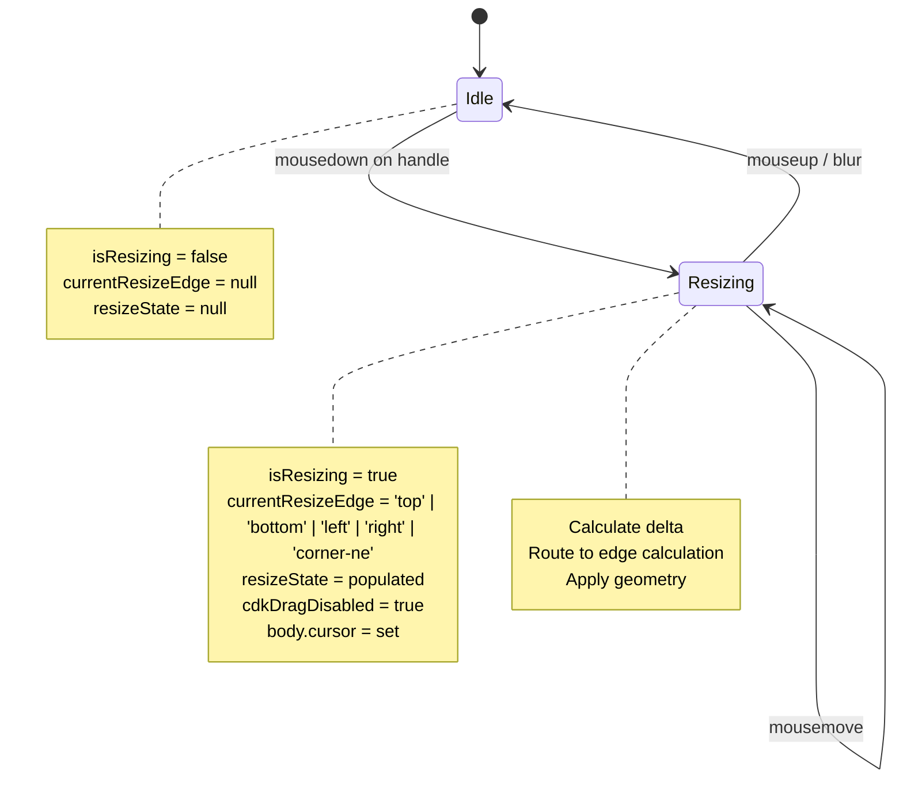
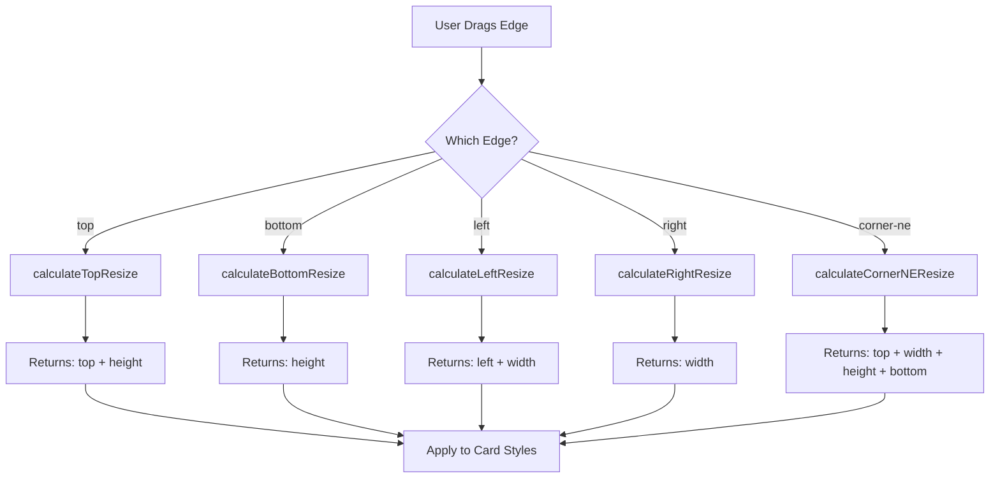
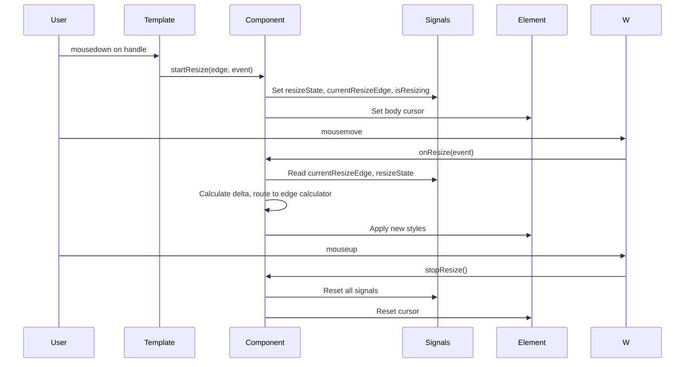

# Multi-Edge Resize Feature - Architectural Implementation Plan

**Goal**: Add four-edge drag resize capability to ai-chat-messages-card component (top, bottom, left, right edges) while preserving existing top-right corner resize handle.

**Architecture**: Event-driven state machine with unified resize logic pipeline

---

## Master Status Tracker

| Phase | Independence | Dependencies | Status |
| :--- | :--- | :--- | :--- |
| **P1: Core Domain Models** | High | None | 🔴 To Do |
| **P2: Resize State Machine** | High | P1 | 🔴 To Do |
| **P3: Template UI Layer** | Medium | P1, P2 | 🔴 To Do |
| **P4: CSS Styling Layer** | Medium | P3 | 🔴 To Do |
| **P5: Edge Calculation Engine** | Low | P1, P2 | 🔴 To Do |
| **P6: Event Integration & Testing** | Low | P2, P3, P4, P5 | 🔴 To Do |

> **Status Legend**: 🔴 To Do, 🟡 In Progress, 🟢 Done

---

## Phase 1: Core Domain Models

**Independence**: High (Can be developed independently)

**Overview**: Define TypeScript interfaces and type definitions for the resize system.

### Task 1.1: Define Edge Type Enum

**File**: `src/app/shared/ui/ai-chat/types/resize-edge.type.ts`

**Description**: Create union type for all resize edges

**Deliverable**:
```typescript
// New file
export type ResizeEdge = 'top' | 'bottom' | 'left' | 'right' | 'corner-ne';
```

**Compilation Check**: Type compiles successfully

---

### Task 1.2: Define ResizeState Interface

**File**: `src/app/shared/ui/ai-chat/types/resize-state.interface.ts`

**Description**: Capture all initial state when resize starts

**Deliverable**:
```typescript
// New file
export interface ResizeState {
  // Mouse starting position
  readonly startMouseX: number;
  readonly startMouseY: number;

  // Card initial geometry
  readonly startTop: number;
  readonly startBottom: number;
  readonly startLeft: number;
  readonly startRight: number;
  readonly startWidth: number;
  readonly startHeight: number;

  // Active edge being dragged
  readonly activeEdge: ResizeEdge;
}
```

**Compilation Check**: Interface compiles successfully

---

### Task 1.3: Define ResizeConstraints Interface

**File**: `src/app/shared/ui/ai-chat/types/resize-constraints.interface.ts`

**Description**: Encapsulate min/max dimensions and viewport padding

**Deliverable**:
```typescript
// New file
export interface ResizeConstraints {
  readonly minWidth: number;
  readonly minHeight: number;
  readonly viewportPadding: number;
  readonly windowWidth: number;
  readonly windowHeight: number;
}
```

**Compilation Check**: Interface compiles successfully

---

### Task 1.4: Define CalculatedGeometry Interface

**File**: `src/app/shared/ui/ai-chat/types/calculated-geometry.interface.ts`

**Description**: Result type for edge calculation methods

**Deliverable**:
```typescript
// New file
export interface CalculatedGeometry {
  readonly width?: number;
  readonly height?: number;
  readonly top?: number;
  readonly bottom?: number;
  readonly left?: number;
  readonly right?: number;
}
```

**Compilation Check**: Interface compiles successfully

---

## Phase 2: Resize State Machine

**Independence**: High (Only depends on P1 types)

**Overview**: Implement state management for resize lifecycle using Signals.

### Task 2.1: Add State Signals to Component

**File**: `src/app/shared/ui/ai-chat/chat-messages-card/chat-messages-card.component.ts`

**Description**: Declare WritableSignals for resize state

**Deliverable**:
```typescript
// Add to ChatMessagesCardComponent class
export class ChatMessagesCardComponent {
  // Existing signals...

  // NEW: Resize state signals
  readonly currentResizeEdge = signal<ResizeEdge | null>(null);
  private resizeState = signal<ResizeState | null>(null);

  // NEW: Constraints as static readonly
  private static readonly MIN_WIDTH = 280;
  private static readonly MIN_HEIGHT = 200;
  private static readonly VIEWPORT_PADDING = 8;
}
```

**Compilation Check**: Component compiles with new signal declarations

---

### Task 2.2: Initialize Constraints Helper

**File**: `src/app/shared/ui/ai-chat/chat-messages-card/chat-messages-card.component.ts`

**Description**: Create private method to get current constraints

**Deliverable**:
```typescript
// Add to ChatMessagesCardComponent class
private getConstraints(): ResizeConstraints {
  return {
    minWidth: ChatMessagesCardComponent.MIN_WIDTH,
    minHeight: ChatMessagesCardComponent.MIN_HEIGHT,
    viewportPadding: ChatMessagesCardComponent.VIEWPORT_PADDING,
    windowWidth: window.innerWidth,
    windowHeight: window.innerHeight,
  };
}
```

**Compilation Check**: Method compiles and returns correct interface type

---

## Phase 3: Template UI Layer

**Independence**: Medium (Depends on P1 for ResizeEdge type)

**Overview**: Add 4 new resize handle elements to template.

### Task 3.1: Add Top Edge Handle

**File**: `src/app/shared/ui/ai-chat/chat-messages-card/chat-messages-card.component.ts` (template)

**Description**: Add top edge resize handle with mousedown binding

**Deliverable**:
```typescript
// Add to template after existing resize handle
<!-- NEW: Top Edge Resize Handle -->
<div
  class="resize-handle resize-handle-top"
  (mousedown)="startResize('top', $event)"
></div>
```

**Compilation Check**: Template compiles successfully

---

### Task 3.2: Add Bottom Edge Handle

**File**: `src/app/shared/ui/ai-chat/chat-messages-card/chat-messages-card.component.ts` (template)

**Description**: Add bottom edge resize handle with mousedown binding

**Deliverable**:
```typescript
<!-- NEW: Bottom Edge Resize Handle -->
<div
  class="resize-handle resize-handle-bottom"
  (mousedown)="startResize('bottom', $event)"
></div>
```

**Compilation Check**: Template compiles successfully

---

### Task 3.3: Add Left Edge Handle

**File**: `src/app/shared/ui/ai-chat/chat-messages-card/chat-messages-card.component.ts` (template)

**Description**: Add left edge resize handle with mousedown binding

**Deliverable**:
```typescript
<!-- NEW: Left Edge Resize Handle -->
<div
  class="resize-handle resize-handle-left"
  (mousedown)="startResize('left', $event)"
></div>
```

**Compilation Check**: Template compiles successfully

---

### Task 3.4: Add Right Edge Handle

**File**: `src/app/shared/ui/ai-chat/chat-messages-card/chat-messages-card.component.ts` (template)

**Description**: Add right edge resize handle with mousedown binding

**Deliverable**:
```typescript
<!-- NEW: Right Edge Resize Handle -->
<div
  class="resize-handle resize-handle-right"
  (mousedown)="startResize('right', $event)"
></div>
```

**Compilation Check**: Template compiles successfully

---

### Task 3.5: Update Existing Corner Handle Call

**File**: `src/app/shared/ui/ai-chat/chat-messages-card/chat-messages-card.component.ts` (template)

**Description**: Update existing corner handle to use new startResize signature

**Deliverable**:
```typescript
// UPDATE: Change existing call from
<div class="resize-handle resize-handle-ne" (mousedown)="startResize($event)">
// TO:
<div class="resize-handle resize-handle-ne" (mousedown)="startResize('corner-ne', $event)">
```

**Compilation Check**: Template compiles successfully

---

## Phase 4: CSS Styling Layer

**Independence**: Medium (Depends on P3 handles existing in DOM)

**Overview**: Position and style the 4 new edge handles.

### Task 4.1: Add Top Handle Styles

**File**: `src/app/shared/ui/ai-chat/chat-messages-card/chat-messages-card.component.css`

**Description**: Position top handle, add ns-resize cursor

**Deliverable**:
```css
/* Top Edge Handle */
.resize-handle-top {
  position: absolute;
  top: 0;
  left: 20px;
  right: 20px;
  height: 4px;
  cursor: ns-resize;
}
```

**Compilation Check**: CSS compiles (no syntax errors)

---

### Task 4.2: Add Bottom Handle Styles

**File**: `src/app/shared/ui/ai-chat/chat-messages-card/chat-messages-card.component.css`

**Description**: Position bottom handle, add ns-resize cursor

**Deliverable**:
```css
/* Bottom Edge Handle */
.resize-handle-bottom {
  position: absolute;
  bottom: 0;
  left: 20px;
  right: 20px;
  height: 4px;
  cursor: ns-resize;
}
```

**Compilation Check**: CSS compiles successfully

---

### Task 4.3: Add Left Handle Styles

**File**: `src/app/shared/ui/ai-chat/chat-messages-card/chat-messages-card.component.css`

**Description**: Position left handle, add ew-resize cursor

**Deliverable**:
```css
/* Left Edge Handle */
.resize-handle-left {
  position: absolute;
  left: 0;
  top: 20px;
  bottom: 20px;
  width: 4px;
  cursor: ew-resize;
}
```

**Compilation Check**: CSS compiles successfully

---

### Task 4.4: Add Right Handle Styles

**File**: `src/app/shared/ui/ai-chat/chat-messages-card/chat-messages-card.component.css`

**Description**: Position right handle, add ew-resize cursor

**Deliverable**:
```css
/* Right Edge Handle */
.resize-handle-right {
  position: absolute;
  right: 0;
  top: 20px;
  bottom: 20px;
  width: 4px;
  cursor: ew-resize;
}
```

**Compilation Check**: CSS compiles successfully

---

### Task 4.5: Add Handle Hover Feedback (Optional)

**File**: `src/app/shared/ui/ai-chat/chat-messages-card/chat-messages-card.component.css`

**Description**: Add visual feedback on handle hover

**Deliverable**:
```css
/* Optional: Hover feedback for all handles */
.resize-handle-top:hover,
.resize-handle-bottom:hover,
.resize-handle-left:hover,
.resize-handle-right:hover {
  background-color: oklch(0.48 0.07 195 / 0.2);
  transition: background-color 0.15s ease;
}
```

**Compilation Check**: CSS compiles successfully

---

## Phase 5: Edge Calculation Engine

**Independence**: Low (Depends on P1 interfaces, P2 state signals)

**Overview**: Implement calculation logic for each edge.

### Task 5.1: Refactor startResize Method Signature

**File**: `src/app/shared/ui/ai-chat/chat-messages-card/chat-messages-card.component.ts`

**Description**: Update to accept edge parameter and populate ResizeState

**Deliverable**:
```typescript
// UPDATE existing method signature
startResize(edge: ResizeEdge, event: MouseEvent): void {
  event.preventDefault();
  event.stopPropagation();

  const card = this.cardRef.nativeElement;
  const rect = card.getBoundingClientRect();
  const computedStyle = window.getComputedStyle(card);

  // Populate resizeState signal
  this.resizeState.set({
    startMouseX: event.clientX,
    startMouseY: event.clientY,
    startTop: rect.top,
    startBottom: window.innerHeight - rect.bottom,
    startLeft: rect.left,
    startRight: window.innerWidth - rect.right,
    startWidth: rect.width,
    startHeight: rect.height,
    activeEdge: edge,
  });

  this.currentResizeEdge.set(edge);
  this.isResizing.set(true);

  // Set cursor based on edge
  this.setBodyCursor(edge);
}

// NEW: Helper method
private setBodyCursor(edge: ResizeEdge): void {
  const cursorMap = {
    top: 'ns-resize',
    bottom: 'ns-resize',
    left: 'ew-resize',
    right: 'ew-resize',
    'corner-ne': 'nwse-resize',
  };
  document.body.style.cursor = cursorMap[edge];
}
```

**Compilation Check**: Method compiles with new signature

---

### Task 5.2: Calculate Top Edge Resize

**File**: `src/app/shared/ui/ai-chat/chat-messages-card/chat-messages-card.component.ts`

**Description**: Implement top edge calculation (changes top + height, keeps bottom fixed)

**Deliverable**:
```typescript
private calculateTopResize(
  state: ResizeState,
  deltaY: number,
  constraints: ResizeConstraints
): CalculatedGeometry {
  const { startTop, startHeight } = state;
  const { minHeight, viewportPadding } = constraints;

  const newHeight = Math.max(minHeight, startHeight - deltaY);
  const newTop = Math.max(
    viewportPadding,
    startTop + (startHeight - newHeight)
  );

  return {
    top: newTop,
    height: newHeight,
  };
}
```

**Compilation Check**: Method compiles and returns CalculatedGeometry

---

### Task 5.3: Calculate Bottom Edge Resize

**File**: `src/app/shared/ui/ai-chat/chat-messages-card/chat-messages-card.component.ts`

**Description**: Implement bottom edge calculation (changes height only)

**Deliverable**:
```typescript
private calculateBottomResize(
  state: ResizeState,
  deltaY: number,
  constraints: ResizeConstraints
): CalculatedGeometry {
  const { startHeight, startTop } = state;
  const { minHeight, windowHeight, viewportPadding } = constraints;

  const newHeight = Math.max(
    minHeight,
    Math.min(windowHeight - startTop - viewportPadding, startHeight + deltaY)
  );

  return {
    height: newHeight,
  };
}
```

**Compilation Check**: Method compiles and returns CalculatedGeometry

---

### Task 5.4: Calculate Left Edge Resize

**File**: `src/app/shared/ui/ai-chat/chat-messages-card/chat-messages-card.component.ts`

**Description**: Implement left edge calculation (changes left + width, keeps right fixed)

**Deliverable**:
```typescript
private calculateLeftResize(
  state: ResizeState,
  deltaX: number,
  constraints: ResizeConstraints
): CalculatedGeometry {
  const { startLeft, startWidth } = state;
  const { minWidth, viewportPadding } = constraints;

  const newWidth = Math.max(minWidth, startWidth - deltaX);
  const newLeft = Math.max(
    viewportPadding,
    startLeft + (startWidth - newWidth)
  );

  return {
    left: newLeft,
    width: newWidth,
  };
}
```

**Compilation Check**: Method compiles and returns CalculatedGeometry

---

### Task 5.5: Calculate Right Edge Resize

**File**: `src/app/shared/ui/ai-chat/chat-messages-card/chat-messages-card.component.ts`

**Description**: Implement right edge calculation (changes width only)

**Deliverable**:
```typescript
private calculateRightResize(
  state: ResizeState,
  deltaX: number,
  constraints: ResizeConstraints
): CalculatedGeometry {
  const { startWidth, startLeft } = state;
  const { minWidth, windowWidth, viewportPadding } = constraints;

  const newWidth = Math.max(
    minWidth,
    Math.min(windowWidth - startLeft - viewportPadding, startWidth + deltaX)
  );

  return {
    width: newWidth,
  };
}
```

**Compilation Check**: Method compiles and returns CalculatedGeometry

---

### Task 5.6: Refactor Existing Corner-NE Logic

**File**: `src/app/shared/ui/ai-chat/chat-messages-card/chat-messages-card.component.ts`

**Description**: Extract existing corner resize into dedicated method

**Deliverable**:
```typescript
private calculateCornerNEResize(
  state: ResizeState,
  deltaX: number,
  deltaY: number,
  constraints: ResizeConstraints
): CalculatedGeometry {
  const { startWidth, startHeight, startTop } = state;
  const { minWidth, minHeight, windowHeight, viewportPadding } = constraints;

  const newWidth = Math.max(minWidth, startWidth + deltaX);
  const newHeight = Math.max(
    minHeight,
    Math.min(windowHeight - viewportPadding, startHeight - deltaY)
  );
  const newTop = startTop + (startHeight - newHeight);

  return {
    width: newWidth,
    height: newHeight,
    top: newTop,
    bottom: state.startBottom,
  };
}
```

**Compilation Check**: Method compiles and returns CalculatedGeometry

---

### Task 5.7: Create Edge Calculation Router

**File**: `src/app/shared/ui/ai-chat/chat-messages-card/chat-messages-card.component.ts`

**Description**: Router method to dispatch to appropriate calculation method

**Deliverable**:
```typescript
private calculateResizeForEdge(
  edge: ResizeEdge,
  state: ResizeState,
  deltaX: number,
  deltaY: number,
  constraints: ResizeConstraints
): CalculatedGeometry {
  switch (edge) {
    case 'top':
      return this.calculateTopResize(state, deltaY, constraints);
    case 'bottom':
      return this.calculateBottomResize(state, deltaY, constraints);
    case 'left':
      return this.calculateLeftResize(state, deltaX, constraints);
    case 'right':
      return this.calculateRightResize(state, deltaX, constraints);
    case 'corner-ne':
      return this.calculateCornerNEResize(state, deltaX, deltaY, constraints);
    default:
      return {};
  }
}
```

**Compilation Check**: Method compiles with exhaustive switch

---

## Phase 6: Event Integration & Testing

**Independence**: Low (Integrates P2, P3, P4, P5)

**Overview**: Wire up event listeners, integrate calculation engine, add safety checks.

### Task 6.1: Refactor onResize Event Handler

**File**: `src/app/shared/ui/ai-chat/chat-messages-card/chat-messages-card.component.ts`

**Description**: Update to use edge routing and calculation engine

**Deliverable**:
```typescript
@HostListener('window:mousemove', ['$event'])
onResize(event: MouseEvent): void {
  const edge = this.currentResizeEdge();
  const state = this.resizeState();

  if (!edge || !state || !this.cardRef) return;

  const card = this.cardRef.nativeElement;
  const deltaX = event.clientX - state.startMouseX;
  const deltaY = event.clientY - state.startMouseY;
  const constraints = this.getConstraints();

  // Route to appropriate calculation method
  const geometry = this.calculateResizeForEdge(
    edge,
    state,
    deltaX,
    deltaY,
    constraints
  );

  // Apply calculated geometry to card
  if (geometry.width !== undefined) {
    card.style.width = `${geometry.width}px`;
  }
  if (geometry.height !== undefined) {
    card.style.height = `${geometry.height}px`;
  }
  if (geometry.top !== undefined) {
    card.style.top = `${geometry.top}px`;
  }
  if (geometry.bottom !== undefined) {
    card.style.bottom = `${geometry.bottom}px`;
  }
  if (geometry.left !== undefined) {
    card.style.left = `${geometry.left}px`;
  }
  if (geometry.right !== undefined) {
    card.style.right = `${geometry.right}px`;
  }
}
```

**Compilation Check**: Method compiles successfully

---

### Task 6.2: Enhance stopResize Cleanup

**File**: `src/app/shared/ui/ai-chat/chat-messages-card/chat-messages-card.component.ts`

**Description**: Add proper cursor cleanup and state reset

**Deliverable**:
```typescript
@HostListener('window:mouseup')
stopResize(): void {
  if (!this.isResizing()) return;

  this.isResizing.set(false);
  this.currentResizeEdge.set(null);
  this.resizeState.set(null);
  document.body.style.cursor = '';
}
```

**Compilation Check**: Method compiles successfully

---

### Task 6.3: Add Window Blur Safety Handler

**File**: `src/app/shared/ui/ai-chat/chat-messages-card/chat-messages-card.component.ts`

**Description**: Handle case where mouse is released outside browser

**Deliverable**:
```typescript
@HostListener('window:blur')
onWindowBlur(): void {
  if (this.isResizing()) {
    this.stopResize();
  }
}
```

**Compilation Check**: Method compiles successfully

---

### Task 6.4: Remove Relative Position Mode Support

**File**: `src/app/shared/ui/ai-chat/chat-messages-card/chat-messages-card.component.ts`

**Description**: Remove position input, hardcode to fixed mode only

**Deliverable**:
```typescript
// REMOVE:
readonly position = input<'fixed' | 'relative'>('relative');

// UPDATE computed:
protected cardClasses = computed(() =>
  cn(
    this.cardContainerBase,
    'chat-messages-card',
    this.cardFixedStyles, // Always use fixed styles
    'fixed', // Always apply fixed class
  )
);
```

**Compilation Check**: Component compiles without position input

---

### Task 6.5: Remove Old State Variables

**File**: `src/app/shared/ui/ai-chat/chat-messages-card/chat-messages-card.component.ts`

**Description**: Clean up legacy resize state variables (replaced by ResizeState interface)

**Deliverable**:
```typescript
// REMOVE these old variables (lines 165-169):
// private startX = 0;
// private startY = 0;
// private startWidth = 0;
// private startHeight = 0;
// private startBottom = 0;

// All now handled by resizeState signal
```

**Compilation Check**: Component compiles without old variables

---

### Task 6.6: Manual Testing Checklist

**File**: Create test documentation in component file header or README

**Description**: Document test scenarios

**Deliverable**:
```typescript
/**
 * ## Testing Checklist
 *
 * ### Basic Resize:
 * [ ] Drag top handle - verify bottom stays fixed
 * [ ] Drag bottom handle - verify top stays fixed
 * [ ] Drag left handle - verify right stays fixed
 * [ ] Drag right handle - verify left stays fixed
 * [ ] Drag corner-ne handle - verify bottom-left stays fixed
 *
 * ### Constraints:
 * [ ] Try to shrink below 280x200 - verify stops at minimum
 * [ ] Drag to viewport edge - verify 8px padding respected
 * [ ] Quick drag movements - verify smooth tracking
 *
 * ### State Management:
 * [ ] Start resize - verify cdkDrag is disabled
 * [ ] During resize - verify drag handle doesn't move card
 * [ ] Release mouse - verify cdkDrag re-enabled
 * [ ] Mouse outside window - verify blur stops resize
 *
 * ### Cursor Feedback:
 * [ ] Hover top/bottom - verify ns-resize cursor
 * [ ] Hover left/right - verify ew-resize cursor
 * [ ] Hover corner - verify nwse-resize cursor
 * [ ] Dragging - verify body cursor matches handle
 */
```

**Compilation Check**: Comment compiles (no syntax errors)

---

## Architecture Diagram

### State Machine Flow



### Edge Calculation Strategy



### Data Flow



---

## Key Design Decisions

### 1. Unified Entry Point
**Decision**: All 5 handles call `startResize(edge, event)` with edge parameter
**Rationale**: Single method reduces code duplication, easier to maintain

### 2. Signal-Based State
**Decision**: Use `WritableSignal<ResizeState | null>` instead of individual variables
**Rationale**: Leverages Angular Signals reactivity, single state object

### 3. Calculation Separation
**Decision**: Each edge has dedicated private calculation method
**Rationale**: Testable in isolation, clear single responsibility

### 4. Interface-First Design
**Decision**: Define interfaces before implementation (P1)
**Rationale**: Type safety, compilable checkpoints, clear contracts

### 5. Fixed Mode Only
**Decision**: Remove relative position mode support
**Rationale**: Simplifies implementation, fixed is primary use case

---

## Risk Mitigation

| Risk | Impact | Mitigation |
|------|--------|------------|
| **Drag/Resize conflict** | High | cdkDragDisabled bound to isResizing signal |
| **Mouse outside window** | Medium | @HostListener('window:blur') safety handler |
| **Min size violation** | Low | Math.max(minWidth/Height, calculated) in all calculations |
| **Viewport overflow** | Medium | Math.min/max with viewportPadding in all calculations |
| **State inconsistency** | Low | Single source of truth (resizeState signal) |

---

## Parallel Execution Strategy

### Can Run in Parallel:
- **P1 (Domain Models)** + **P2 (State Machine)**: High independence
- **P3 (Template)** + **P4 (CSS)**: After P1 completes, can run concurrently

### Must Run Sequentially:
- **P5 (Calculations)**: Depends on P1 (interfaces) + P2 (signals)
- **P6 (Integration)**: Depends on all previous phases

### Recommended Execution Order:
```
Sprint 1: P1 + P2 (in parallel)
Sprint 2: P3 + P4 (in parallel, after P1)
Sprint 3: P5 (after P1+P2)
Sprint 4: P6 (after all)
```

---

## Success Criteria

✅ All 5 handles (top, bottom, left, right, corner-ne) functional
✅ Minimum size constraint (280×200) enforced
✅ Viewport boundary protection (8px padding) active
✅ cdkDrag disabled during resize
✅ Proper cursor feedback on hover/drag
✅ No relative mode support (removed)
✅ Compilable checkpoints achieved at every task
✅ Type safety maintained throughout

---

## Post-Implementation (Future Work)

- [ ] Emit resizeStart/resizeMove/resizeEnd events
- [ ] Persist size to localStorage
- [ ] Add size tooltip during drag
- [ ] Support touch events (mobile)
- [ ] Add Shift key aspect-ratio lock
- [ ] Add ESC key to cancel resize

---

**Plan Status**: ✅ Ready for Implementation

**Next Step**: Begin Phase 1 (Core Domain Models)
