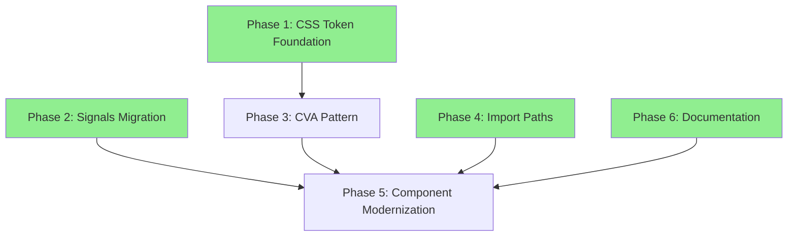

# CSS Token & Angular Modernization Architecture

**Goal:** 统一设计系统 CSS Token 使用，全面采用 Angular 20+ Signal API，对齐 shadcn/ui 最佳实践
**Architecture:** 域驱动设计 (DDD) + 迁移策略模式
**Estimated Duration:** 2-3 weeks (分阶段实施)

---

## Executive Summary

基于代码审查报告（CODE_REVIEW_2025-02-05.md），本计划解决三个核心问题域：

1. **CSS Token 一致性** - 部分组件硬编码尺寸，未使用设计系统变量
2. **Angular API 现代化** - 混用旧式装饰器（@Input/@ViewChild）与现代 Signal API
3. **shadcn/ui 对齐** - 组件样式组织不统一，需统一使用 CVA 模式

**关键策略：**
- ✅ **向后兼容** - 每个阶段保持组件 API 兼容性
- ✅ **渐进式迁移** - 优先级驱动，可独立部署
- ✅ **并行执行** - P0/P1 任务可分发给并发子代理
- ✅ **可编译检查点** - 每个任务结束后项目必须可运行

---

## Master Status Tracker

| Phase | Independence | Dependencies | Status |
| :--- | :--- | :--- | :--- |
| **P1: CSS Token Foundation** | **High** | None | 🔴 To Do |
| **P2: Angular Signals Migration** | **High** | None | 🔴 To Do |
| **P3: CVA Pattern Standardization** | **Medium** | P1 | 🔴 To Do |
| **P4: Import Path Infrastructure** | **High** | None | 🔴 To Do |
| **P5: Component Modernization** | **Low** | P1, P2, P3, P4 | 🔴 To Do |

> **Status Legend:** 🔴 To Do, 🟡 In Progress, 🟢 Done, ⚪ Blocked

---

## Phase 1: CSS Token Foundation

**Independence:** High (可独立并行执行)
**Goal:** 扩展全局 CSS 变量系统，为所有组件提供设计 token
**Output:** `styles.css` 更新 + Token 类型定义

### Domain Model

```typescript
// Token 命名空间
namespace DesignTokens {
  // Avatar tokens (新增)
  interface AvatarTokens {
    'size-sm': string;    // 2rem (32px)
    'size-md': string;    // 2.5rem (40px)
    'size-lg': string;    // 3rem (48px)
    'size-xl': string;    // 4rem (64px)
    'font-size-sm': string;  // 0.75rem (12px)
    'font-size-md': string;  // 0.875rem (14px)
    'font-size-lg': string;  // 1rem (16px)
  }

  // Progress tokens (新增)
  interface ProgressTokens {
    'height': string;     // 0.25rem (4px)
  }

  // Slider tokens (新增)
  interface SliderTokens {
    'height': string;        // 0.375rem (6px)
    'thumb-size': string;    // 1rem (16px)
    'thumb-scale': string;   // 1.25
  }

  // 全局 tokens (已存在，需验证完整性)
  interface ExistingTokens {
    Button: { ... };      // 已验证 ✅
    Card: { ... };        // 已验证 ✅
    Badge: { ... };       // 已验证 ✅
    Switch: { ... };      // 已验证 ✅
    Sheet: { ... };       // 已验证 ✅
  }
}
```

### Task List

#### T1.1: Define Missing CSS Variables (styles.css)
**Output:** `styles.css` 更新，编译通过
**Estimated Time:** 15-20 分钟

**Action Items:**
- 在 `@theme inline` 区块添加 Avatar tokens
- 在 `@theme inline` 区块添加 Progress tokens
- 在 `@theme inline` 区块添加 Slider tokens
- 验证 dark mode 变量对称性
- **编译检查:** `ng build` 成功，无 CSS 解析错误

**File:** `src/styles.css`
**Changes:**
```css
/* @theme inline */
--avatar-size-sm: 2rem;
--avatar-size-md: 2.5rem;
--avatar-size-lg: 3rem;
--avatar-size-xl: 4rem;
--avatar-font-size-sm: 0.75rem;
--avatar-font-size-md: 0.875rem;
--avatar-font-size-lg: 1rem;

--progress-height: 0.25rem;

--slider-height: 0.375rem;
--slider-thumb-size: 1rem;
--slider-thumb-scale: 1.25;
```

#### T1.2: Create Token Type Definitions
**Output:** 新建 `src/app/shared/ui/tokens/` 目录 + TypeScript 类型文件
**Estimated Time:** 15-20 分钟

**Action Items:**
- 创建 `src/app/shared/ui/tokens/index.ts` (barrel export)
- 创建 `src/app/shared/ui/tokens/avatar-tokens.ts`
- 创建 `src/app/shared/ui/tokens/progress-tokens.ts`
- 创建 `src/app/shared/ui/tokens/slider-tokens.ts`
- 导出所有 token 类型供组件使用
- **编译检查:** TypeScript 编译通过，类型导出正确

**File Structure:**
```
src/app/shared/ui/tokens/
├── index.ts              # Barrel export
├── avatar-tokens.ts      # export type AvatarSize = 'sm' | 'md' | 'lg' | 'xl';
├── progress-tokens.ts    # export type ProgressHeight = string;
└── slider-tokens.ts      # export type SliderSize = 'sm' | 'md' | 'lg';
```

---

## Phase 2: Angular Signals Migration

**Independence:** High (可独立并行执行)
**Goal:** 统一所有组件使用现代 Signal API（input/output/model/viewChild）
**Output:** 组件 API 一致性 + 移除所有旧式装饰器

### Domain Model

```typescript
// Signal API 统一模式
namespace SignalComponentPattern {
  // 输入信号标准
  interface InputSignal<T> {
    readonly (): T;
    transform?: (value: any) => T;
  }

  // 双向绑定标准
  interface ModelSignal<T> {
    readonly (): T;
    update: (value: T) => void;
  }

  // 输出信号标准
  interface OutputSignal<T> {
    emit: (value: T) => void;
  }

  // ViewChild 信号标准
  interface ViewChildSignal<T> {
    readonly (): T | null;
    required(): T;
  }
}

// 需要迁移的组件清单
const ComponentsToMigrate = {
  HighPriority: [
    'ContextMenuTriggerDirective',  // @Input → input()
  ],
  MediumPriority: [
    // 其他混用装饰器的组件
  ]
} as const;
```

### Task List

#### T2.1: Migrate ContextMenuTriggerDirective to Signals
**Output:** `context-menu.component.ts` 使用 `input()` 替代 `@Input`
**Estimated Time:** 20-30 分钟

**Action Items:**
- 将 `@Input('uiContextMenuTrigger') menuItems` 改为 `readonly menuItems = input<ContextMenuItem[]>([])`
- 更新所有使用 `this.menuItems` 的地方为 `this.menuItems()`
- 移除 `implements AfterViewInit, OnDestroy` (如不需要)
- 更新 `@Directive` 元数据，移除旧装饰器导入
- **编译检查:** `ng build` 成功，组件测试通过
- **运行时检查:** 右键菜单功能正常

**File:** `src/app/shared/ui/context-menu/context-menu.component.ts:265`
**Before:**
```typescript
export class ContextMenuTriggerDirective implements AfterViewInit, OnDestroy {
  @Input('uiContextMenuTrigger') menuItems: ContextMenuItem[] = [];
}
```

**After:**
```typescript
export class ContextMenuTriggerDirective {
  readonly menuItems = input<ContextMenuItem[]>([]);
  // 更新所有 this.menuItems → this.menuItems()
}
```

#### T2.2: Remove ViewEncapsulation.None (Tabs, Checkbox, Tooltip)
**Output:** 移除 `encapsulation: ViewEncapsulation.None`，使用样式封装
**Estimated Time:** 30-40 分钟

**Action Items:**
- **TabsComponent:** 移除 `ViewEncapsulation.None`，将样式迁移到 `styles: [...]` 或 `styleUrls`
- **CheckboxComponent:** 同上
- **TooltipComponent:** 同上
- 验证样式隔离正确（不影响其他组件）
- **编译检查:** 构建成功，样式渲染无泄漏
- **视觉检查:** 组件外观无变化

**Files:**
- `src/app/shared/ui/tabs/tabs.component.ts`
- `src/app/shared/ui/checkbox/checkbox.component.ts`
- `src/app/shared/ui/tooltip/tooltip.component.ts`

---

## Phase 3: CVA Pattern Standardization

**Independence:** Medium (依赖 P1 的 token 类型定义)
**Goal:** 统一所有组件使用 `class-variance-authority` 组织样式变体
**Output:** 样式定义一致性 + 可维护性提升

### Domain Model

```typescript
// CVA 模式统一接口
namespace CVAPattern {
  import { cva, type VariantProps } from 'class-variance-authority';

  // 标准变体结构
  interface Variants<T extends string> {
    base: string;
    variants: {
      [key: string]: {
        [variant in T]: string;
      };
    };
    defaultVariants?: {
      [key: string]: T;
    };
  }

  // 类型导出模式
  type VariantType<T> = VariantProps<T>['variant'];
  type SizeType<T> = VariantProps<T>['size'];
}

// 需要迁移到 CVA 的组件
const ComponentsToCVAMigrate = [
  'ButtonComponent',      // 当前手动映射
  'InputComponent',       // 当前手动映射
  'LabelComponent',       // 当前手动映射
  // ... 其他手动映射组件
] as const;
```

### Task List

#### T3.1: Refactor ButtonComponent to CVA
**Output:** `button.component.ts` 使用 `cva()` 定义变体
**Estimated Time:** 30-40 分钟

**Action Items:**
- 创建 `buttonVariants` 使用 `cva()`
- 导出 `ButtonVariant` 和 `ButtonSize` 类型
- 移除 `getVariantClasses()`, `getSizeClasses()` 等手动方法
- 更新 `computedClass` 使用 `buttonVariants()`
- **编译检查:** TypeScript 编译通过
- **运行时检查:** 所有 button 示例渲染正确

**File:** `src/app/shared/ui/button/button.component.ts`

**Before:**
```typescript
private getVariantClasses(): string {
  const variantMap: Record<ButtonVariant, string> = {
    default: 'bg-primary text-primary-foreground hover:bg-primary/90',
    // ...
  };
  return variantMap[this.variant()];
}
```

**After:**
```typescript
import { cva, type VariantProps } from 'class-variance-authority';

const buttonVariants = cva(
  'inline-flex items-center justify-center gap-1 whitespace-nowrap rounded-md text-xs font-normal transition-colors',
  {
    variants: {
      variant: {
        default: 'bg-primary text-primary-foreground hover:bg-primary/90',
        destructive: 'bg-destructive text-destructive-foreground hover:bg-destructive/90',
        // ...
      },
      size: {
        default: 'h-[var(--button-height-md)] px-2.5 py-1.5',
        sm: 'h-[var(--button-height-sm)] px-2 py-1',
        lg: 'h-[var(--button-height-lg)] px-3 py-2',
        icon: 'h-[var(--button-height-md)] w-[var(--button-height-md)]',
      },
    },
    defaultVariants: {
      variant: 'default',
      size: 'default',
    },
  }
);

export type ButtonVariant = VariantProps<typeof buttonVariants>['variant'];
export type ButtonSize = VariantProps<typeof buttonVariants>['size'];

protected computedClass = computed(() =>
  cn(buttonVariants({ variant: this.variant(), size: this.size() }), this.class())
);
```

#### T3.2: Refactor InputComponent to CVA
**Output:** `input.component.ts` 使用 `cva()`
**Estimated Time:** 20-30 分钟

**Action Items:**
- 创建 `inputVariants` (如有多个变体)
- 导出类型定义
- 统一样式组织方式
- **编译检查:** 编译通过，所有 input 示例正确

#### T3.3: Refactor Remaining Components to CVA
**Output:** Label, Card (如需要), 其他手动映射组件
**Estimated Time:** 1-2 小时

**Action Items:**
- 批量处理剩余手动映射组件
- 统一导出类型定义
- **编译检查:** 全部组件渲染正确

---

## Phase 4: Import Path Infrastructure

**Independence:** High (完全独立，可立即执行)
**Goal:** 统一导入路径，创建 barrel exports
**Output:** 一致的导入方式 (`@app/shared` 或 `@app/shared/ui`)

### Domain Model

```typescript
// 导入路径策略
namespace ImportPathStrategy {
  // 目标导入模式（从混乱到统一）
  interface BeforeState {
    imports: [
      '@app/shared/utils',
      '@app/shared/lib/cn',
      // ... 其他不一致路径
    ];
  }

  interface AfterState {
    primary: '@app/shared';  // 统一入口
    alternatives: [
      '@app/shared/ui',
      '@app/shared/lib'
    ];
  }

  // Barrel Export 策略
  interface BarrelExports {
    'src/app/shared/index.ts': {
      exports: [
        'ui/*',           // 所有 UI 组件
        'lib/cn',         // cn 工具函数
        'utils/*',        // 其他工具
      ];
    };

    'src/app/shared/ui/index.ts': {
      exports: [
        'button',
        'input',
        'card',
        // ... 所有组件
      ];
    };
  }
}
```

### Task List

#### T4.1: Create Barrel Exports
**Output:** 新建 `src/app/shared/index.ts` 和 `src/app/shared/ui/index.ts`
**Estimated Time:** 20-30 分钟

**Action Items:**
- 创建 `src/app/shared/index.ts`，导出所有子模块
- 创建 `src/app/shared/ui/index.ts`，导出所有组件
- 创建 `src/app/shared/lib/index.ts`，导出工具函数
- 更新所有组件中的导入语句
- **编译检查:** `ng build` 成功，所有导入解析正确

**File:** `src/app/shared/index.ts`
```typescript
export * from './ui';
export * from './lib';
export * from './utils';
```

**File:** `src/app/shared/ui/index.ts`
```typescript
export * from './button';
export * from './input';
export * from './card';
// ... 其他组件
```

**Migration Pattern:**
```typescript
// Before (混乱)
import { cn } from '@app/shared/utils';
// or
import { cn } from '@app/shared/lib/cn';

// After (统一)
import { cn } from '@app/shared';
// or
import { cn } from '@app/shared/ui';
```

#### T4.2: Update All Import Statements
**Output:** 所有组件文件使用统一导入路径
**Estimated Time:** 30-40 分钟

**Action Items:**
- 使用全局搜索替换所有 `@app/shared/utils` → `@app/shared`
- 使用全局搜索替换所有 `@app/shared/lib/cn` → `@app/shared`
- 验证所有导入解析正确
- **编译检查:** TypeScript 编译通过，无导入错误

---

## Phase 5: Component Modernization

**Independence:** Low (依赖 P1, P2, P3, P4)
**Goal:** 修复具体组件问题（Avatar, Slider, Skeleton, Progress）
**Output:** 所有组件使用 CSS Tokens + Signal API + CVA

### Domain Model

```typescript
// 组件迁移标准模式
namespace ComponentMigrationStandard {
  interface ComponentMigration {
    component: string;

    // CSS Tokens
    useCssVariables: boolean;

    // Signal API
    useSignals: boolean;

    // CVA Pattern
    useCVA: boolean;

    // 类型导出
    exportTypes: string[];

    // 文档
    hasJSDoc: boolean;
  }

  // 迁移清单
  const Migrations: ComponentMigration[] = [
    {
      component: 'AvatarComponent',
      useCssVariables: true,      // ❌ 当前硬编码
      useSignals: true,           // ✅ 已使用
      useCVA: false,              // N/A (无变体)
      exportTypes: ['AvatarSize'],
      hasJSDoc: false,            // ❌ 缺失
    },
    {
      component: 'SliderComponent',
      useCssVariables: true,      // ❌ 未使用
      useSignals: true,           // ✅ 已使用
      useCVA: false,              // N/A
      exportTypes: ['SliderValue', 'SliderOrientation'],
      hasJSDoc: false,            // ❌ 缺失
    },
    {
      component: 'SkeletonComponent',
      useCssVariables: true,      // ⚠️ 缺少尺寸变体
      useSignals: true,           // ✅ 已使用
      useCVA: true,               // ⚠️ 可添加变体
      exportTypes: [],
      hasJSDoc: false,            // ❌ 缺失
    },
    {
      component: 'ProgressComponent',
      useCssVariables: true,      // ❌ 硬编码高度
      useSignals: true,           // ✅ 已使用
      useCVA: false,              // N/A
      exportTypes: [],
      hasJSDoc: false,            // ❌ 缺失
    },
  ];
}
```

### Task List

#### T5.1: Refactor AvatarComponent
**Output:** `avatar.ts` 使用 CSS 变量 + 类型导出 + JSDoc
**Estimated Time:** 30-40 分钟

**Action Items:**
- 添加 `protected avatarStyle = computed()` 使用 CSS 变量
- 导出 `type AvatarSize = 'sm' | 'md' | 'lg' | 'xl'`
- 添加完整的 JSDoc 注释
- 更新 template 使用 style binding
- **编译检查:** 编译通过
- **运行时检查:** Avatar 渲染正确，尺寸响应式

**File:** `src/app/shared/ui/avatar/avatar.ts`

**Key Changes:**
```typescript
export type AvatarSize = 'sm' | 'md' | 'lg' | 'xl';

/**
 * Avatar Component - User avatar image
 *
 * @selector ui-avatar
 * @standalone true
 *
 * @example
 * ```html
 * <ui-avatar size="md" [imageUrl]="user.avatar" fallback="JD" />
 * ```
 */
@Component({ /* ... */ })
export class AvatarComponent {
  readonly size = input<AvatarSize>('md');
  readonly class = input<string>('');

  protected avatarStyle = computed(() => {
    const size = this.size();
    const sizeMap = {
      sm: 'var(--avatar-size-sm)',
      md: 'var(--avatar-size-md)',
      lg: 'var(--avatar-size-lg)',
      xl: 'var(--avatar-size-xl)',
    };
    return `width: ${sizeMap[size]}; height: ${sizeMap[size]};`;
  });
}
```

#### T5.2: Refactor SkeletonComponent
**Output:** `skeleton.ts` 添加尺寸变体 + JSDoc
**Estimated Time:** 20-30 分钟

**Action Items:**
- 添加 `readonly height = input<string>()`
- 添加 `readonly width = input<string>()`
- 添加 `protected skeletonStyle = computed()`
- 添加 JSDoc 注释
- **编译检查:** 编译通过

#### T5.3: Refactor ProgressComponent
**Output:** `progress.ts` 使用 CSS 变量 + JSDoc
**Estimated Time:** 20-30 分钟

**Action Items:**
- 移除 host 中的 `h-4` 硬编码
- 添加 `protected progressStyle = computed()` 使用 `var(--progress-height)`
- 添加 JSDoc
- **编译检查:** 编译通过，样式正确

#### T5.4: Refactor SliderComponent
**Output:** `slider.ts` + `slider.css` 使用 CSS 变量 + 类型导出 + JSDoc
**Estimated Time:** 30-40 分钟

**Action Items:**
- 更新 `slider.css` 使用 `var(--slider-*)` 变量
- 导出 `type SliderValue = number[]`
- 导出 `type SliderOrientation = 'horizontal' | 'vertical'`
- 添加完整 JSDoc
- **编译检查:** 编译通过，滑块功能正常

#### T5.5: Add JSDoc to All Components
**Output:** 所有组件有完整的 JSDoc 注释
**Estimated Time:** 1-2 小时

**Action Items:**
- 为 Slider, Skeleton, Avatar, Progress 等组件添加 JSDoc
- 统一 JSDoc 格式（参考 ContextMenuComponent 示例）
- **编译检查:** 无影响，仅文档完善

---

## Phase 6: Documentation & Verification

**Independence:** High (独立执行)
**Goal:** 更新文档，验证所有变更
**Output:** 完整的迁移文档 + 测试报告

### Task List

#### T6.1: Update CLAUDE.md Design System Docs
**Output:** 更新设计系统文档，记录新增 tokens
**Estimated Time:** 20-30 分钟

**Action Items:**
- 在 `CLAUDE.md` 中添加 Avatar, Progress, Slider tokens 文档
- 更新组件开发指南，强制使用 CVA 模式
- 更新导入路径规范
- **检查:** 文档清晰准确

#### T6.2: Create Migration Summary
**Output:** 新建 `docs/MIGRATION_SUMMARY_2026-02-05.md`
**Estimated Time:** 30-40 分钟

**Action Items:**
- 记录所有变更
- 列出破坏性变更（如有）
- 提供迁移前后对比
- 添加视觉验证清单

#### T6.3: Visual Verification
**Output:** 所有组件截图验证
**Estimated Time:** 1 小时

**Action Items:**
- 运行 `npm run dev`
- 访问 `/demo/*` 路由，验证所有组件
- 创建回归测试截图
- **检查:** 无视觉回归

---

## Parallel Execution Strategy

### 可并行的 Phases



**并行策略：**
1. **第一轮并行** (可立即开始):
   - SubAgent A: Phase 1 (CSS Tokens)
   - SubAgent B: Phase 2 (Signals)
   - SubAgent C: Phase 4 (Import Paths)
   - SubAgent D: Phase 6 (Documentation - 预备)

2. **第二轮并行** (等待 P1, P2, P4 完成):
   - SubAgent E: Phase 3 (CVA Pattern)
   - SubAgent F: Phase 5 (Component Modernization - 部分)

3. **最后阶段**:
   - Phase 6 (Documentation - 最终)

---

## Success Criteria

### 编译检查点
- ✅ `ng build` 成功，无 TypeScript 错误
- ✅ `ng test` 通过（如有测试）
- ✅ `ng lint` 通过

### 运行时检查点
- ✅ `/demo/button` 所有变体渲染正确
- ✅ `/demo/input` 输入功能正常
- ✅ `/demo/avatar` 尺寸正确
- ✅ 右键菜单 (ContextMenu) 功能正常
- ✅ 所有组件无视觉回归

### 代码质量指标
| 指标 | 当前 | 目标 |
|------|------|------|
| CSS Token 使用率 | ~70% | **95%** |
| Signal API 采用率 | 85% | **100%** |
| CVA 模式采用率 | ~40% | **90%** |
| 导入路径一致性 | ❌ 混乱 | **100%** |
| JSDoc 覆盖率 | ~40% | **80%** |

---

## Risk Management

### 高风险变更
1. **移除 ViewEncapsulation.None** - 可能导致样式泄漏
   - **缓解策略:** 逐个组件迁移，充分测试

2. **统一导入路径** - 可能影响第三方库
   - **缓解策略:** 保留 barrel exports 兼容性

3. **CVA 模式迁移** - 可能破坏现有变体
   - **缓解策略:** 编译后视觉验证所有变体

### 回滚计划
- 每个阶段独立 commit
- 如失败，使用 `git revert <commit>` 回滚
- 保留所有测试截图用于对比

---

## Appendices

### A. File Change Summary

**Total Files Estimated:** ~40 files
- 1 file: `styles.css`
- 4 files: Token 类型定义
- 6 files: Signal API 迁移
- 8 files: CVA 模式重构
- 2 files: Barrel exports
- 20+ files: 组件重构
- 3 files: 文档更新

### B. Testing Checklist

- [ ] 所有 `/demo/*` 路由可访问
- [ ] Button 所有变体 (variant × size 组合)
- [ ] Input 所有状态 (focus, error, disabled)
- [ ] Avatar 所有尺寸 (sm, md, lg, xl)
- [ ] Slider 交互正常
- [ ] ContextMenu 右键功能
- [ ] Dark mode 切换无视觉异常
- [ ] 移动端响应式正常

### C. Code Review Validation

使用本计划完成后，应重新运行代码审查工具验证：
- ✅ CSS Token 一致性 = 95%+
- ✅ Signal API 采用率 = 100%
- ✅ shadcn/ui 对齐度 = 90%+
- ✅ 代码质量 = A 级

---

**Plan Version:** 1.0
**Last Updated:** 2026-02-05
**Next Review:** After Phase 1 completion
