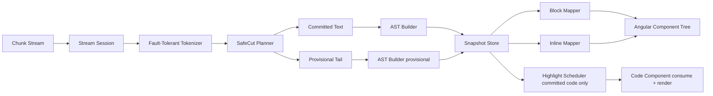

# Streaming Markdown V2 设计文档（严格基于当前代码基线）

## 文档元信息

- 文档日期：2026-02-10
- 代码基线（HEAD）：`24bdd18`（`refactor(streaming-markdown): complete discriminated union types migration`）
- 工作区状态：仅新增本文档（其余代码以 HEAD 为准）
- 设计范围：`src/app/shared/components/streaming-markdown/**` 与 demo 对照页

---

## 1. 目标与边界

### 1.1 目标

构建一个 **Streaming-first** 的 Markdown 渲染内核，满足以下四点：

1. 流式增量输入下，结构稳定（尤其 fenced code、blockquote、table）。
2. 高亮链路单通道、可观测、可回写，不出现“排队但 UI 未消费”。
3. AST 到组件树的映射可扩展（Block + Inline），支持组件注入。
4. 对外 API 尽量兼容现有 `StreamingMarkdownComponent`。

### 1.2 非目标（本阶段）

- 不一次性引入 mermaid/math 等重型扩展。
- 不要求首版达成极致性能，先保证正确性与可维护性。
- 不重写无关 UI 模块。

---

## 2. 当前代码事实（严格盘点）

> 本节只陈述“现在是什么”，不掺入目标态。

### 2.1 入口与渲染主链

- 主入口：`src/app/shared/components/streaming-markdown/streaming-markdown.component.ts`
- 当前流式处理：每个 chunk 走 `parser.parse(updatedRawContent)`（全量 parse），不走 `parseIncremental`
  - `processChunk`：约 `351-357` 行
- complete 时会做一次 `preprocessor.process(raw)` 后再 parse
  - `finalizeCompletedState`：约 `363-373` 行

**结论**：当前已从“增量 parse + 预处理混用”回退为“流式保守 parse + 完成态修复 parse”。

### 2.2 block parser 现状

- `parseIncremental` 仍存在，但当前主链未调用
  - `src/app/shared/components/streaming-markdown/core/block-parser.ts:144`
- `list` 与 `blockquote` 在模型上已扁平化为字符串数组：
  - `list.items: string[]`（`models.ts`）
  - `blockquote.blocks: string[]`（`models.ts`）
- `tokenToBlock` 中 blockquote 不再构建嵌套 `MarkdownBlock[]`，而是提取文本
  - `block-parser.ts:378-394`

**结论**：当前 parser 对嵌套结构表达能力下降，尤其影响 blockquote 内 code block 的结构化渲染能力。

### 2.3 block 渲染器现状

- block router 使用 `ngComponentOutlet`，具备 block 级动态映射能力
  - `blocks/block-router/block-router.component.ts:24-68`
- `blockquote` 组件仅渲染 `block.content`，不渲染嵌套 blocks
  - `blocks/blockquote/blockquote.component.ts:18-24`
- `list` 组件渲染字符串项，非 block 子树
  - `blocks/list/list.component.ts:20-50`

**结论**：当前是“block 组件映射 + 扁平内容渲染”，不是“完整 AST 子树组件化”。

### 2.4 inline 渲染现状

- paragraph/heading 的 inline 渲染是模板内 `@switch`，非 registry 插件化
- `image` 仍是硬编码 ``：
  - paragraph：`blocks/paragraph/paragraph.component.ts:38`
  - heading：`blocks/heading/heading.component.ts:37`

**结论**：尚未具备 inline 级组件注入能力（例如替换为统一 image 组件）。

### 2.5 高亮链路现状

- `HighlightSchedulerService` 负责 queue / frame budget / cache / callback
- `MarkdownCodeComponent` 订阅 scheduler callback 并消费结果
- `allowHighlight` 已从 streaming component → block router → code component 透传

**结论**：高亮主链可工作，但仍依赖“上游 block 结构正确”。如果 parser 输出错误，高亮无法补救。

### 2.6 代码组织与技术债

- `StreamingPipelineService`、`HighlightCoordinator` 仍导出，但当前主组件未注入使用
  - 仅在 `index.ts` / `core/index.ts` 暴露
- 已删除测试文件（当前无 `*.spec.ts`）
  - 命令校验：`rg --files ... -g "*.spec.ts"` 为空

**结论**：存在“公共 API 暴露但无运行入口”的维护成本；回归保障不足。

---

## 3. 现状问题定义（基于事实）

1. **语义提交边界缺失**
   - 当前 chunk 到来后直接全量 parse，未区分 committed/provisional。
2. **嵌套结构丢失**
   - blockquote/list 被扁平化为字符串，无法稳定承载嵌套 code/list/table。
3. **inline 不可注入**
   - image/link 等行内节点仍硬编码模板分支，难以扩展。
4. **高亮对 parser 强依赖**
   - 上游结构错，scheduler 无法纠正。
5. **测试基线缺失**
   - 任何重构缺乏自动回归保护。

---

## 4. V2 目标架构



### 4.1 核心原则

1. 提交与展示分离：`committed` 与 `provisional`。
2. 只对 committed code 执行高亮。
3. Block/Inline 都通过 registry 映射，避免模板硬编码膨胀。
4. 任何状态变化都可追踪到 snapshot version。

---

## 5. 关键数据结构（V2）

```ts
type NodeStability = 'committed' | 'provisional';

interface StreamSnapshot {
  rawText: string;
  safeCut: number;
  committedText: string;
  provisionalText: string;
  committedAst: MarkdownBlock[];
  provisionalAst: MarkdownBlock[];
  version: number;
}

interface RenderNode {
  id: string;
  block: MarkdownBlock;
  stability: NodeStability;
}
```

补充说明：

- `MarkdownBlock` 恢复对子树能力（至少 blockquote/list 的 children 需可表达）。
- `ListBlock` / `BlockquoteBlock` 不再仅限 `string[]`。

---

## 6. 容错 Tokenizer 与 SafeCut 设计

### 6.1 最小状态集

- `inFence`（含 fence marker）
- `inBlockquote`
- `inTableCandidate`
- `inLinkOrImage`
- `inHtmlEntity`

### 6.2 safeCut 规则

safeCut 不得落在：

1. 未闭合 fenced code 内。
2. 未闭合 link/image/entity 尾部。
3. 不完整 table 结构中（仅 header 未有 separator）。

若找不到新安全点，保持上一版 safeCut（宁可延迟提交，不提交脏结构）。

---

## 7. 解析与提交流程（V2）

每次 chunk：

1. `raw += chunk`
2. tokenizer 扫描并产出 `safeCut`
3. 切分 committed/provisional
4. committed AST 增量构建（或先全量，后增量优化）
5. provisional AST 轻量构建
6. 生成 render nodes

complete：

1. 对完整 raw 执行 preprocessor
2. 生成最终 committed AST
3. 清空 provisional
4. 触发高亮收敛

---

## 8. 渲染映射策略

### 8.1 Block Mapper（延续现有）

保留现有 `ngComponentOutlet` 路径：

- `block-router.component.ts`
- `plugin.ts` / `builtin-plugin.ts`

新增输入统一协议：

- `stability`
- `allowHighlight`（由 stability 推导）

### 8.2 Inline Mapper（新增）

新增 `INLINE_COMPONENT_REGISTRY`：

- `text`, `bold`, `italic`, `code`, `link`, `image`, `sup`, `sub`...

paragraph/heading 改为：

- 不直接 `@switch inline.type` 写 DOM
- 改为 inline outlet + registry 映射

---

## 9. 高亮链路统一规范

### 9.1 触发条件

只在以下条件全部满足时触发：

1. node.type === CODE_BLOCK
2. node.stability === committed
3. not cached && not inFlight

### 9.2 回写条件

- 回写 key：`node.id`
- 回写容器：`highlightResultsMap`（snapshot 内）
- UI 只消费 committed 节点对应结果

### 9.3 lazyHighlight

- `lazy=true`：可视窗口队列化
- `lazy=false`：commit 后立即高亮
- 两者共享缓存与回写协议

---

## 10. API 兼容策略

### 10.1 对外保持

`StreamingMarkdownComponent` 现有输入输出保持：

- `@Input() stream$`
- `@Input() enableLazyHighlight`
- `@Output() rawContentChange/statusChange/completed/error`

### 10.2 内部新增

- `StreamSessionCoordinator`
- `FaultTolerantTokenizer`
- `SafeCutPlanner`
- `InlineRendererRegistry`

---

## 11. 分阶段实施计划（严格版）

## Phase 0：恢复结构正确性（1~2 天）

### 目标

- 恢复 blockquote/list 子树表达能力。
- 引入 committed/provisional snapshot（可以先不增量优化）。

### 触及文件

- `core/models.ts`
- `core/block-parser.ts`
- `streaming-markdown.component.ts`
- `blocks/blockquote/blockquote.component.ts`
- `blocks/list/list.component.ts`

### 验收

- 顶层 fenced code 流式不断裂。
- blockquote 内 fenced code 可见且闭合后稳定。

## Phase 1：Inline Image 组件注入（样例，1 天）

### 目标

- 以 image 节点作为首个 inline registry 样例。

### 触及文件

- 新增：`blocks/inline/image/markdown-inline-image.component.ts`
- 新增：`core/inline-renderer.registry.ts`
- 修改：`blocks/paragraph/paragraph.component.ts`
- 修改：`blocks/heading/heading.component.ts`

### 组件行为要求（样例标准）

1. `loading="lazy"`
2. 错误占位（broken image fallback）
3. 安全 URL 策略（http/https/data 白名单可配置）
4. 响应式宽度与最大高度约束

## Phase 2：Inline 全量组件化（2~3 天）

- link/code/bold/italic/sup/sub 接入 inline registry
- 提供统一 sanitizer 与 link policy

## Phase 3：语义边界增量优化（2 天）

- safeCut + committed 增量 AST
- 引入性能指标对照（CPU、掉帧率、内存）

---

## 12. 测试与质量门禁

> 当前仓库无 spec，需先重建最小回归集。

### 12.1 必测用例

1. 顶层 fenced code（lazy on/off）
2. blockquote fenced code（lazy on/off）
3. 流式中未闭合 fence 不触发高亮
4. complete 后 provisional 归零，最终渲染与静态一致
5. inline image（成功/失败/半截 URL）

### 12.2 门禁建议

- PR 必须包含：
  - 变更设计点
  - 对应测试清单
  - demo 录屏（顶层 + blockquote + lazy 双模式）

---

## 13. 风险与缓解

1. **状态机复杂度提升**
   - 缓解：最小状态集起步，分层单测。
2. **提交边界过保守导致延迟感**
   - 缓解：增加 telemetry，按数据调参。
3. **旧 API 与新内核并存导致维护负担**
   - 缓解：设定 deprecate 路线，逐步下线未使用服务导出。

---

## 14. 代码级差异清单（当前 vs 目标）

1. `BlockquoteBlock/ListBlock` 当前是 `string[]`，目标是可承载 block 子树。
2. `parseIncremental` 当前存在但未在主链使用，目标是语义边界增量。
3. `paragraph/heading` 当前 inline 硬编码，目标是 inline registry。
4. `StreamingPipelineService/HighlightCoordinator` 当前导出但未接入主链，目标是统一收口或下线。
5. 当前无自动回归测试，目标是恢复至少核心回归集。

---

## 15. 决策结论

- 本仓库现状已经具备“block 级组件映射”基础，但还未达到“流式语义提交 + inline 可注入 + 完整回归保障”的成熟状态。
- V2 必须从“结构正确性（Phase 0）”开始，而不是继续在高亮末端打补丁。
- `image` 作为 Phase 1 样例是合理且必要的：它最能验证 inline mapper 的可扩展性与工程收益。

